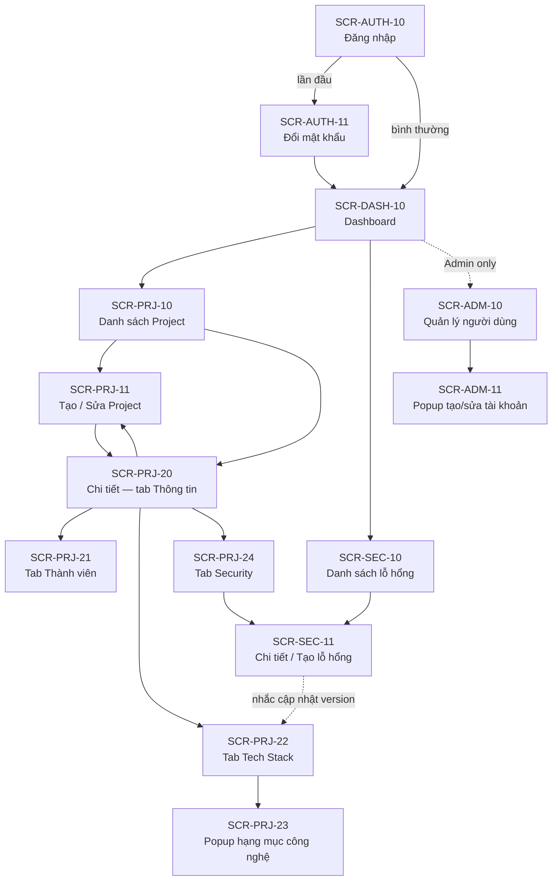

# Screen Flow / Sitemap — Hệ thống Quản lý Dự án, Tech Stack & Bảo mật

> **Phase**: Design — Specification | **Trạng thái**: Draft v0.2 — chờ BU verify
> **Phạm vi**: Toàn hệ thống (5 khối chức năng, 14 màn). **Nguồn**: `[FROM-TEAM]` (context dự án) + quyết định DEC-01..DEC-12.
> **Upstream**: `02-usecase-overview.md` (v0.2), `04-role-matrix.md` (v0.2)
> **Thay đổi v0.1 → v0.2**: thêm SCR-AUTH-11 (Đổi mật khẩu — bắt buộc lần đầu, DEC-12); chốt SCR-PRJ-11 là **trang đầy** thay vì popup; điền cột Screen spec; bổ sung DP-04, DP-05 và bảng điều hướng toàn cục.

**Bảng prefix Screen ID**

| Prefix | Cụm chức năng |
|--------|----------------|
| AUTH | Đăng nhập / phiên làm việc / mật khẩu |
| ADM | Quản trị người dùng |
| DASH | Dashboard |
| PRJ | Quản lý Project (gồm các tab Thành viên, Tech Stack, Security theo project) |
| SEC | Quản lý Security toàn hệ thống |

---

## 1. Sections / Modules

- **Đăng nhập (AUTH)**: cổng vào duy nhất; chưa đăng nhập thì mọi route đều chuyển về `/login`. Người dùng có cờ "phải đổi mật khẩu" bị giữ ở `/change-password` cho tới khi đổi xong.
- **Dashboard (DASH)**: trang chủ sau đăng nhập; thống kê tổng quan dự án, công nghệ, bảo mật, kèm ô cảnh báo lỗ hổng nghiêm trọng.
- **Project (PRJ)**: danh sách dự án → chi tiết dự án dạng tab: Thông tin & Repository, Thành viên, Tech Stack, Security.
- **Security (SEC)**: góc nhìn cắt ngang toàn hệ thống — mọi lỗ hổng của mọi dự án, lọc theo mức nghiêm trọng/trạng thái, gom nhóm theo CVE.
- **Quản trị (ADM)**: quản lý tài khoản và phân quyền — chỉ Admin.

## 2. Sơ đồ tổng quan

## 3. Danh sách màn hình (Screen list)

| Screen ID | Tên màn | Loại | Route / entry | Use case chính | Guard / role | Ý nghĩa nghiệp vụ | Screen spec | Evidence |
|-----------|---------|------|---------------|----------------|--------------|--------------------|-------------|----------|
| SCR-AUTH-10 | Đăng nhập | Trang đầy | `/login` | UC-AUTH-01, UC-AUTH-02 | Public | Cổng vào hệ thống | `07-screen-spec-auth-admin.md` §1 | `[FROM-TEAM]` |
| SCR-AUTH-11 | Đổi mật khẩu | Trang đầy | `/change-password` | UC-AUTH-03 | Đã đăng nhập | Đặt mật khẩu mới; bắt buộc ở lần đăng nhập đầu | `07-screen-spec-auth-admin.md` §2 | `[DECIDED — DEC-12]` |
| SCR-DASH-10 | Dashboard | Trang đầy | `/` (alias `/dashboard`) | UC-DASH-01 | Đã đăng nhập | Thống kê tổng quan + cảnh báo bảo mật | `09-screen-spec-security-dashboard.md` §4 | `[FROM-TEAM]` |
| SCR-PRJ-10 | Danh sách Project | Trang đầy | `/projects` | UC-PRJ-01, UC-PRJ-05 | Đã đăng nhập | Tra cứu, tìm kiếm, lọc, kết xuất dự án | `08-screen-spec-project.md` §1 | `[FROM-TEAM]` |
| SCR-PRJ-11 | Tạo / Sửa Project | Trang đầy | `/projects/new`, `/projects/:id/edit` | UC-PRJ-03 | Tạo: đã đăng nhập · Sửa: thành viên hoặc Admin | Khai báo thông tin dự án, repository, trạng thái | `08-screen-spec-project.md` §2 | `[DECIDED]` — chọn trang đầy vì có bảng repository động |
| SCR-PRJ-20 | Chi tiết Project — tab Thông tin | Trang đầy (tab) | `/projects/:id` | UC-PRJ-02 | Đã đăng nhập | Xem thông tin chung, repository, chỉ số nhanh | `08-screen-spec-project.md` §3 | `[FROM-TEAM]` |
| SCR-PRJ-21 | Tab Thành viên | Tab | `/projects/:id/members` | UC-PRJ-04 | Đọc: mọi người · Ghi: thành viên/Admin | Thêm/xóa thành viên, vai trò trong dự án | `08-screen-spec-project.md` §4 | `[FROM-TEAM]` |
| SCR-PRJ-22 | Tab Tech Stack | Tab | `/projects/:id/tech-stack` | UC-TS-01 | Đọc: mọi người · Ghi: thành viên/Admin | Xem công nghệ và phiên bản của dự án | `08-screen-spec-project.md` §5 | `[FROM-TEAM]` |
| SCR-PRJ-23 | Popup thêm/sửa hạng mục công nghệ | Modal / Dialog | Từ SCR-PRJ-22 | UC-TS-02 | Thành viên/Admin | Khai báo loại, tên, phiên bản | `08-screen-spec-project.md` §6 | `[FROM-TEAM]` |
| SCR-PRJ-24 | Tab Security (theo Project) | Tab | `/projects/:id/security` | UC-SEC-01 | Đọc: mọi người · Ghi: thành viên/Admin | Lỗ hổng của riêng dự án này | `09-screen-spec-security-dashboard.md` §3 | `[FROM-TEAM]` |
| SCR-SEC-10 | Danh sách lỗ hổng (toàn hệ thống) | Trang đầy | `/security` | UC-SEC-01, UC-SEC-05 | Đã đăng nhập | Theo dõi CVE mọi dự án, lọc + gom nhóm theo CVE, kết xuất CSV | `09-screen-spec-security-dashboard.md` §1 | `[FROM-TEAM]` |
| SCR-SEC-11 | Chi tiết / Tạo lỗ hổng | Trang đầy | `/security/new`, `/security/:id` | UC-SEC-02, UC-SEC-03, UC-SEC-04 | Đọc: mọi người · Ghi: thành viên/Admin | Ghi nhận CVE, chuyển trạng thái, xem lịch sử | `09-screen-spec-security-dashboard.md` §2 | `[FROM-TEAM]` |
| SCR-ADM-10 | Quản lý người dùng | Trang đầy | `/admin/users` | UC-ADM-01, UC-ADM-02 | **Admin only** | Tạo, khóa tài khoản, gán vai trò, đặt lại mật khẩu | `07-screen-spec-auth-admin.md` §3 | `[FROM-TEAM]` |
| SCR-ADM-11 | Popup tạo/sửa tài khoản | Modal / Dialog | Từ SCR-ADM-10 | UC-ADM-01, UC-ADM-02 | **Admin only** | Nhập thông tin tài khoản, vai trò | `07-screen-spec-auth-admin.md` §4 | `[FROM-TEAM]` |

## 4. Điều hướng toàn cục

| Thành phần | Hiển thị ở | Nội dung | Ghi chú |
|---|---|---|---|
| Thanh điều hướng ngang | Mọi màn sau đăng nhập | Dashboard · Dự án · Bảo mật · Quản trị (chỉ Admin) | Mục đang mở được đánh dấu |
| Menu tài khoản (góc phải) | Mọi màn sau đăng nhập | Tên người dùng + vai trò · Đổi mật khẩu · Đăng xuất | — |
| Breadcrumb | Các màn cấp 2 trở xuống | `Dự án / <Tên dự án> / <Tab>` | Bấm được về từng cấp |
| Thanh tab của Project | SCR-PRJ-20/21/22/24 | Thông tin · Thành viên · Tech Stack · Bảo mật (kèm số lỗ hổng mở) | Giữ nguyên bộ lọc khi quay lại tab |

## 5. Luồng đi sâu tới màn chi tiết (deep paths)

### DP-01 — Ghi nhận và xử lý một lỗ hổng CVE *(luồng quan trọng nhất)*

| Bước | Từ | Hành động | Đến | Điều kiện / ghi chú |
|------|----|-----------|-----|---------------------|
| 1 | SCR-DASH-10 | Bấm ô "Lỗ hổng Critical còn mở" hoặc menu Bảo mật | SCR-SEC-10 | Bộ lọc mức = Critical, trạng thái = còn mở được áp sẵn |
| 2 | SCR-SEC-10 | Bấm "Ghi nhận lỗ hổng" | SCR-SEC-11 (chế độ tạo) | Nút chỉ hiện với người có quyền ghi trên ít nhất một Project |
| 3 | SCR-SEC-11 | Nhập CVE, chọn project, thư viện, phiên bản, mức, khuyến nghị → Lưu | SCR-SEC-11 (chế độ xem) | Trạng thái khởi tạo `Mới`; validate R-ENT-009; tạo dòng lịch sử đầu tiên |
| 4 | SCR-SEC-11 | "Chuyển trạng thái" → `Đang xử lý` | SCR-SEC-11 | Bắt buộc chọn người phụ trách (R-ENT-007) |
| 5 | SCR-SEC-11 | "Chuyển trạng thái" → `Đã xử lý` | SCR-SEC-11 | Bắt buộc ngày xử lý + ghi chú; hiện nhắc `MSG-INF-020` kèm liên kết tới tab Tech Stack |
| 6 | SCR-SEC-11 | Bấm liên kết trong lời nhắc | SCR-PRJ-22 → SCR-PRJ-23 | Cập nhật version thư viện sau nâng cấp (BR-17) |

**Alternative A**: bước 5 chọn `Chấp nhận rủi ro` thay vì `Đã xử lý` → bắt buộc lý do; nếu mức Critical/High và người dùng không phải Admin thì nút vô hiệu hóa kèm tooltip (BR-15).
**Alternative B**: vào từ SCR-PRJ-24 thay vì SCR-SEC-10 → trường Project điền sẵn và khóa.
**Exception**: Project đã `Kết thúc` → nút "Ghi nhận lỗ hổng" ẩn; gọi trực tiếp URL `/security/new?project=` → `MSG-BIZ-032`.

### DP-02 — Thiết lập dự án mới hoàn chỉnh

| Bước | Từ | Hành động | Đến | Điều kiện / ghi chú |
|------|----|-----------|-----|---------------------|
| 1 | SCR-PRJ-10 | Bấm "Tạo dự án" | SCR-PRJ-11 | Mọi người dùng đã đăng nhập (BR-04) |
| 2 | SCR-PRJ-11 | Nhập mã, tên, trạng thái, thêm repository → Lưu | SCR-PRJ-20 | Mã/tên không trùng (BR-06); người tạo thành PM |
| 3 | SCR-PRJ-20 | Tab Thành viên → thêm thành viên | SCR-PRJ-21 | Không trùng người trong cùng Project |
| 4 | SCR-PRJ-20 | Tab Tech Stack → thêm hạng mục | SCR-PRJ-22 → SCR-PRJ-23 | Không trùng loại + tên (R-ENT-005) |
| 5 | SCR-PRJ-20 | Bấm "Sửa" → đổi trạng thái sang `Đang phát triển` | SCR-PRJ-11 → SCR-PRJ-20 | — |

### DP-03 — Admin cấp tài khoản mới

| Bước | Từ | Hành động | Đến | Điều kiện / ghi chú |
|------|----|-----------|-----|---------------------|
| 1 | SCR-DASH-10 | Menu Quản trị | SCR-ADM-10 | Guard Admin only; User mở URL trực tiếp → trang 403 (EC-07) |
| 2 | SCR-ADM-10 | Bấm "Tạo tài khoản" | SCR-ADM-11 | — |
| 3 | SCR-ADM-11 | Nhập email, họ tên, vai trò, mật khẩu tạm → Lưu | SCR-ADM-10 | Email không trùng; cờ `must_change_password` = Đúng |
| 4 | *(người dùng mới)* SCR-AUTH-10 | Đăng nhập bằng mật khẩu tạm | SCR-AUTH-11 | Bị giữ ở màn đổi mật khẩu, không vào được màn khác |
| 5 | SCR-AUTH-11 | Đặt mật khẩu mới → Lưu | SCR-DASH-10 | Cờ được gỡ |

### DP-04 — Đóng một dự án đã kết thúc `[DECIDED — DEC-05]`

| Bước | Từ | Hành động | Đến | Điều kiện / ghi chú |
|------|----|-----------|-----|---------------------|
| 1 | SCR-PRJ-20 | Bấm "Sửa" | SCR-PRJ-11 | Là thành viên hoặc Admin |
| 2 | SCR-PRJ-11 | Chọn trạng thái `Kết thúc` → Lưu | *(chặn)* | Nếu còn lỗ hổng `Mới`/`Đang xử lý` → `MSG-BIZ-003` kèm số lượng và liên kết |
| 3 | *(từ thông báo)* | Bấm liên kết "Xem N lỗ hổng còn mở" | SCR-PRJ-24 | Bộ lọc trạng thái = còn mở áp sẵn |
| 4 | SCR-PRJ-24 → SCR-SEC-11 | Xử lý hoặc chấp nhận rủi ro từng lỗ hổng | SCR-SEC-11 | Critical/High cần Admin (BR-15) |
| 5 | SCR-PRJ-11 | Lưu lại với trạng thái `Kết thúc` | SCR-PRJ-20 | Bắt buộc `end_date` (R-ENT-008) |

### DP-05 — Kết xuất báo cáo lỗ hổng `[DECIDED — DEC-06]`

| Bước | Từ | Hành động | Đến | Điều kiện / ghi chú |
|------|----|-----------|-----|---------------------|
| 1 | SCR-SEC-10 | Đặt bộ lọc (dự án, mức, trạng thái, khoảng ngày ghi nhận) | SCR-SEC-10 | — |
| 2 | SCR-SEC-10 | Bấm "Kết xuất CSV" | *(tải tệp)* | Xuất theo **bộ lọc hiện tại**, không phải trang hiện tại |
| 3 | — | — | — | Quá 10.000 dòng → `MSG-BIZ-070`, yêu cầu thu hẹp bộ lọc |
| 4 | — | — | — | 0 dòng → `MSG-BIZ-071`, không tạo tệp |

## 6. Quy tắc điều hướng và trạng thái phiên

| Tình huống | Hành vi |
|---|---|
| Chưa đăng nhập, mở bất kỳ route protected | Chuyển về `/login`, ghi nhớ route đích để quay lại sau khi đăng nhập |
| Phiên hết hạn giữa chừng (BR-22) | Thao tác tiếp theo trả 401 → hiện `MSG-AUTH-004`, chuyển về `/login` |
| Có cờ `must_change_password` | Mọi route trừ `/change-password` và `/logout` đều chuyển về `/change-password` |
| Không đủ quyền route (User mở `/admin/*`) | Trang 403 với `MSG-AUTH-005` và nút "Về Dashboard" — không chuyển hướng âm thầm (EC-07) |
| Mở ID không tồn tại (`/projects/999`) | Trang 404 với `MSG-NF-001` và nút quay lại danh sách |
| Rời màn có form đang sửa dở | Hộp thoại xác nhận `MSG-INF-011` "Thay đổi chưa lưu sẽ mất" |

## 7. Checklist rà soát

- [x] Mọi màn trong phạm vi có Screen ID và dòng trong bảng (14 màn).
- [x] Guard/role note rõ ràng cho màn protected (SCR-ADM-*, SCR-PRJ-11).
- [x] Loại popup đã phân biệt Modal/Dialog (SCR-PRJ-23, SCR-ADM-11) thay vì ghi chung "popup".
- [x] Luồng detail quan trọng có deep path (DP-01..DP-05).
- [x] Cột screen spec đã trỏ tới file và mục cụ thể.
- [x] Quy tắc điều hướng khi 401/403/404 và khi form dirty đã ghi rõ.
- [x] Không mâu thuẫn với BU/UC v0.2; điểm chưa chốt đã gắn `[NEEDS-CONFIRMATION]` ở tài liệu upstream.

**Last Updated**: 2026-08-26
