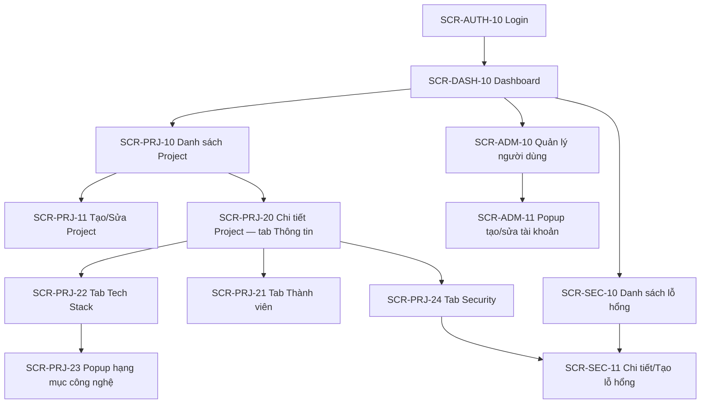

# Screen Flow / Sitemap — Hệ thống Quản lý Dự án, Tech Stack & Bảo mật

> **Phase**: Design — Foundation/Specification | **Trạng thái**: Draft v0.1 — chờ BU verify
> **Phạm vi**: Toàn hệ thống (5 khối chức năng). **Nguồn**: `[FROM-TEAM]` (context dự án); chưa có wireframe/code — mọi màn đều là đề xuất, coverage `partial`.
> **Upstream**: [02-usecase-overview.md](./02-usecase-overview.md), [04-role-matrix.md](./04-role-matrix.md)

**Bảng prefix Screen ID**

| Prefix | Cụm chức năng |
|--------|----------------|
| AUTH | Đăng nhập / phiên làm việc |
| ADM | Quản trị người dùng |
| DASH | Dashboard |
| PRJ | Quản lý Project (gồm các tab Tech Stack, Security theo project) |
| SEC | Quản lý Security toàn hệ thống |

---

## 1. Sections / Modules

- **Đăng nhập (AUTH)**: cổng vào duy nhất; chưa đăng nhập thì mọi route đều chuyển về Login.
- **Dashboard (DASH)**: trang chủ sau đăng nhập; thống kê tổng quan dự án, công nghệ, bảo mật.
- **Project (PRJ)**: danh sách dự án → chi tiết dự án dạng tab: Thông tin & Repository, Thành viên, Tech Stack, Security.
- **Security (SEC)**: góc nhìn cắt ngang toàn hệ thống — danh sách mọi lỗ hổng của mọi dự án, lọc theo mức nghiêm trọng/trạng thái.
- **Quản trị (ADM)**: quản lý tài khoản và phân quyền — chỉ Admin.

## 2. Sơ đồ tổng quan

## 3. Danh sách màn hình (Screen list)

| Screen ID | Tên màn | Loại | Route / entry | Use case chính | Guard / role | Ý nghĩa nghiệp vụ | Screen spec | Evidence | Ghi chú |
|-----------|---------|------|---------------|----------------|--------------|--------------------|-------------|----------|---------|
| SCR-AUTH-10 | Đăng nhập | Trang đầy | `/login` | UC-AUTH-01 | Public | Cổng vào hệ thống | *(phase Detailing)* | `[FROM-TEAM]` | — |
| SCR-DASH-10 | Dashboard | Trang đầy | `/` hoặc `/dashboard` | UC-DASH-01 | Đã đăng nhập | Thống kê tổng quan dự án, công nghệ, bảo mật | *(phase Detailing)* | `[FROM-TEAM]` | Trang chủ sau login |
| SCR-PRJ-10 | Danh sách Project | Trang đầy | `/projects` | UC-PRJ-01 | Đã đăng nhập | Tra cứu, tìm kiếm, lọc dự án | *(phase Detailing)* | `[FROM-TEAM]` | — |
| SCR-PRJ-11 | Tạo / Sửa Project | Trang đầy hoặc popup `[NEEDS-CONFIRMATION]` | `/projects/new`, `/projects/:id/edit` | UC-PRJ-03 | Admin, hoặc User thành viên (sửa) `[ASSUMED]` | Khai báo thông tin dự án, repository, trạng thái | *(phase Detailing)* | `[FROM-TEAM]` | — |
| SCR-PRJ-20 | Chi tiết Project — tab Thông tin | Trang đầy (tab) | `/projects/:id` | UC-PRJ-02 | Đã đăng nhập | Xem thông tin chung, repository, trạng thái | *(phase Detailing)* | `[FROM-TEAM]` | Tab mặc định |
| SCR-PRJ-21 | Tab Thành viên | Tab | `/projects/:id/members` | UC-PRJ-04 | Ghi: thành viên/Admin | Thêm/xóa thành viên, vai trò trong dự án | *(phase Detailing)* | `[FROM-TEAM]` | — |
| SCR-PRJ-22 | Tab Tech Stack | Tab | `/projects/:id/tech-stack` | UC-TS-01 | Đã đăng nhập | Xem công nghệ và phiên bản của dự án | *(phase Detailing)* | `[FROM-TEAM]` | — |
| SCR-PRJ-23 | Popup thêm/sửa hạng mục công nghệ | Popup | Từ SCR-PRJ-22 | UC-TS-02 | Thành viên/Admin | Khai báo loại, tên, phiên bản | *(phase Detailing)* | `[FROM-TEAM]` | — |
| SCR-PRJ-24 | Tab Security (theo Project) | Tab | `/projects/:id/security` | UC-SEC-01 | Đã đăng nhập | Lỗ hổng của riêng dự án này | *(phase Detailing)* | `[FROM-TEAM]` | — |
| SCR-SEC-10 | Danh sách lỗ hổng (toàn hệ thống) | Trang đầy | `/security` | UC-SEC-01 | Đã đăng nhập | Theo dõi CVE mọi dự án, lọc theo mức/trạng thái | *(phase Detailing)* | `[FROM-TEAM]` | — |
| SCR-SEC-11 | Chi tiết / Tạo lỗ hổng | Trang đầy | `/security/new`, `/security/:id` | UC-SEC-02, UC-SEC-03 | Ghi: thành viên project/Admin | Ghi nhận CVE, cập nhật trạng thái xử lý, khuyến nghị | *(phase Detailing)* | `[FROM-TEAM]` | — |
| SCR-ADM-10 | Quản lý người dùng | Trang đầy | `/admin/users` | UC-ADM-01, UC-ADM-02 | **Admin only** | Tạo, khóa tài khoản, gán vai trò | *(phase Detailing)* | `[FROM-TEAM]` | — |
| SCR-ADM-11 | Popup tạo/sửa tài khoản | Popup | Từ SCR-ADM-10 | UC-ADM-01 | **Admin only** | Nhập thông tin tài khoản, vai trò | *(phase Detailing)* | `[FROM-TEAM]` | — |

## 4. Luồng đi sâu tới màn chi tiết (deep paths)

### DP-01 — Ghi nhận và xử lý một lỗ hổng CVE (luồng quan trọng nhất)

| Bước | Từ | Hành động | Đến | Điều kiện / ghi chú | Evidence |
|------|----|-----------|-----|---------------------|----------|
| 1 | SCR-DASH-10 | Bấm vào số lỗ hổng đang mở / menu Security | SCR-SEC-10 | — | `[ASSUMED]` |
| 2 | SCR-SEC-10 | Bấm "Ghi nhận lỗ hổng" | SCR-SEC-11 | Chỉ hiện với người có quyền ghi | `[ASSUMED]` |
| 3 | SCR-SEC-11 | Nhập CVE, chọn project, thư viện, mức nghiêm trọng, khuyến nghị → Lưu | SCR-SEC-10 | Trạng thái khởi tạo "Mới"; validate R-ENT-001..004 | `[ASSUMED]` |
| 4 | SCR-SEC-10 | Mở lỗ hổng → cập nhật trạng thái "Đang xử lý" → "Đã xử lý" | SCR-SEC-11 | Bắt buộc ngày xử lý + ghi chú khi đóng | `[ASSUMED]` |
| 5 | SCR-PRJ-22 | Cập nhật version thư viện sau nâng cấp | SCR-PRJ-23 | Quy trình thủ công (BR-09) | `[ASSUMED]` |

*Alternative*: không đủ quyền ghi → nút tạo/sửa ẩn hoặc disabled; project đã "Kết thúc" → xử lý theo Q-05 `[NEEDS-CONFIRMATION]`.

### DP-02 — Thiết lập dự án mới hoàn chỉnh

| Bước | Từ | Hành động | Đến | Điều kiện / ghi chú |
|------|----|-----------|-----|---------------------|
| 1 | SCR-PRJ-10 | Bấm "Tạo Project" | SCR-PRJ-11 | Quyền tạo: ASM-RM-002 |
| 2 | SCR-PRJ-11 | Nhập thông tin, repository → Lưu | SCR-PRJ-20 | Tên không trùng (BR-04) |
| 3 | SCR-PRJ-20 | Chuyển tab Thành viên → thêm thành viên | SCR-PRJ-21 | — |
| 4 | SCR-PRJ-20 | Chuyển tab Tech Stack → thêm hạng mục | SCR-PRJ-22 → SCR-PRJ-23 | R-ENT-005 |

### DP-03 — Admin cấp tài khoản mới

| Bước | Từ | Hành động | Đến | Điều kiện / ghi chú |
|------|----|-----------|-----|---------------------|
| 1 | SCR-DASH-10 | Menu Quản trị | SCR-ADM-10 | Guard: Admin only; User bị chặn → thông báo không đủ quyền |
| 2 | SCR-ADM-10 | Bấm "Tạo tài khoản" | SCR-ADM-11 | — |
| 3 | SCR-ADM-11 | Nhập email, họ tên, vai trò → Lưu | SCR-ADM-10 | Email không trùng |

## 5. Checklist rà soát

- [x] Mọi màn trong phạm vi có Screen ID và dòng trong bảng.
- [x] Guard/role note rõ ràng cho màn protected (SCR-ADM-*).
- [x] Luồng detail quan trọng có deep path (DP-01..03).
- [ ] Cột screen spec — sẽ điền ở phase Detailing (ngoài phạm vi gói này).
- [x] Không mâu thuẫn với BU/UC; điểm chưa chốt đã gắn `[NEEDS-CONFIRMATION]`.
