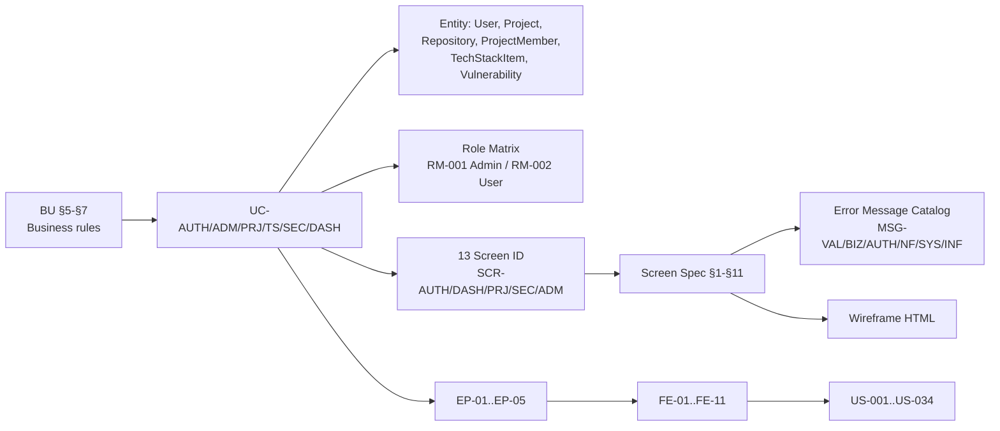

# Bộ tài liệu BA — Hệ thống Quản lý Dự án, Tech Stack & Bảo mật

> Tạo theo quy trình **ai-framework** (BA Design Guideline — Foundation → Specification → Detailing).
> **Phiên bản**: v0.2 — 2026-08-26 | **Trạng thái**: Draft — chờ Business User verify.
> **Thay đổi so với v0.1**: chốt giả định cho 8 câu hỏi mở (DEC-01..DEC-12), hoàn thiện tài liệu 01–06, bổ sung Screen Spec (13 màn), Error Message Catalog và Wireframe.

## Danh mục tài liệu

| #   | Tài liệu                              | File                                   | Phase         | Vai trò trong chuỗi traceability                     |
| --- | ------------------------------------- | -------------------------------------- | ------------- | ---------------------------------------------------- |
| 1   | Business Understanding (BU)           | `01-business-understanding.md`         | Foundation    | Nguồn chân lý nghiệp vụ — mọi tài liệu khác bám theo |
| 2   | Usecase Overview                      | `02-usecase-overview.md`               | Foundation    | BU → UC                                              |
| 3   | Business Entities                     | `03-business-entities.md`              | Foundation    | UC → Entity                                          |
| 4   | Role Matrix                           | `04-role-matrix.md`                    | Foundation    | Actor → quyền → UC/Screen                            |
| 5   | Screen Flow / Sitemap                 | `05-screen-flow.md`                    | Specification | UC → Screen                                          |
| 6   | Backlog — Epic / Feature / User Story | `06-backlog.md`                        | Specification | UC/Screen/Entity → Epic → Feature → Story            |
| 7   | Screen Spec — Auth & Admin            | `07-screen-spec-auth-admin.md`         | Detailing     | Screen → đặc tả chi tiết                             |
| 8   | Screen Spec — Project & Tech Stack    | `08-screen-spec-project.md`            | Detailing     | Screen → đặc tả chi tiết                             |
| 9   | Screen Spec — Security & Dashboard    | `09-screen-spec-security-dashboard.md` | Detailing     | Screen → đặc tả chi tiết                             |
| 10  | Error Message Catalog                 | `10-error-message-catalog.md`          | Detailing     | Screen Spec §6 → mã message                          |
| 11  | Wireframe (low-fidelity)              | `11-wireframe.html`                    | Detailing     | Screen Spec → bố cục trực quan                       |

## Quy ước nhãn nguồn

| Nhãn                   | Ý nghĩa                                                                               |
| ---------------------- | ------------------------------------------------------------------------------------- |
| `[FROM-TEAM]`          | Context do khách hàng/PO cung cấp — đã xác nhận                                       |
| `[ASSUMED]`            | Giả định do BA đề xuất — **cần khách hàng xác nhận**, nhưng đã đủ chi tiết để đi tiếp |
| `[NEEDS-CONFIRMATION]` | Câu hỏi còn mở — **chưa** có giả định thay thế, chặn thiết kế nếu không trả lời       |
| `[DECIDED]`            | Đã chốt trong Decision Log của BU §16                                                 |

## Nguyên tắc làm việc

- **Upstream-first**: phát hiện mâu thuẫn → sửa BU trước → sync xuống UC → Entity → Role Matrix → Screen Flow → Backlog → Screen Spec → Error Catalog.
- **Một nguồn chân lý cho message**: mọi thông báo hiển thị cho người dùng chỉ định nghĩa **một lần** trong `10-error-message-catalog.md`; Screen Spec chỉ trỏ mã message.
- **Item Type chuẩn**: cột "Kiểu" trong Screen Spec §3 dùng đúng tên chuẩn từ Item Type Catalog của ai-framework (không dùng bí danh tự do).

## Chuỗi traceability tổng thể

## Việc cần làm tiếp

1. **BU verify vòng 1**: khách hàng xác nhận 12 quyết định giả định DEC-01..DEC-12 trong BU §16.
2. Nếu có quyết định bị bác → sửa BU → sync downstream theo thứ tự trong bảng trên.
3. Chuyển sang phase **Delivery**: API spec, DB schema, test case (Tester map Common Test Case theo Item Type chuẩn ở Screen Spec §3).

**Last Updated**: 2026-08-26
