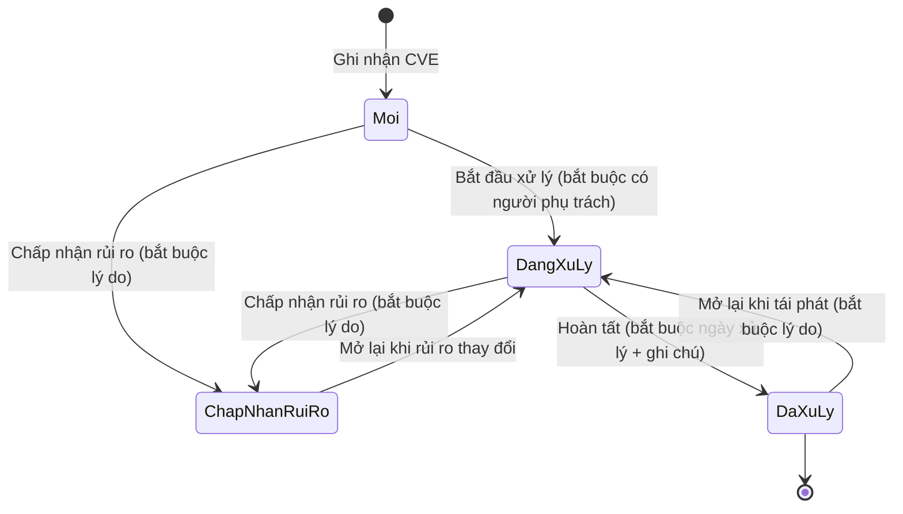

# Business Understanding (BU) — Hệ thống Quản lý Dự án, Tech Stack & Bảo mật

> **Phase**: Design — Foundation | **Ngôn ngữ**: Tiếng Việt | **Trạng thái**: Draft v0.2 — chờ BU verify
> **Nguồn**: Context dự án do khách hàng/PO cung cấp `[FROM-TEAM]`. Các nội dung mở rộng chưa được xác nhận đều gắn nhãn `[ASSUMED]`.
> **Thay đổi v0.1 → v0.2**: 8 câu hỏi mở Q-01..Q-08 và 4 câu hỏi phái sinh đã được BA đề xuất phương án chốt — ghi trong **§16 Decision log (DEC-01..DEC-12)**. Các mục §6, §7, §8, §11, §13 được cập nhật theo quyết định đó.

---

## 1. Business overview

Hệ thống là một công cụ quản trị nội bộ giúp tổ chức theo dõi **toàn bộ danh mục dự án phần mềm** đang vận hành: mỗi dự án dùng công nghệ gì, phiên bản nào, và đang tồn tại những rủi ro bảo mật nào. Người hưởng lợi chính là **quản lý kỹ thuật và đội ngũ phát triển**: thay vì phải hỏi từng team hoặc lục tài liệu rời rạc, họ tra cứu một nơi duy nhất để biết tình trạng công nghệ và bảo mật của từng dự án.

Hệ thống gồm năm khối chức năng chính: đăng nhập và phân quyền (hai vai trò Admin và User); quản lý Project (thông tin dự án, repository, thành viên và trạng thái); quản lý Tech Stack theo Project (ngôn ngữ lập trình, framework, database, cache, cloud và phiên bản đang sử dụng); quản lý Security (theo dõi lỗ hổng CVE, phiên bản thư viện, trạng thái xử lý và khuyến nghị nâng cấp); và Dashboard hiển thị thống kê tổng quan.

Hệ thống là công cụ **theo dõi và ghi nhận** (registry): dữ liệu tech stack và lỗ hổng được con người nhập/cập nhật; hệ thống không tự quét mã nguồn hay tự đồng bộ từ scanner bên ngoài trong phạm vi lần triển khai này `[DECIDED — DEC-02]`.

## 2. Business goals & success criteria

| #    | Mục tiêu                                                             | Tiêu chí thành công                                                                                                          |
| ---- | -------------------------------------------------------------------- | ---------------------------------------------------------------------------------------------------------------------------- |
| G-01 | Có một nguồn duy nhất về danh mục dự án và công nghệ đang sử dụng    | 100% dự án đang vận hành có hồ sơ trên hệ thống với tech stack đầy đủ                                                        |
| G-02 | Nhìn thấy sớm rủi ro bảo mật theo từng dự án                         | Mỗi lỗ hổng CVE liên quan được ghi nhận kèm trạng thái xử lý; không có lỗ hổng nghiêm trọng nào "không ai theo dõi"          |
| G-03 | Giảm thời gian tổng hợp báo cáo tình trạng công nghệ/bảo mật         | Quản lý xem được Dashboard tổng quan thay vì tổng hợp thủ công; kết xuất CSV khi cần báo cáo ngoài hệ thống                  |
| G-04 | Kiểm soát ai được sửa dữ liệu                                        | Phân quyền Admin/User rõ ràng; thao tác quản trị chỉ dành cho Admin                                                          |
| G-05 | Không có lỗ hổng nghiêm trọng bị "chấp nhận rủi ro" một cách âm thầm | Việc chuyển lỗ hổng Critical/High sang "Chấp nhận rủi ro" chỉ Admin thực hiện được và bắt buộc có lý do `[DECIDED — DEC-09]` |

## 3. Stakeholders & roles (business)

| Vai trò                          | Mô tả                                                                             | Quan tâm chính                                                |
| -------------------------------- | --------------------------------------------------------------------------------- | ------------------------------------------------------------- |
| Admin                            | Quản trị hệ thống: quản lý tài khoản, phân quyền, toàn quyền trên dữ liệu         | Dữ liệu chuẩn, kiểm soát truy cập, phê duyệt chấp nhận rủi ro |
| User                             | Thành viên dự án / kỹ sư: xem toàn hệ thống, cập nhật dữ liệu dự án mình tham gia | Tra cứu nhanh, cập nhật thuận tiện                            |
| Quản lý kỹ thuật (đọc Dashboard) | Có thể là Admin hoặc User tùy tổ chức `[ASSUMED]`                                 | Bức tranh tổng quan, rủi ro bảo mật                           |

## 4. As-Is process (high-level)

Hiện tại thông tin dự án, công nghệ và lỗ hổng được quản lý phân tán (file Excel, tài liệu wiki, trao đổi trực tiếp) `[ASSUMED — cần xác nhận hiện trạng]`. Hệ quả: khó biết dự án nào đang dùng thư viện có lỗ hổng, khó tổng hợp báo cáo, thông tin nhanh lỗi thời.

Không có kế hoạch chuyển dữ liệu tự động từ hệ thống cũ trong lần triển khai này; dữ liệu ban đầu do các team tự nhập `[DECIDED — DEC-11]`.

## 5. To-Be process (high-level)

1. Admin tạo tài khoản và phân quyền cho thành viên; người dùng đổi mật khẩu ở lần đăng nhập đầu tiên.
2. Admin/User tạo hồ sơ Project: thông tin chung, repository (chỉ lưu đường dẫn), thành viên, trạng thái. Người tạo tự động trở thành thành viên với vai trò PM.
3. Với mỗi Project, người phụ trách khai báo Tech Stack: ngôn ngữ, framework, database, cache, cloud và phiên bản đang sử dụng.
4. Khi phát hiện lỗ hổng (CVE) liên quan tới thư viện/phiên bản đang dùng, người phụ trách ghi nhận vào hệ thống **theo từng Project**: mã CVE, thư viện và phiên bản ảnh hưởng, mức nghiêm trọng, trạng thái xử lý, khuyến nghị nâng cấp, người phụ trách.
5. Trạng thái xử lý được cập nhật theo tiến độ: Mới ghi nhận → Đang xử lý → Đã xử lý / Chấp nhận rủi ro. Mỗi lần chuyển trạng thái được ghi lại kèm người thực hiện, thời điểm và ghi chú.
6. Dashboard tổng hợp: số dự án theo trạng thái, phân bố công nghệ, số lỗ hổng theo mức nghiêm trọng và trạng thái; bấm vào số liệu để đi tới danh sách đã lọc.
7. Khi cần báo cáo ra ngoài hệ thống, người dùng kết xuất danh sách lỗ hổng hoặc danh sách dự án ra CSV.

### 5.1 Vòng đời trạng thái lỗ hổng

Ghi chú: `Moi` = Mới, `DangXuLy` = Đang xử lý, `DaXuLy` = Đã xử lý, `ChapNhanRuiRo` = Chấp nhận rủi ro. Không có nhánh nào quay về `Mới`.

## 6. Business rules

**Nhóm phân quyền**

- **BR-01**: Chỉ Admin được tạo/khóa tài khoản và thay đổi vai trò người dùng.
- **BR-02**: User cập nhật được dữ liệu của các Project mà mình là thành viên; Admin cập nhật được mọi Project. `[DECIDED — DEC-03]`
- **BR-03**: Mọi người dùng đã đăng nhập đều **xem** được Dashboard, danh sách Project và danh sách lỗ hổng của toàn hệ thống. `[DECIDED — DEC-03]`
- **BR-04**: User được tạo Project mới và tự động trở thành thành viên với vai trò PM của Project đó. `[DECIDED — DEC-03]`
- **BR-05**: Hệ thống luôn phải còn ít nhất một tài khoản Admin đang hoạt động; không cho khóa hoặc hạ vai trò Admin cuối cùng.

**Nhóm dữ liệu Project & Tech Stack**

- **BR-06**: Tên Project và Mã Project không được trùng trong toàn hệ thống (so sánh không phân biệt hoa/thường, đã cắt khoảng trắng đầu cuối).
- **BR-07**: Một Project có thể có nhiều repository và nhiều thành viên; mỗi thành viên có đúng một vai trò trong dự án (PM / Tech Lead / Dev / QA / Khác). `[DECIDED — DEC-08]`
- **BR-08**: Mỗi Project phải có ít nhất một thành viên vai trò PM. Không cho xóa PM cuối cùng của Project.
- **BR-09**: Mỗi hạng mục tech stack phải ghi rõ loại (ngôn ngữ / framework / database / cache / cloud), tên và phiên bản đang sử dụng; trong một Project không có hai hạng mục trùng cả loại + tên.
- **BR-10**: Repository chỉ lưu **đường dẫn** tới GitHub/GitLab; hệ thống không gọi API tới nền tảng đó. `[DECIDED — DEC-07]`

**Nhóm bảo mật**

- **BR-11**: Mỗi lỗ hổng phải gắn với **đúng một** Project và ghi rõ thư viện/phiên bản bị ảnh hưởng. Một CVE ảnh hưởng nhiều Project thì tạo nhiều bản ghi, mỗi Project một bản. `[DECIDED — DEC-04]`
- **BR-12**: Trong một Project, cặp (mã CVE + thư viện) là duy nhất — không ghi nhận trùng.
- **BR-13**: Lỗ hổng phải có mức nghiêm trọng (Critical / High / Medium / Low) và trạng thái xử lý; **không ai được xóa** lỗ hổng đã ghi nhận, chỉ chuyển trạng thái.
- **BR-14**: Mọi lần chuyển trạng thái lỗ hổng đều được lưu lịch sử: trạng thái cũ, trạng thái mới, người thực hiện, thời điểm, ghi chú. Lịch sử không sửa/xóa được. `[DECIDED — DEC-10]`
- **BR-15**: Chỉ **Admin** được đặt trạng thái "Chấp nhận rủi ro" cho lỗ hổng mức **Critical** hoặc **High**, và bắt buộc nhập lý do. Với Medium/Low, thành viên dự án tự thực hiện được nhưng vẫn bắt buộc lý do. `[DECIDED — DEC-09]`
- **BR-16**: Khi chuyển sang "Đã xử lý" phải nhập ngày xử lý và ghi chú cách xử lý.
- **BR-17**: Khi lỗ hổng được xử lý bằng nâng cấp phiên bản, tech stack của Project cần được cập nhật tương ứng — **quy trình thủ công**, hệ thống chỉ nhắc, không tự đổi.
- **BR-18**: Không cho chuyển Project sang trạng thái "Kết thúc" khi còn lỗ hổng ở trạng thái "Mới" hoặc "Đang xử lý" — hệ thống chặn và yêu cầu xử lý hoặc chấp nhận rủi ro trước. `[DECIDED — DEC-05]`
- **BR-19**: Lỗ hổng thuộc Project đã "Kết thúc" **không** tính vào số liệu mặc định của Dashboard; Dashboard có tùy chọn "Bao gồm dự án đã kết thúc". `[DECIDED — DEC-05]`

**Nhóm tài khoản & phiên làm việc**

- **BR-20**: Mật khẩu tối thiểu 8 ký tự, phải có chữ hoa, chữ thường và chữ số. Người dùng bắt buộc đổi mật khẩu ở lần đăng nhập đầu tiên. `[DECIDED — DEC-12]`
- **BR-21**: Sai mật khẩu 5 lần liên tiếp trong 15 phút → khóa đăng nhập tạm thời 15 phút. `[ASSUMED]`
- **BR-22**: Phiên làm việc hết hạn sau 30 phút không thao tác; hết hạn thì chuyển về màn Đăng nhập. `[ASSUMED]`
- **BR-23**: Tài khoản chỉ được **khóa**, không được xóa — để giữ nguyên dấu vết lịch sử (người tạo, người phụ trách lỗ hổng).

## 7. Business scenarios

### 7.1 Happy paths

- **HP-01**: Admin tạo tài khoản mới cho một kỹ sư, gán vai trò User; kỹ sư đăng nhập lần đầu, bị buộc đổi mật khẩu, sau đó thấy Dashboard và các Project của mình.
- **HP-02**: PM tạo Project mới, khai báo repository, thêm thành viên, khai báo tech stack đủ 5 loại.
- **HP-03**: Kỹ sư ghi nhận CVE mới cho thư viện đang dùng, đặt mức High, nhận phụ trách, chuyển "Đang xử lý", kèm khuyến nghị nâng cấp version; sau khi nâng cấp xong chuyển "Đã xử lý" (nhập ngày + ghi chú) và cập nhật version trong tab Tech Stack.
- **HP-04**: Quản lý mở Dashboard, thấy tổng số dự án, phân bố công nghệ và số lỗ hổng Critical còn mở; bấm vào ô "Critical còn mở" để đi thẳng tới danh sách đã lọc.
- **HP-05**: Quản lý kết xuất danh sách lỗ hổng đang lọc ra CSV để gửi báo cáo tháng.

### 7.2 Edge cases / exceptions

| Mã    | Tình huống                                                                | Cách xử lý đã chốt                                                                                                                                              |
| ----- | ------------------------------------------------------------------------- | --------------------------------------------------------------------------------------------------------------------------------------------------------------- |
| EC-01 | Một thư viện có lỗ hổng được dùng ở nhiều Project                         | Mỗi Project một bản ghi riêng, trạng thái xử lý độc lập. Danh sách lỗ hổng toàn hệ thống có chế độ **gom nhóm theo CVE** để nhìn tổng thể. `[DECIDED — DEC-04]` |
| EC-02 | Project chuyển sang "Kết thúc" khi còn lỗ hổng mở                         | Hệ thống **chặn**, hiển thị số lỗ hổng còn mở và yêu cầu xử lý/chấp nhận rủi ro trước. `[DECIDED — DEC-05]`                                                     |
| EC-03 | Xóa thành viên khỏi Project khi người đó đang phụ trách lỗ hổng chưa đóng | Hệ thống chặn, liệt kê các lỗ hổng liên quan và yêu cầu gán người phụ trách khác trước.                                                                         |
| EC-04 | Tài khoản bị khóa khi đang là thành viên nhiều Project                    | Giữ nguyên tư cách thành viên và mọi dấu vết lịch sử; tài khoản khóa không đăng nhập được và không xuất hiện trong danh sách chọn người phụ trách mới.          |
| EC-05 | Hai người cùng sửa một lỗ hổng                                            | Người lưu sau nhận cảnh báo "bản ghi đã được người khác cập nhật", được xem thay đổi mới và phải tải lại trước khi lưu.                                         |
| EC-06 | Xóa hạng mục tech stack đang bị một lỗ hổng chưa đóng tham chiếu tới      | Cảnh báo (không chặn) — vì lỗ hổng ghi tên thư viện dạng văn bản, không phải khóa ngoại cứng.                                                                   |
| EC-07 | Người dùng mở trực tiếp URL màn quản trị mà không đủ quyền                | Hiển thị trang "Không đủ quyền truy cập" (403), không chuyển hướng âm thầm.                                                                                     |

## 8. Dữ liệu và báo cáo

### 8.1 Nhóm dữ liệu nghiệp vụ

| Nhóm dữ liệu               | Ý nghĩa nghiệp vụ                                      | Ai tạo / ai dùng                 | Mức nhạy cảm                                       | Ràng buộc lưu trữ                                                                                  | Nguồn                |
| -------------------------- | ------------------------------------------------------ | -------------------------------- | -------------------------------------------------- | -------------------------------------------------------------------------------------------------- | -------------------- |
| Tài khoản & vai trò        | Danh tính và quyền của người dùng                      | Admin tạo; mọi người dùng        | Thông tin cá nhân nội bộ (email, tên)              | Giữ khi còn hoạt động; **khóa thay vì xóa** (BR-23)                                                | `[FROM-TEAM]`        |
| Hồ sơ Project              | Thông tin dự án, repository, thành viên, trạng thái    | PM/Admin tạo; mọi người dùng đọc | Nội bộ                                             | Giữ cả dự án đã kết thúc để tra cứu                                                                | `[FROM-TEAM]`        |
| Tech Stack                 | Công nghệ và phiên bản từng dự án                      | Thành viên dự án                 | Nội bộ                                             | Theo vòng đời Project; chỉ lưu trạng thái hiện tại + người/thời điểm sửa cuối `[DECIDED — DEC-10]` | `[FROM-TEAM]`        |
| Lỗ hổng bảo mật            | CVE, thư viện ảnh hưởng, trạng thái xử lý, khuyến nghị | Thành viên dự án / Admin         | **Nhạy cảm** — lộ ra ngoài là lộ điểm yếu hệ thống | Không xóa; giữ làm dấu vết kiểm toán (BR-13)                                                       | `[FROM-TEAM]`        |
| Lịch sử trạng thái lỗ hổng | Ai chuyển trạng thái gì, khi nào, vì sao               | Hệ thống ghi tự động             | **Nhạy cảm**                                       | Không sửa, không xóa (BR-14)                                                                       | `[DECIDED — DEC-10]` |

### 8.2 Báo cáo và kết xuất

| Báo cáo                    | Ai đọc                  | Tần suất        | Nội dung chính                                                   | Định dạng                                         | Nguồn         |
| -------------------------- | ----------------------- | --------------- | ---------------------------------------------------------------- | ------------------------------------------------- | ------------- |
| Dashboard tổng quan        | Quản lý, mọi người dùng | Realtime khi mở | Thống kê dự án, công nghệ, tình trạng bảo mật                    | Màn hình                                          | `[FROM-TEAM]` |
| Kết xuất danh sách lỗ hổng | Quản lý                 | Theo nhu cầu    | CVE theo bộ lọc hiện tại (project, mức, trạng thái, khoảng ngày) | **CSV** — UTF-8 có BOM, CRLF `[DECIDED — DEC-06]` | `[DECIDED]`   |
| Kết xuất danh sách dự án   | Quản lý                 | Theo nhu cầu    | Project + trạng thái + số lỗ hổng mở theo mức                    | **CSV** — UTF-8 có BOM, CRLF `[DECIDED — DEC-06]` | `[DECIDED]`   |

## 9. Yêu cầu phi chức năng (mức nghiệp vụ)

| Nhóm                 | Kỳ vọng                                                                                                                   | Vì sao quan trọng                    | Mã NFR    | Mức tin cậy                   |
| -------------------- | ------------------------------------------------------------------------------------------------------------------------- | ------------------------------------ | --------- | ----------------------------- |
| Bảo mật & phân quyền | Bắt buộc đăng nhập; dữ liệu lỗ hổng chỉ người trong tổ chức xem được; hành động quản trị chỉ Admin; mật khẩu lưu dạng băm | Dữ liệu CVE là điểm yếu hệ thống     | NFR-SEC   | `[FROM-TEAM]`                 |
| Hiệu năng            | Danh sách và Dashboard mở trong **≤ 3 giây** ở quy mô 200 dự án / 5.000 bản ghi lỗ hổng                                   | Công cụ tra cứu hằng ngày            | NFR-PERF  | `[DECIDED — DEC-01]`          |
| Quy mô               | ~200 dự án, ~150 tài khoản, ~5.000 bản ghi lỗ hổng trong 2 năm đầu                                                        | Chọn hạ tầng, thiết kế phân trang    | NFR-SCALE | `[DECIDED — DEC-01]`          |
| Nền tảng sử dụng     | Trình duyệt desktop tại văn phòng (Chrome/Edge bản mới nhất và bản trước đó); độ rộng thiết kế tối thiểu 1280px           | Người dùng là kỹ sư/quản lý          | NFR-PLAT  | `[ASSUMED]`                   |
| Tính sẵn sàng        | Giờ hành chính; gián đoạn ngắn chấp nhận được (công cụ nội bộ)                                                            | Không phải hệ thống mission-critical | NFR-AVAIL | `[ASSUMED]`                   |
| Ngôn ngữ             | Giao diện tiếng Việt, một ngôn ngữ duy nhất                                                                               | Người dùng nội bộ                    | NFR-I18N  | `[ASSUMED — ASM-04]`          |
| Tuân thủ             | Chưa ghi nhận yêu cầu pháp lý riêng; cần xác nhận chính sách bảo mật nội bộ về lưu trữ dữ liệu CVE                        | —                                    | —         | `[NEEDS-CONFIRMATION — Q-09]` |

## 10. Tích hợp và phụ thuộc bên ngoài

Không có tích hợp bắt buộc trong lần triển khai này. Các tích hợp **tiềm năng** được xác nhận là **ngoài phạm vi giai đoạn 1**:

| Tích hợp                                       | Trạng thái    | Quyết định                                                        |
| ---------------------------------------------- | ------------- | ----------------------------------------------------------------- |
| GitHub/GitLab API (lấy repository, dependency) | Ngoài phạm vi | Chỉ lưu link `[DECIDED — DEC-07]`                                 |
| NVD / OSV (tra cứu CVE tự động)                | Ngoài phạm vi | Nhập tay hoàn toàn `[DECIDED — DEC-02]`                           |
| SSO nội bộ (Google/AD)                         | Ngoài phạm vi | Login bằng email + mật khẩu `[DECIDED — DEC-12]`                  |
| Email / notification cảnh báo                  | Ngoài phạm vi | Thay bằng cảnh báo trực quan trên Dashboard `[DECIDED — DEC-08b]` |

## 11. Ngoài phạm vi (Out of scope)

| Hạng mục                                                   | Lý do                                                       | Xác nhận              | Giai đoạn sau? |
| ---------------------------------------------------------- | ----------------------------------------------------------- | --------------------- | -------------- |
| Tự động quét mã nguồn / dependency để phát hiện CVE        | Ảnh hưởng lớn tới chi phí; giai đoạn 1 là registry nhập tay | `[DECIDED — DEC-02]`  | Có             |
| Tích hợp SSO (Google/AD)                                   | Context chỉ nêu login thường                                | `[DECIDED — DEC-12]`  | Có             |
| Gửi email/notification cảnh báo lỗ hổng                    | Chưa nêu trong context; giai đoạn 1 dùng Dashboard          | `[DECIDED — DEC-08b]` | Có             |
| Ứng dụng mobile / responsive điện thoại                    | Công cụ nội bộ trên desktop                                 | `[ASSUMED]`           | —              |
| Chuyển dữ liệu từ file/hệ thống cũ                         | Team tự nhập dữ liệu ban đầu                                | `[DECIDED — DEC-11]`  | —              |
| Lịch sử thay đổi phiên bản tech stack (audit trail đầy đủ) | Giai đoạn 1 chỉ lưu người/thời điểm sửa cuối                | `[DECIDED — DEC-10]`  | Có             |
| Phân quyền tùy biến ngoài Admin/User                       | Context chỉ có hai vai trò                                  | `[ASSUMED — ASM-02]`  | Có             |
| Báo cáo tùy biến / biểu đồ do người dùng tự cấu hình       | Giai đoạn 1 chỉ có Dashboard cố định + export CSV           | `[DECIDED — DEC-06]`  | Có             |

## 12. Key concepts & terminology

| Thuật ngữ            | Giải thích                                                                                                       |
| -------------------- | ---------------------------------------------------------------------------------------------------------------- |
| Tech Stack           | Tập hợp công nghệ một dự án đang dùng: ngôn ngữ, framework, database, cache, cloud, kèm phiên bản                |
| CVE                  | Mã định danh công khai của một lỗ hổng bảo mật (Common Vulnerabilities and Exposures), định dạng `CVE-YYYY-NNNN` |
| Mức nghiêm trọng     | Critical / High / Medium / Low — theo cách phân loại CVSS phổ biến                                               |
| Trạng thái xử lý     | Tiến độ khắc phục một lỗ hổng: Mới → Đang xử lý → Đã xử lý / Chấp nhận rủi ro                                    |
| Lỗ hổng "còn mở"     | Lỗ hổng ở trạng thái **Mới** hoặc **Đang xử lý**                                                                 |
| Chấp nhận rủi ro     | Quyết định không khắc phục lỗ hổng, có lý do được ghi lại; Critical/High cần Admin                               |
| Khuyến nghị nâng cấp | Phiên bản thư viện nên nâng lên để vá lỗ hổng                                                                    |
| Vai trò hệ thống     | Admin / User — quyết định quyền trên toàn hệ thống                                                               |
| Vai trò trong dự án  | PM / Tech Lead / Dev / QA / Khác — chỉ mang tính ghi nhận trách nhiệm, không tạo lớp quyền riêng ở giai đoạn 1   |

## 13. Assumptions / constraints

| Mã     | Nội dung                                                                          | Ảnh hưởng                    | Trạng thái             |
| ------ | --------------------------------------------------------------------------------- | ---------------------------- | ---------------------- |
| ASM-01 | Dữ liệu nhập thủ công, không có scanner tự động                                   | Phạm vi & chi phí            | Chốt tại DEC-02        |
| ASM-02 | Hai vai trò cố định Admin/User, không có phân quyền tùy biến                      | Thiết kế role matrix         | Giữ nguyên `[ASSUMED]` |
| ASM-03 | Đơn tổ chức (single-tenant), không chia theo phòng ban                            | Data scope                   | Giữ nguyên `[ASSUMED]` |
| ASM-04 | Ngôn ngữ giao diện: tiếng Việt, một ngôn ngữ                                      | UI/UX, Error Message Catalog | Giữ nguyên `[ASSUMED]` |
| ASM-05 | Múi giờ hiển thị: GMT+7; ngày hiển thị `dd/MM/yyyy`, thời điểm `dd/MM/yyyy HH:mm` | Screen spec, export CSV      | Mới `[ASSUMED]`        |
| ASM-06 | Danh sách mặc định 20 dòng/trang, cho chọn 20/50/100                              | Screen spec                  | Mới `[ASSUMED]`        |

## 14. Open questions (còn lại sau vòng chốt v0.2)

| Mã   | Câu hỏi                                                                                                                       | Ảnh hưởng            | Ưu tiên    |
| ---- | ----------------------------------------------------------------------------------------------------------------------------- | -------------------- | ---------- |
| Q-09 | Chính sách bảo mật nội bộ có yêu cầu riêng về lưu trữ/che giấu dữ liệu CVE không (ví dụ chỉ Admin xem được lỗ hổng Critical)? | Role matrix, NFR-SEC | Trung bình |
| Q-10 | Có cần ghi nhật ký truy cập (audit log) cho hành vi đăng nhập và xem dữ liệu nhạy cảm không?                                  | Phạm vi, NFR-SEC     | Trung bình |
| Q-11 | Khi Admin khóa tài khoản, có cần thông báo cho các PM của Project mà người đó tham gia không?                                 | Nghiệp vụ nhỏ        | Thấp       |

> Q-01..Q-08 của v0.1 đã được chốt bằng giả định — xem §16.

## 15. Q&A log

| #   | Ngày | Người hỏi | Câu hỏi                                   | Người trả lời | Trả lời |
| --- | ---- | --------- | ----------------------------------------- | ------------- | ------- |
| —   | —    | —         | _(chưa mở vòng hỏi đáp trực tiếp với BU)_ | —             | —       |

## 16. Decision log

> Toàn bộ quyết định dưới đây do **BA đề xuất** trên cơ sở context đã có, để tài liệu downstream đủ chi tiết đi tiếp. Mỗi dòng cần khách hàng/PO xác nhận (cột "Xác nhận"). Nếu bị bác, sửa BU trước rồi sync xuống theo thứ tự ở `00-index.md`.

| Mã      | Câu hỏi gốc              | Quyết định                                                                                                                                         | Lý do                                                                                | Ảnh hưởng downstream                                              | Xác nhận |
| ------- | ------------------------ | -------------------------------------------------------------------------------------------------------------------------------------------------- | ------------------------------------------------------------------------------------ | ----------------------------------------------------------------- | -------- |
| DEC-01  | Q-01 Quy mô              | ~200 dự án, ~150 tài khoản, ~5.000 bản ghi lỗ hổng trong 2 năm đầu; danh sách và Dashboard mở ≤ 3 giây                                             | Quy mô một tổ chức phần mềm cỡ vừa; đủ để chọn phân trang phía máy chủ               | NFR-PERF, NFR-SCALE, phân trang ở mọi màn danh sách               | ☐        |
| DEC-02  | Q-02 Nguồn CVE           | **Nhập tay hoàn toàn**; không tích hợp NVD/OSV ở giai đoạn 1                                                                                       | BU §1 mô tả hệ thống là registry; tích hợp làm phình phạm vi                         | UC-SEC-02, SCR-SEC-11, EP-04 out-of-scope                         | ☐        |
| DEC-03  | Q-03 Phạm vi quyền User  | User **đọc toàn hệ thống**, **ghi** chỉ Project mình là thành viên; User được **tạo** Project mới và tự thành PM                                   | Công cụ nội bộ khuyến khích minh bạch; hạn chế ghi để tránh sửa nhầm                 | BR-02/03/04, Role Matrix RM-002, mọi Screen Spec §2               | ☐        |
| DEC-04  | Q-04 CVE nhiều Project   | **Mỗi Project một bản ghi riêng**; khóa duy nhất = (Project + CVE + thư viện). Danh sách toàn hệ thống có chế độ gom nhóm theo CVE                 | Trạng thái xử lý khác nhau theo dự án; gom nhóm giải quyết nhu cầu nhìn tổng thể     | Entity Vulnerability, BR-11/12, SCR-SEC-10                        | ☐        |
| DEC-05  | Q-05 Project kết thúc    | **Chặn** chuyển Project sang "Kết thúc" khi còn lỗ hổng mở; lỗ hổng của Project đã kết thúc không tính vào Dashboard mặc định                      | Buộc đóng sổ rủi ro trước khi đóng dự án; tránh số liệu Dashboard bị nhiễu           | BR-18/19, SCR-PRJ-11, SCR-DASH-10                                 | ☐        |
| DEC-06  | Q-06 Export              | **Có** export CSV cho danh sách lỗ hổng và danh sách dự án, theo bộ lọc hiện tại. UTF-8 có BOM, CRLF, tối đa 10.000 dòng                           | Nhu cầu báo cáo tháng là thực tế; CSV rẻ hơn báo cáo tùy biến                        | G-03, SCR-SEC-10 §9, SCR-PRJ-10 §9                                | ☐        |
| DEC-07  | Q-07 Repository          | **Chỉ lưu đường dẫn** (URL) tới GitHub/GitLab; không gọi API                                                                                       | Giữ phạm vi giai đoạn 1 gọn                                                          | BR-10, Entity Repository, EP-02                                   | ☐        |
| DEC-08  | Q-ENT-02 Tập giá trị     | Project status: Khởi tạo / Đang phát triển / Đang vận hành / Tạm dừng / Kết thúc. Vai trò trong dự án: PM / Tech Lead / Dev / QA / Khác            | Bao phủ vòng đời dự án phần mềm thông thường                                         | Entity Project & ProjectMember, mọi dropdown liên quan            | ☐        |
| DEC-08b | Q-08 Cảnh báo            | **Không** gửi email/notification ở giai đoạn 1; thay bằng ô cảnh báo nổi bật trên Dashboard cho lỗ hổng Critical còn mở và lỗ hổng quá hạn 30 ngày | Tránh phụ thuộc hạ tầng mail; Dashboard là nơi người dùng vào hằng ngày              | EP-05, SCR-DASH-10 §3, Screen Spec §8 ghi "không phát sinh email" | ☐        |
| DEC-09  | Q-RM-01 Chấp nhận rủi ro | Chỉ **Admin** được đặt "Chấp nhận rủi ro" cho lỗ hổng **Critical/High**; mọi mức đều bắt buộc nhập lý do                                           | Ngăn rủi ro nghiêm trọng bị đóng âm thầm (G-05)                                      | BR-15, Role Matrix, SCR-SEC-11                                    | ☐        |
| DEC-10  | Q-ENT-01 Lịch sử         | **Có** lưu lịch sử chuyển trạng thái lỗ hổng (không sửa/xóa được). **Không** lưu lịch sử phiên bản tech stack — chỉ lưu người + thời điểm sửa cuối | Lịch sử lỗ hổng là dấu vết kiểm toán bắt buộc; lịch sử tech stack chưa có nhu cầu rõ | BR-14, Entity VulnerabilityStatusHistory, SCR-SEC-11 §3           | ☐        |
| DEC-11  | Migration                | **Không** có chuyển dữ liệu tự động; các team tự nhập dữ liệu ban đầu                                                                              | Chưa xác định được hiện trạng dữ liệu cũ                                             | §4, §11                                                           | ☐        |
| DEC-12  | Q-ENT-03 Mật khẩu        | Tối thiểu 8 ký tự, có chữ hoa + chữ thường + số; **bắt buộc đổi mật khẩu lần đầu**; không SSO                                                      | Chuẩn tối thiểu hợp lý cho công cụ nội bộ                                            | BR-20, SCR-AUTH-10, SCR-AUTH-11 (màn đổi mật khẩu)                | ☐        |

**Last Updated**: 2026-08-26
