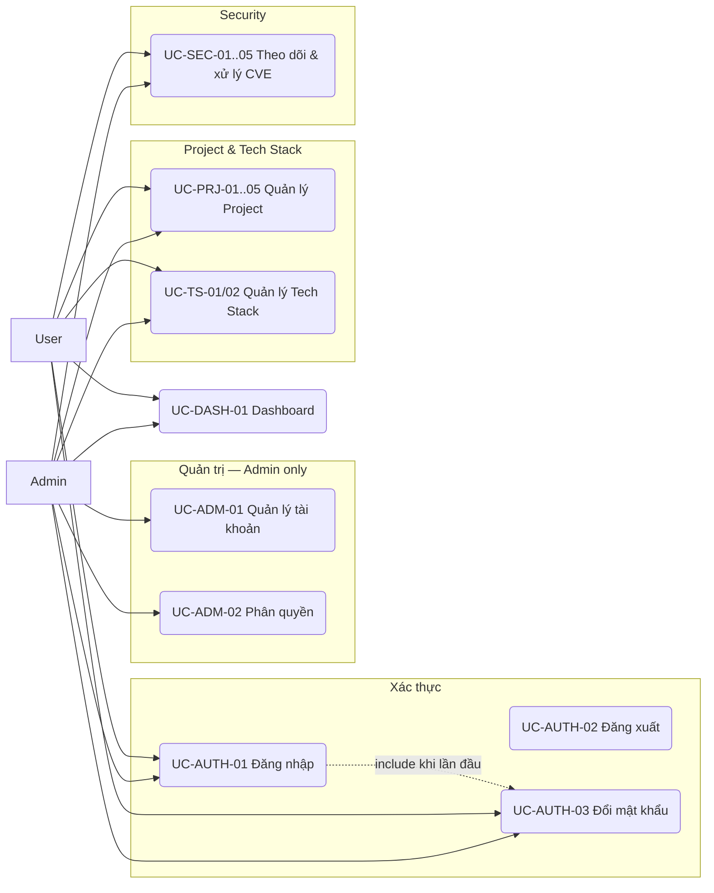

# Usecase Overview — Hệ thống Quản lý Dự án, Tech Stack & Bảo mật

> **Phase**: Design — Foundation | **Trạng thái**: Draft v0.2 — chờ BU verify
> **Upstream**: `01-business-understanding.md` (v0.2, Decision log DEC-01..DEC-12)
> **Thay đổi v0.1 → v0.2**: bổ sung UC-AUTH-03 (đổi mật khẩu), UC-PRJ-05 (kết xuất CSV), UC-SEC-04 (xem lịch sử trạng thái); thêm đặc tả luồng chính/luồng phụ cho 6 use case cốt lõi; gỡ các `[ASSUMED]` đã được chốt trong Decision log.

---

## 1. System overview

Hệ thống quản trị nội bộ cho phép tổ chức theo dõi danh mục dự án phần mềm, tech stack theo từng dự án và tình trạng bảo mật (CVE). Người dùng đăng nhập với vai trò **Admin** hoặc **User**. Admin quản trị tài khoản, phân quyền và có toàn quyền trên dữ liệu. User **đọc được toàn hệ thống** nhưng chỉ **ghi** được dữ liệu của Project mà mình là thành viên `[DECIDED — DEC-03]`.

Ranh giới hệ thống: mọi dữ liệu do con người nhập. Hệ thống không quét mã nguồn, không gọi API GitHub/GitLab, không đồng bộ CVE từ NVD/OSV, không gửi email `[DECIDED — DEC-02, DEC-07, DEC-08b]`.

## 2. Actors

| Actor                           | Loại                  | Mô tả                                                                                                                                    | Số lượng dự kiến          |
| ------------------------------- | --------------------- | ---------------------------------------------------------------------------------------------------------------------------------------- | ------------------------- |
| Admin                           | Primary — người       | Quản trị hệ thống: tài khoản, phân quyền, toàn quyền trên mọi dữ liệu; là người duy nhất được chấp nhận rủi ro cho lỗ hổng Critical/High | ~5 `[ASSUMED]`            |
| User                            | Primary — người       | Thành viên dự án (PM, Tech Lead, Dev, QA): xem toàn hệ thống, cập nhật dữ liệu dự án mình tham gia                                       | ~145 `[DECIDED — DEC-01]` |
| Hệ thống (Scheduler/Aggregator) | Supporting — hệ thống | Tổng hợp số liệu Dashboard từ dữ liệu đã nhập tại thời điểm mở màn                                                                       | —                         |

Không có actor bên ngoài (không có hệ thống thứ ba nào tương tác) trong giai đoạn 1.

## 3. Use case summary table

| ID         | Name                              | Primary actor            | Goal                                                                               | Pre-condition                                                               | Post-condition                                                  | Priority |
| ---------- | --------------------------------- | ------------------------ | ---------------------------------------------------------------------------------- | --------------------------------------------------------------------------- | --------------------------------------------------------------- | -------- |
| UC-AUTH-01 | Đăng nhập                         | Admin, User              | Truy cập hệ thống bằng tài khoản được cấp                                          | Có tài khoản trạng thái Hoạt động                                           | Phiên đăng nhập được tạo; nếu là lần đầu → buộc sang UC-AUTH-03 | Must     |
| UC-AUTH-02 | Đăng xuất                         | Admin, User              | Kết thúc phiên làm việc                                                            | Đã đăng nhập                                                                | Phiên bị hủy, quay về màn Đăng nhập                             | Must     |
| UC-AUTH-03 | Đổi mật khẩu                      | Admin, User              | Đặt mật khẩu mới (bắt buộc ở lần đăng nhập đầu)                                    | Đã đăng nhập                                                                | Mật khẩu được cập nhật, cờ "phải đổi mật khẩu" được gỡ          | Must     |
| UC-ADM-01  | Quản lý tài khoản người dùng      | Admin                    | Tạo, sửa, khóa/mở khóa tài khoản; đặt lại mật khẩu                                 | Đăng nhập với vai trò Admin                                                 | Tài khoản được cập nhật                                         | Must     |
| UC-ADM-02  | Phân quyền (gán vai trò)          | Admin                    | Gán vai trò Admin/User cho tài khoản                                               | Đăng nhập Admin                                                             | Vai trò được cập nhật; đảm bảo còn ≥1 Admin hoạt động (BR-05)   | Must     |
| UC-PRJ-01  | Xem danh sách & tìm kiếm Project  | Admin, User              | Tra cứu dự án theo tên/mã, trạng thái, công nghệ                                   | Đã đăng nhập                                                                | —                                                               | Must     |
| UC-PRJ-02  | Xem chi tiết Project              | Admin, User              | Xem thông tin, repository, thành viên, tech stack, lỗ hổng                         | Project tồn tại                                                             | —                                                               | Must     |
| UC-PRJ-03  | Tạo / cập nhật Project            | Admin, User              | Khai báo thông tin dự án, repository, trạng thái                                   | Tạo: đã đăng nhập. Sửa: là thành viên hoặc Admin                            | Hồ sơ Project được lưu; người tạo thành PM (BR-04)              | Must     |
| UC-PRJ-04  | Quản lý thành viên Project        | Admin, User (thành viên) | Thêm/xóa thành viên, gán vai trò trong dự án                                       | Project tồn tại, có quyền ghi                                               | Danh sách thành viên cập nhật; luôn còn ≥1 PM (BR-08)           | Must     |
| UC-PRJ-05  | Kết xuất danh sách Project        | Admin, User              | Tải danh sách dự án đang lọc ra CSV                                                | Đã đăng nhập                                                                | Tệp CSV được tải về                                             | Should   |
| UC-TS-01   | Xem Tech Stack của Project        | Admin, User              | Xem công nghệ và phiên bản đang dùng                                               | Project tồn tại                                                             | —                                                               | Must     |
| UC-TS-02   | Cập nhật Tech Stack               | Admin, User (thành viên) | Thêm/sửa/gỡ hạng mục công nghệ kèm phiên bản                                       | Project tồn tại, có quyền ghi                                               | Tech stack được lưu                                             | Must     |
| UC-SEC-01  | Xem danh sách lỗ hổng             | Admin, User              | Tra cứu CVE theo project, mức nghiêm trọng, trạng thái; gom nhóm theo CVE          | Đã đăng nhập                                                                | —                                                               | Must     |
| UC-SEC-02  | Ghi nhận lỗ hổng (CVE)            | Admin, User (thành viên) | Khai báo CVE, thư viện/phiên bản ảnh hưởng, mức nghiêm trọng, khuyến nghị nâng cấp | Project tồn tại, có quyền ghi                                               | Lỗ hổng được ghi nhận, trạng thái "Mới"                         | Must     |
| UC-SEC-03  | Cập nhật trạng thái xử lý lỗ hổng | Admin, User (thành viên) | Chuyển trạng thái theo luồng, kèm ghi chú bắt buộc                                 | Lỗ hổng tồn tại, có quyền ghi; Critical/High → "Chấp nhận rủi ro" cần Admin | Trạng thái cập nhật; một bản ghi lịch sử được tạo               | Must     |
| UC-SEC-04  | Xem lịch sử xử lý lỗ hổng         | Admin, User              | Xem ai đã chuyển trạng thái gì, khi nào, vì sao                                    | Lỗ hổng tồn tại                                                             | —                                                               | Should   |
| UC-SEC-05  | Kết xuất danh sách lỗ hổng        | Admin, User              | Tải danh sách lỗ hổng đang lọc ra CSV                                              | Đã đăng nhập                                                                | Tệp CSV được tải về                                             | Should   |
| UC-DASH-01 | Xem Dashboard tổng quan           | Admin, User              | Xem thống kê dự án, công nghệ, tình trạng bảo mật; điều hướng tới danh sách đã lọc | Đã đăng nhập                                                                | —                                                               | Must     |

## 4. Use case diagram

## 5. Đặc tả luồng — các use case cốt lõi

### UC-AUTH-01 — Đăng nhập

| Mục                | Nội dung                                                                                                                                        |
| ------------------ | ----------------------------------------------------------------------------------------------------------------------------------------------- |
| **Actor**          | Admin, User                                                                                                                                     |
| **Pre-condition**  | Tài khoản tồn tại, trạng thái Hoạt động, không đang bị khóa tạm                                                                                 |
| **Luồng chính**    | 1. Người dùng mở `/login`. 2. Nhập email và mật khẩu. 3. Bấm "Đăng nhập". 4. Hệ thống kiểm tra thông tin. 5. Tạo phiên và chuyển tới Dashboard. |
| **Luồng phụ A1**   | Bước 4 — tài khoản có cờ "phải đổi mật khẩu" → chuyển tới UC-AUTH-03, chặn mọi màn khác cho tới khi đổi xong.                                   |
| **Ngoại lệ E1**    | Email hoặc mật khẩu sai → thông báo `MSG-AUTH-001`, không nói rõ sai ở trường nào; tăng bộ đếm sai.                                             |
| **Ngoại lệ E2**    | Sai 5 lần trong 15 phút → khóa tạm 15 phút, thông báo `MSG-AUTH-002` (BR-21).                                                                   |
| **Ngoại lệ E3**    | Tài khoản trạng thái Khóa → thông báo `MSG-AUTH-003`, gợi ý liên hệ quản trị viên.                                                              |
| **Post-condition** | Phiên hợp lệ 30 phút không thao tác (BR-22)                                                                                                     |
| **Business rules** | BR-20, BR-21, BR-22, BR-23                                                                                                                      |

### UC-PRJ-03 — Tạo / cập nhật Project

| Mục                | Nội dung                                                                                                                                                                                                                                                                           |
| ------------------ | ---------------------------------------------------------------------------------------------------------------------------------------------------------------------------------------------------------------------------------------------------------------------------------- |
| **Actor**          | Admin (mọi Project), User (tạo mới; sửa Project mình là thành viên)                                                                                                                                                                                                                |
| **Pre-condition**  | Đã đăng nhập; với thao tác sửa: là thành viên của Project hoặc là Admin                                                                                                                                                                                                            |
| **Luồng chính**    | 1. Từ danh sách Project bấm "Tạo dự án". 2. Nhập mã, tên, mô tả, khách hàng, trạng thái. 3. Thêm 0..n repository (tên + URL). 4. Bấm "Lưu". 5. Hệ thống kiểm tra trùng mã/tên. 6. Lưu, tạo bản ghi ProjectMember cho người tạo với vai trò PM. 7. Chuyển tới màn chi tiết Project. |
| **Luồng phụ A1**   | Chế độ sửa: bước 1 vào từ màn chi tiết; bước 6 không tạo lại ProjectMember.                                                                                                                                                                                                        |
| **Ngoại lệ E1**    | Mã hoặc tên trùng → `MSG-BIZ-001` / `MSG-BIZ-002` inline dưới trường tương ứng, không gọi API lưu lần hai.                                                                                                                                                                         |
| **Ngoại lệ E2**    | Chọn trạng thái "Kết thúc" khi Project còn lỗ hổng ở trạng thái Mới/Đang xử lý → chặn, hiển thị `MSG-BIZ-003` kèm số lượng và liên kết tới danh sách lỗ hổng còn mở (BR-18).                                                                                                       |
| **Ngoại lệ E3**    | Bản ghi đã bị người khác sửa → `MSG-BIZ-020`, yêu cầu tải lại.                                                                                                                                                                                                                     |
| **Post-condition** | Hồ sơ Project được lưu; người tạo là PM                                                                                                                                                                                                                                            |
| **Business rules** | BR-02, BR-04, BR-06, BR-08, BR-10, BR-18                                                                                                                                                                                                                                           |

### UC-TS-02 — Cập nhật Tech Stack

| Mục                | Nội dung                                                                                                                                                                            |
| ------------------ | ----------------------------------------------------------------------------------------------------------------------------------------------------------------------------------- |
| **Actor**          | Admin, User là thành viên Project                                                                                                                                                   |
| **Pre-condition**  | Project tồn tại; người dùng có quyền ghi trên Project đó                                                                                                                            |
| **Luồng chính**    | 1. Mở tab Tech Stack của Project. 2. Bấm "Thêm hạng mục". 3. Chọn loại, nhập tên công nghệ và phiên bản, ghi chú. 4. Lưu. 5. Bảng làm mới, hạng mục mới xuất hiện đúng nhóm loại.   |
| **Luồng phụ A1**   | Sửa: bấm biểu tượng sửa trên dòng → popup mở với dữ liệu hiện tại.                                                                                                                  |
| **Luồng phụ A2**   | Gỡ: bấm biểu tượng xóa → hộp thoại xác nhận `MSG-INF-010`; nếu hạng mục đang bị lỗ hổng chưa đóng tham chiếu theo tên thư viện → cảnh báo `MSG-BIZ-011` nhưng vẫn cho tiếp (EC-06). |
| **Ngoại lệ E1**    | Trùng loại + tên trong cùng Project → `MSG-BIZ-010` inline dưới trường Tên công nghệ (BR-09).                                                                                       |
| **Ngoại lệ E2**    | Không đủ quyền ghi → các nút Thêm/Sửa/Gỡ không hiển thị; nếu gọi trực tiếp API → `MSG-AUTH-005`.                                                                                    |
| **Post-condition** | Tech stack được lưu kèm người sửa và thời điểm sửa cuối                                                                                                                             |
| **Business rules** | BR-02, BR-09, BR-17                                                                                                                                                                 |

### UC-SEC-02 — Ghi nhận lỗ hổng (CVE)

| Mục                | Nội dung                                                                                                                                                                                                                                                                                                                                             |
| ------------------ | ---------------------------------------------------------------------------------------------------------------------------------------------------------------------------------------------------------------------------------------------------------------------------------------------------------------------------------------------------- |
| **Actor**          | Admin, User là thành viên Project                                                                                                                                                                                                                                                                                                                    |
| **Pre-condition**  | Project tồn tại và **không** ở trạng thái Kết thúc; người dùng có quyền ghi                                                                                                                                                                                                                                                                          |
| **Luồng chính**    | 1. Từ danh sách lỗ hổng hoặc tab Security của Project bấm "Ghi nhận lỗ hổng". 2. Chọn Project, nhập mã CVE, thư viện, phiên bản bị ảnh hưởng, chọn mức nghiêm trọng, ngày ghi nhận, khuyến nghị nâng cấp, người phụ trách. 3. Lưu. 4. Hệ thống tạo bản ghi với trạng thái "Mới" và một bản ghi lịch sử đầu tiên. 5. Chuyển tới màn chi tiết lỗ hổng. |
| **Luồng phụ A1**   | Vào từ tab Security của Project: trường Project được điền sẵn và khóa.                                                                                                                                                                                                                                                                               |
| **Ngoại lệ E1**    | Mã CVE sai định dạng `CVE-YYYY-NNNN(N…)` → `MSG-VAL-020` inline.                                                                                                                                                                                                                                                                                     |
| **Ngoại lệ E2**    | Trùng (Project + CVE + thư viện) → `MSG-BIZ-030`, kèm liên kết tới bản ghi đã có (BR-12).                                                                                                                                                                                                                                                            |
| **Ngoại lệ E3**    | Người phụ trách được chọn không phải thành viên Project → cảnh báo `MSG-BIZ-031` nhưng vẫn cho lưu; tài khoản bị khóa thì không xuất hiện trong danh sách chọn.                                                                                                                                                                                      |
| **Ngoại lệ E4**    | Project đã Kết thúc → không cho ghi nhận mới, `MSG-BIZ-032`.                                                                                                                                                                                                                                                                                         |
| **Post-condition** | Lỗ hổng ở trạng thái "Mới", có mặt trên Dashboard nếu Project chưa Kết thúc                                                                                                                                                                                                                                                                          |
| **Business rules** | BR-11, BR-12, BR-13                                                                                                                                                                                                                                                                                                                                  |

### UC-SEC-03 — Cập nhật trạng thái xử lý lỗ hổng

| Mục                | Nội dung                                                                                                                                                                                                                                          |
| ------------------ | ------------------------------------------------------------------------------------------------------------------------------------------------------------------------------------------------------------------------------------------------- |
| **Actor**          | Admin, User là thành viên Project                                                                                                                                                                                                                 |
| **Pre-condition**  | Lỗ hổng tồn tại; người dùng có quyền ghi trên Project của lỗ hổng                                                                                                                                                                                 |
| **Luồng chính**    | 1. Mở chi tiết lỗ hổng. 2. Bấm "Chuyển trạng thái". 3. Chọn trạng thái đích trong các trạng thái hợp lệ theo §5.1 của BU. 4. Nhập các trường bắt buộc theo trạng thái đích. 5. Xác nhận. 6. Hệ thống cập nhật trạng thái và ghi một dòng lịch sử. |
| **Luồng phụ A1**   | Đích = "Đã xử lý" → bắt buộc ngày xử lý (≥ ngày ghi nhận, ≤ hôm nay) và ghi chú cách xử lý (BR-16); hiển thị nhắc "Đừng quên cập nhật phiên bản trong tab Tech Stack" `MSG-INF-020` (BR-17).                                                      |
| **Luồng phụ A2**   | Đích = "Chấp nhận rủi ro" → bắt buộc lý do. Nếu mức là Critical/High và người dùng **không phải Admin** → nút bị vô hiệu hóa kèm tooltip; gọi trực tiếp API trả `MSG-AUTH-006` (BR-15).                                                           |
| **Luồng phụ A3**   | Đích = "Đang xử lý" từ "Đã xử lý" (mở lại) → bắt buộc lý do mở lại.                                                                                                                                                                               |
| **Ngoại lệ E1**    | Chuyển trạng thái không hợp lệ theo sơ đồ (ví dụ về "Mới") → `MSG-BIZ-040`.                                                                                                                                                                       |
| **Ngoại lệ E2**    | Ngày xử lý trước ngày ghi nhận → `MSG-VAL-030` inline.                                                                                                                                                                                            |
| **Ngoại lệ E3**    | Bản ghi đã bị người khác chuyển trạng thái → `MSG-BIZ-020`, hiển thị trạng thái hiện tại, buộc tải lại.                                                                                                                                           |
| **Post-condition** | Trạng thái mới được lưu; một dòng lịch sử bất biến được tạo (BR-14)                                                                                                                                                                               |
| **Business rules** | BR-13, BR-14, BR-15, BR-16, BR-17                                                                                                                                                                                                                 |

### UC-DASH-01 — Xem Dashboard tổng quan

| Mục                | Nội dung                                                                                                                                                                                                                                                                     |
| ------------------ | ---------------------------------------------------------------------------------------------------------------------------------------------------------------------------------------------------------------------------------------------------------------------------- |
| **Actor**          | Admin, User                                                                                                                                                                                                                                                                  |
| **Pre-condition**  | Đã đăng nhập                                                                                                                                                                                                                                                                 |
| **Luồng chính**    | 1. Đăng nhập thành công hoặc bấm menu Dashboard. 2. Hệ thống tổng hợp số liệu tại thời điểm mở. 3. Hiển thị 4 khối: cảnh báo bảo mật, thống kê dự án, phân bố công nghệ, tình trạng lỗ hổng. 4. Người dùng bấm vào một chỉ số → đi tới danh sách tương ứng đã áp sẵn bộ lọc. |
| **Luồng phụ A1**   | Bật tùy chọn "Bao gồm dự án đã kết thúc" → mọi số liệu tính lại (BR-19).                                                                                                                                                                                                     |
| **Ngoại lệ E1**    | Chưa có dữ liệu nào → mỗi khối hiển thị trạng thái rỗng riêng, không hiển thị số 0 gây hiểu nhầm.                                                                                                                                                                            |
| **Ngoại lệ E2**    | Lỗi tổng hợp số liệu ở một khối → khối đó hiển thị lỗi kèm nút "Thử lại", các khối khác vẫn hiển thị bình thường.                                                                                                                                                            |
| **Post-condition** | — (chỉ đọc)                                                                                                                                                                                                                                                                  |
| **Business rules** | BR-03, BR-19                                                                                                                                                                                                                                                                 |

## 6. Usecase ↔ Screen mapping

| Use case                        | Screen                                                                             |
| ------------------------------- | ---------------------------------------------------------------------------------- |
| UC-AUTH-01, UC-AUTH-02          | SCR-AUTH-10 Đăng nhập                                                              |
| UC-AUTH-03                      | SCR-AUTH-11 Đổi mật khẩu                                                           |
| UC-ADM-01, UC-ADM-02            | SCR-ADM-10 Quản lý người dùng, SCR-ADM-11 Popup tạo/sửa tài khoản                  |
| UC-PRJ-01, UC-PRJ-05            | SCR-PRJ-10 Danh sách Project                                                       |
| UC-PRJ-02                       | SCR-PRJ-20 Chi tiết Project — tab Thông tin                                        |
| UC-PRJ-03                       | SCR-PRJ-11 Tạo/Sửa Project                                                         |
| UC-PRJ-04                       | SCR-PRJ-21 Tab Thành viên                                                          |
| UC-TS-01, UC-TS-02              | SCR-PRJ-22 Tab Tech Stack, SCR-PRJ-23 Popup hạng mục công nghệ                     |
| UC-SEC-01, UC-SEC-05            | SCR-SEC-10 Danh sách lỗ hổng (toàn hệ thống), SCR-PRJ-24 Tab Security theo Project |
| UC-SEC-02, UC-SEC-03, UC-SEC-04 | SCR-SEC-11 Chi tiết/Tạo lỗ hổng                                                    |
| UC-DASH-01                      | SCR-DASH-10 Dashboard                                                              |

## 7. Usecase ↔ Entity mapping (CRUD)

| Use case        | User  | Project | Repository | ProjectMember | TechStackItem | Vulnerability | VulnStatusHistory |
| --------------- | ----- | ------- | ---------- | ------------- | ------------- | ------------- | ----------------- |
| UC-AUTH-01/02   | R     | —       | —          | —             | —             | —             | —                 |
| UC-AUTH-03      | U     | —       | —          | —             | —             | —             | —                 |
| UC-ADM-01       | C R U | —       | —          | R             | —             | —             | —                 |
| UC-ADM-02       | R U   | —       | —          | —             | —             | —             | —                 |
| UC-PRJ-01/02/05 | R     | R       | R          | R             | R             | R             | —                 |
| UC-PRJ-03       | R     | C U     | C U D      | C             | —             | R             | —                 |
| UC-PRJ-04       | R     | R       | —          | C U D         | —             | R             | —                 |
| UC-TS-01/02     | —     | R       | —          | R             | C R U D       | R             | —                 |
| UC-SEC-01/04/05 | R     | R       | —          | R             | —             | R             | R                 |
| UC-SEC-02       | R     | R       | —          | R             | R             | C             | C                 |
| UC-SEC-03       | R     | R       | —          | R             | —             | U             | C                 |
| UC-DASH-01      | —     | R       | —          | —             | R             | R             | —                 |

> Không có ô "D" cho Vulnerability và VulnStatusHistory — đúng theo BR-13 và BR-14.

## 8. Open questions / conflicts

- Q-09 (BU): nếu chính sách nội bộ yêu cầu chỉ Admin xem lỗ hổng Critical, UC-SEC-01 và Role Matrix RM-002 phải sửa lại phạm vi đọc.
- Q-10 (BU): nếu cần audit log truy cập, sẽ phát sinh UC-ADM-03 "Xem nhật ký hệ thống".
- Không phát hiện conflict giữa UC và BU v0.2.

**Last Updated**: 2026-08-26
