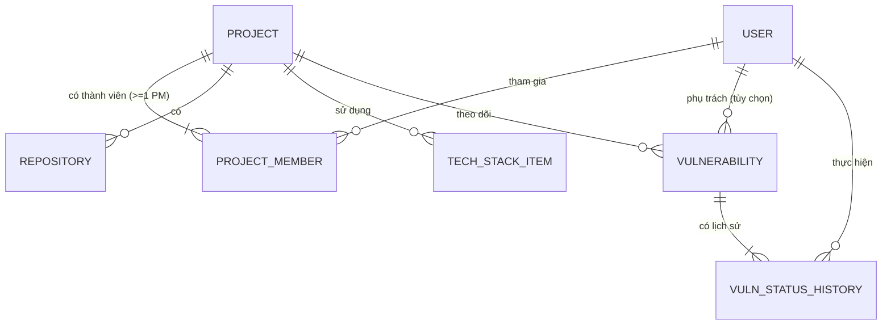

# Business Entities — Hệ thống Quản lý Dự án, Tech Stack & Bảo mật

> **Phase**: Design — Foundation | **Trạng thái**: Draft v0.2 — chờ BU verify
> **Upstream**: `01-business-understanding.md` (v0.2), `02-usecase-overview.md` (v0.2)
> **Thay đổi v0.1 → v0.2**: thêm entity **VulnerabilityStatusHistory** (DEC-10); chốt tập giá trị Project.status và ProjectMember.project_role (DEC-08); chốt khóa duy nhất Vulnerability (DEC-04); bổ sung trường audit chung; bổ sung ràng buộc R-ENT-007..012 và ma trận vòng đời.

---

## 1. Danh sách thực thể (Entity list)

| Entity                                          | Ý nghĩa nghiệp vụ                                          | Owner nghiệp vụ          | Số lượng dự kiến | Ghi chú                                  |
| ----------------------------------------------- | ---------------------------------------------------------- | ------------------------ | ---------------- | ---------------------------------------- |
| User (Người dùng)                               | Tài khoản đăng nhập hệ thống, mang vai trò Admin hoặc User | Admin                    | ~150             | Khóa thay vì xóa (BR-23)                 |
| Project (Dự án)                                 | Hồ sơ một dự án phần mềm: thông tin chung, trạng thái      | PM / Admin               | ~200             | Tên và mã duy nhất toàn hệ thống (BR-06) |
| Repository                                      | Kho mã nguồn thuộc một dự án — chỉ lưu đường dẫn           | Thành viên dự án         | ~400             | Không tích hợp API (BR-10)               |
| ProjectMember (Thành viên dự án)                | Liên kết User ↔ Project kèm vai trò trong dự án            | PM / Admin               | ~800             | Vai trò trong dự án ≠ vai trò hệ thống   |
| TechStackItem (Hạng mục công nghệ)              | Một công nghệ dự án đang dùng: loại, tên, phiên bản        | Thành viên dự án         | ~2.000           | 5 loại cố định                           |
| Vulnerability (Lỗ hổng)                         | Một CVE ghi nhận cho **một** dự án                         | Thành viên dự án / Admin | ~5.000           | Không xóa, chỉ chuyển trạng thái (BR-13) |
| VulnerabilityStatusHistory (Lịch sử trạng thái) | Dấu vết mỗi lần chuyển trạng thái lỗ hổng                  | Hệ thống ghi tự động     | ~15.000          | Bất biến: không sửa, không xóa (BR-14)   |

Dashboard là **màn hình tổng hợp** từ các entity trên, không phải entity riêng.

### 1.1 Trường audit chung

Mọi entity (trừ `VulnerabilityStatusHistory` vốn đã là bản ghi lịch sử) đều có bộ trường sau, không lặp lại trong từng bảng bên dưới:

| Field      | Nhãn hiển thị       | Bắt buộc | Kiểu            | Quy tắc                         |
| ---------- | ------------------- | -------- | --------------- | ------------------------------- |
| created_at | Ngày tạo            | Có       | Thời điểm       | Hệ thống gán, không sửa được    |
| created_by | Người tạo           | Có       | Tham chiếu User | Hệ thống gán từ phiên đăng nhập |
| updated_at | Cập nhật lần cuối   | Có       | Thời điểm       | Hệ thống gán mỗi lần lưu        |
| updated_by | Người cập nhật cuối | Có       | Tham chiếu User | Hệ thống gán từ phiên đăng nhập |

> `updated_at` còn được dùng làm **mốc kiểm tra xung đột đồng thời** (EC-05): khi lưu, nếu `updated_at` phía máy chủ khác giá trị người dùng đã tải về → chặn và báo `MSG-BIZ-020`.

## 2. Đặc tả từng thực thể — từ điển trường

### 2.1 User

| Field                | Nhãn hiển thị        | Bắt buộc | Kiểu            | Quy tắc một trường                                                                                                       | Mặc định / tập giá trị                      | Nguồn                |
| -------------------- | -------------------- | -------- | --------------- | ------------------------------------------------------------------------------------------------------------------------ | ------------------------------------------- | -------------------- |
| email                | Email đăng nhập      | Có       | Văn bản (email) | Đúng định dạng email; duy nhất toàn hệ thống (so sánh không phân biệt hoa/thường); tối đa 255 ký tự; lưu dạng chữ thường | —                                           | `[FROM-TEAM]`        |
| full_name            | Họ tên               | Có       | Văn bản         | 2–100 ký tự; cắt khoảng trắng đầu/cuối                                                                                   | —                                           | `[ASSUMED]`          |
| password_hash        | Mật khẩu             | Có       | Văn bản (băm)   | Mật khẩu gốc ≥ 8 ký tự, có chữ hoa + chữ thường + số; lưu dạng băm, không bao giờ hiển thị lại                           | —                                           | `[DECIDED — DEC-12]` |
| must_change_password | Phải đổi mật khẩu    | Có       | Đúng/Sai        | Đặt `Đúng` khi Admin tạo tài khoản hoặc đặt lại mật khẩu; gỡ sau khi người dùng đổi thành công                           | Mặc định: Đúng                              | `[DECIDED — DEC-12]` |
| role                 | Vai trò hệ thống     | Có       | Danh mục        | Chỉ nhận một trong hai giá trị; không hạ vai trò Admin cuối cùng (BR-05)                                                 | `Admin` / `User` — mặc định `User`          | `[FROM-TEAM]`        |
| status               | Trạng thái tài khoản | Có       | Danh mục        | Tài khoản `Khóa` không đăng nhập được và không chọn được làm người phụ trách mới                                         | `Hoạt động` / `Khóa` — mặc định `Hoạt động` | `[ASSUMED]`          |
| failed_login_count   | Số lần đăng nhập sai | Không    | Số nguyên       | Hệ thống quản lý; đặt lại về 0 khi đăng nhập thành công                                                                  | Mặc định 0                                  | `[ASSUMED — BR-21]`  |
| locked_until         | Khóa tạm đến         | Không    | Thời điểm       | Có giá trị khi đang bị khóa tạm do sai mật khẩu                                                                          | —                                           | `[ASSUMED — BR-21]`  |
| last_login_at        | Đăng nhập gần nhất   | Không    | Thời điểm       | Chỉ đọc, hiển thị ở màn quản lý người dùng                                                                               | —                                           | `[ASSUMED]`          |

### 2.2 Project

| Field       | Nhãn hiển thị                | Bắt buộc | Kiểu        | Quy tắc một trường                                                                                                                   | Mặc định / tập giá trị                                                                           | Nguồn                |
| ----------- | ---------------------------- | -------- | ----------- | ------------------------------------------------------------------------------------------------------------------------------------ | ------------------------------------------------------------------------------------------------ | -------------------- |
| code        | Mã dự án                     | Có       | Văn bản     | Duy nhất toàn hệ thống; 2–20 ký tự; chỉ chữ hoa không dấu, số và dấu gạch dưới (`^[A-Z0-9_]{2,20}$`); **không sửa được sau khi tạo** | —                                                                                                | `[ASSUMED]`          |
| name        | Tên dự án                    | Có       | Văn bản     | Duy nhất toàn hệ thống (so sánh không phân biệt hoa/thường, đã trim); 3–100 ký tự                                                    | —                                                                                                | `[FROM-TEAM]`        |
| description | Mô tả                        | Không    | Văn bản dài | Tối đa 1.000 ký tự                                                                                                                   | —                                                                                                | `[FROM-TEAM]`        |
| status      | Trạng thái                   | Có       | Danh mục    | Chuyển sang `Kết thúc` bị chặn nếu còn lỗ hổng mở (BR-18)                                                                            | `Khởi tạo` / `Đang phát triển` / `Đang vận hành` / `Tạm dừng` / `Kết thúc` — mặc định `Khởi tạo` | `[DECIDED — DEC-08]` |
| customer    | Khách hàng / đơn vị chủ quản | Không    | Văn bản     | Tối đa 100 ký tự                                                                                                                     | —                                                                                                | `[ASSUMED]`          |
| start_date  | Ngày bắt đầu                 | Không    | Ngày        | —                                                                                                                                    | —                                                                                                | `[ASSUMED]`          |
| end_date    | Ngày kết thúc                | Không    | Ngày        | Không được trước `start_date`; bắt buộc khi status = `Kết thúc`                                                                      | —                                                                                                | `[ASSUMED]`          |

### 2.3 Repository

| Field   | Nhãn hiển thị  | Bắt buộc | Kiểu               | Quy tắc một trường                                                                                                | Nguồn         |
| ------- | -------------- | -------- | ------------------ | ----------------------------------------------------------------------------------------------------------------- | ------------- |
| project | Dự án          | Có       | Tham chiếu Project | Repository luôn thuộc đúng một Project                                                                            | `[FROM-TEAM]` |
| name    | Tên repository | Có       | Văn bản            | 1–100 ký tự; duy nhất trong cùng Project                                                                          | `[FROM-TEAM]` |
| url     | Đường dẫn      | Có       | Văn bản (URL)      | URL hợp lệ, bắt buộc scheme `http`/`https`; tối đa 500 ký tự; trùng URL trong cùng Project → cảnh báo, không chặn | `[FROM-TEAM]` |
| note    | Ghi chú        | Không    | Văn bản            | Tối đa 200 ký tự                                                                                                  | `[ASSUMED]`   |

### 2.4 ProjectMember

| Field        | Nhãn hiển thị       | Bắt buộc | Kiểu               | Quy tắc một trường                                                                       | Tập giá trị                                                 | Nguồn                |
| ------------ | ------------------- | -------- | ------------------ | ---------------------------------------------------------------------------------------- | ----------------------------------------------------------- | -------------------- |
| project      | Dự án               | Có       | Tham chiếu Project | —                                                                                        | —                                                           | `[FROM-TEAM]`        |
| user         | Thành viên          | Có       | Tham chiếu User    | Một User không xuất hiện hai lần trong cùng Project; chỉ chọn được tài khoản `Hoạt động` | —                                                           | `[FROM-TEAM]`        |
| project_role | Vai trò trong dự án | Có       | Danh mục           | Mỗi Project phải còn ≥ 1 `PM` (BR-08)                                                    | `PM` / `Tech Lead` / `Dev` / `QA` / `Khác` — mặc định `Dev` | `[DECIDED — DEC-08]` |
| joined_date  | Ngày tham gia       | Không    | Ngày               | Không được là ngày tương lai                                                             | Mặc định: hôm nay                                           | `[ASSUMED]`          |

### 2.5 TechStackItem

| Field    | Nhãn hiển thị       | Bắt buộc | Kiểu               | Quy tắc một trường                                                                                                                                      | Tập giá trị                                               | Nguồn         |
| -------- | ------------------- | -------- | ------------------ | ------------------------------------------------------------------------------------------------------------------------------------------------------- | --------------------------------------------------------- | ------------- |
| project  | Dự án               | Có       | Tham chiếu Project | —                                                                                                                                                       | —                                                         | `[FROM-TEAM]` |
| category | Loại                | Có       | Danh mục           | Cố định 5 giá trị, không mở rộng ở giai đoạn 1                                                                                                          | `Ngôn ngữ` / `Framework` / `Database` / `Cache` / `Cloud` | `[FROM-TEAM]` |
| name     | Tên công nghệ       | Có       | Văn bản            | 1–50 ký tự; duy nhất theo cặp (project + category + name), so sánh không phân biệt hoa/thường (BR-09). Ví dụ: Java, Spring Boot, PostgreSQL, Redis, AWS | —                                                         | `[FROM-TEAM]` |
| version  | Phiên bản đang dùng | Có       | Văn bản            | 1–30 ký tự; ghi theo phiên bản thực tế, ví dụ `17`, `3.2.1`, `2024.1`                                                                                   | —                                                         | `[FROM-TEAM]` |
| note     | Ghi chú             | Không    | Văn bản            | Tối đa 200 ký tự                                                                                                                                        | —                                                         | `[ASSUMED]`   |

### 2.6 Vulnerability

| Field              | Nhãn hiển thị                    | Bắt buộc                          | Kiểu               | Quy tắc một trường                                                                                                      | Tập giá trị                                                             | Nguồn                         |
| ------------------ | -------------------------------- | --------------------------------- | ------------------ | ----------------------------------------------------------------------------------------------------------------------- | ----------------------------------------------------------------------- | ----------------------------- |
| project            | Dự án                            | Có                                | Tham chiếu Project | Không sửa được sau khi tạo; Project `Kết thúc` không cho tạo mới (EC-02)                                                | —                                                                       | `[FROM-TEAM]`                 |
| cve_id             | Mã CVE                           | Có                                | Văn bản            | Đúng định dạng `CVE-YYYY-NNNN` trở lên (`^CVE-\d{4}-\d{4,7}$`); lưu chữ hoa                                             | —                                                                       | `[FROM-TEAM]`                 |
| library            | Thư viện ảnh hưởng               | Có                                | Văn bản            | 1–100 ký tự; nhập tay dạng văn bản, **không** là khóa ngoại tới TechStackItem                                           | —                                                                       | `[FROM-TEAM]`                 |
| affected_version   | Phiên bản đang dùng bị ảnh hưởng | Có                                | Văn bản            | 1–30 ký tự                                                                                                              | —                                                                       | `[FROM-TEAM]`                 |
| severity           | Mức nghiêm trọng                 | Có                                | Danh mục           | Quyết định ai được "Chấp nhận rủi ro" (BR-15)                                                                           | `Critical` / `High` / `Medium` / `Low`                                  | `[ASSUMED — theo chuẩn CVSS]` |
| status             | Trạng thái xử lý                 | Có                                | Danh mục           | Chuyển theo sơ đồ BU §5.1; không quay về `Mới`                                                                          | `Mới` / `Đang xử lý` / `Đã xử lý` / `Chấp nhận rủi ro` — mặc định `Mới` | `[ASSUMED]`                   |
| recommendation     | Khuyến nghị nâng cấp             | Không                             | Văn bản            | Tối đa 500 ký tự; ví dụ "Nâng lên 2.17.1 trở lên"                                                                       | —                                                                       | `[FROM-TEAM]`                 |
| assignee           | Người phụ trách                  | Không (Có khi `Đang xử lý`)       | Tham chiếu User    | Bắt buộc khi chuyển sang `Đang xử lý`; nên là thành viên Project (cảnh báo nếu không); không chọn được tài khoản `Khóa` | —                                                                       | `[ASSUMED]`                   |
| detected_date      | Ngày ghi nhận                    | Có                                | Ngày               | Không được là ngày tương lai                                                                                            | Mặc định: hôm nay                                                       | `[ASSUMED]`                   |
| resolved_date      | Ngày xử lý xong                  | Không (Có khi `Đã xử lý`)         | Ngày               | Chỉ có giá trị khi trạng thái `Đã xử lý`; ≥ `detected_date` và ≤ hôm nay                                                | —                                                                       | `[ASSUMED]`                   |
| resolution_note    | Ghi chú cách xử lý               | Không (Có khi `Đã xử lý`)         | Văn bản            | Tối đa 500 ký tự (BR-16)                                                                                                | —                                                                       | `[ASSUMED]`                   |
| risk_accept_reason | Lý do chấp nhận rủi ro           | Không (Có khi `Chấp nhận rủi ro`) | Văn bản            | Tối đa 500 ký tự (BR-15)                                                                                                | —                                                                       | `[DECIDED — DEC-09]`          |

**Trường dẫn xuất (không lưu, tính khi hiển thị)**

| Tên            | Cách tính                                                                | Dùng ở đâu                            |
| -------------- | ------------------------------------------------------------------------ | ------------------------------------- |
| Số ngày còn mở | `hôm nay − detected_date`, chỉ tính khi trạng thái là `Mới`/`Đang xử lý` | Danh sách lỗ hổng, cảnh báo Dashboard |
| Quá hạn        | `Số ngày còn mở > 30`                                                    | Ô cảnh báo Dashboard (DEC-08b)        |

### 2.7 VulnerabilityStatusHistory `[DECIDED — DEC-10]`

| Field         | Nhãn hiển thị    | Bắt buộc                                            | Kiểu                     | Quy tắc một trường                  | Nguồn       |
| ------------- | ---------------- | --------------------------------------------------- | ------------------------ | ----------------------------------- | ----------- |
| vulnerability | Lỗ hổng          | Có                                                  | Tham chiếu Vulnerability | —                                   | `[DECIDED]` |
| from_status   | Trạng thái trước | Không                                               | Danh mục                 | Rỗng ở dòng đầu tiên (lúc ghi nhận) | `[DECIDED]` |
| to_status     | Trạng thái sau   | Có                                                  | Danh mục                 | —                                   | `[DECIDED]` |
| changed_by    | Người thực hiện  | Có                                                  | Tham chiếu User          | Hệ thống gán từ phiên đăng nhập     | `[DECIDED]` |
| changed_at    | Thời điểm        | Có                                                  | Thời điểm                | Hệ thống gán                        | `[DECIDED]` |
| note          | Ghi chú / lý do  | Không (Có với các chuyển trạng thái bắt buộc lý do) | Văn bản                  | Tối đa 500 ký tự                    | `[DECIDED]` |

> Bản ghi lịch sử **bất biến**: không có chức năng sửa hay xóa ở bất kỳ vai trò nào (BR-14).

## 3. Ràng buộc trong một thực thể (cross-field)

| Mã        | Mô tả                                                                            | Trường liên quan                       | Khi vi phạm                                                          | Message                      | Nguồn                |
| --------- | -------------------------------------------------------------------------------- | -------------------------------------- | -------------------------------------------------------------------- | ---------------------------- | -------------------- |
| R-ENT-001 | Trạng thái lỗ hổng chỉ chuyển theo sơ đồ BU §5.1; không nhánh nào quay về `Mới`  | Vulnerability.status                   | Chặn lưu                                                             | `MSG-BIZ-040`                | `[ASSUMED]`          |
| R-ENT-002 | Khi chuyển sang `Đã xử lý` phải nhập `resolved_date` và `resolution_note`        | status, resolved_date, resolution_note | Chặn lưu                                                             | `MSG-VAL-031`                | `[ASSUMED — BR-16]`  |
| R-ENT-003 | `resolved_date` không trước `detected_date` và không sau hôm nay                 | detected_date, resolved_date           | Chặn lưu                                                             | `MSG-VAL-030`                | `[ASSUMED]`          |
| R-ENT-004 | Khi chọn `Chấp nhận rủi ro` phải nhập `risk_accept_reason`                       | status, risk_accept_reason             | Chặn lưu                                                             | `MSG-VAL-032`                | `[DECIDED — DEC-09]` |
| R-ENT-005 | Trong một Project, không có hai TechStackItem trùng cả `category` + `name`       | TechStackItem                          | Chặn lưu                                                             | `MSG-BIZ-010`                | `[ASSUMED — BR-09]`  |
| R-ENT-006 | Tài khoản `Khóa` không được gán làm `assignee` mới                               | User.status, Vulnerability.assignee    | Không xuất hiện trong danh sách chọn; nếu gọi API trực tiếp thì chặn | `MSG-BIZ-033`                | `[ASSUMED]`          |
| R-ENT-007 | Khi chuyển sang `Đang xử lý` phải có `assignee`                                  | status, assignee                       | Chặn lưu                                                             | `MSG-VAL-033`                | `[ASSUMED]`          |
| R-ENT-008 | `Project.end_date` bắt buộc khi `status = Kết thúc`, và không trước `start_date` | status, start_date, end_date           | Chặn lưu                                                             | `MSG-VAL-011`                | `[ASSUMED]`          |
| R-ENT-009 | Trong một Project, cặp (`cve_id` + `library`) là duy nhất                        | Vulnerability                          | Chặn lưu, kèm liên kết tới bản ghi đã có                             | `MSG-BIZ-030`                | `[DECIDED — DEC-04]` |
| R-ENT-010 | `Project.code` không sửa được sau khi tạo                                        | Project.code                           | Trường ở chế độ chỉ đọc trong màn Sửa                                | —                            | `[ASSUMED]`          |
| R-ENT-011 | Mật khẩu mới phải khác mật khẩu hiện tại và khớp ô xác nhận                      | User.password_hash                     | Chặn lưu                                                             | `MSG-VAL-002`, `MSG-VAL-003` | `[DECIDED — DEC-12]` |
| R-ENT-012 | `Vulnerability.project` không sửa được sau khi tạo                               | Vulnerability.project                  | Trường ở chế độ chỉ đọc trong màn Sửa                                | —                            | `[ASSUMED]`          |

## 4. Quan hệ và ràng buộc giữa các thực thể

### 4.1 Bảng quan hệ tổng quan

| Entity A      | Entity B                   | Quan hệ  | Bắt buộc khi tạo A?                  | Khóa duy nhất / ghi chú                         |
| ------------- | -------------------------- | -------- | ------------------------------------ | ----------------------------------------------- |
| Project       | Repository                 | 1 — 0..n | Không                                | (project + name) duy nhất; trùng URL → cảnh báo |
| Project       | ProjectMember              | 1 — 1..n | Có (người tạo thành PM ngay khi lưu) | (project + user) duy nhất; luôn còn ≥1 PM       |
| Project       | TechStackItem              | 1 — 0..n | Không                                | (project + category + name) duy nhất            |
| Project       | Vulnerability              | 1 — 0..n | Không                                | (project + cve_id + library) duy nhất           |
| User          | ProjectMember              | 1 — 0..n | Không                                | —                                               |
| User          | Vulnerability (assignee)   | 1 — 0..n | Không                                | Tùy chọn                                        |
| Vulnerability | VulnerabilityStatusHistory | 1 — 1..n | Có (dòng đầu tạo cùng lỗ hổng)       | Bất biến                                        |

### 4.2 Ràng buộc tham chiếu và hành vi nghiệp vụ

| Mã      | Từ                         | Đến             | Khi tạo mới                                               | Khi cập nhật                                                           | Khi xóa / vô hiệu                                                                                | Message                      |
| ------- | -------------------------- | --------------- | --------------------------------------------------------- | ---------------------------------------------------------------------- | ------------------------------------------------------------------------------------------------ | ---------------------------- |
| REL-001 | ProjectMember              | User            | User phải tồn tại và `Hoạt động`                          | —                                                                      | Khóa User: giữ nguyên tư cách thành viên và mọi lịch sử                                          | —                            |
| REL-002 | Vulnerability              | Project         | Project phải tồn tại và **không** ở trạng thái `Kết thúc` | `project` không đổi được (R-ENT-012)                                   | Project `Kết thúc`: lỗ hổng giữ nguyên, không tính vào Dashboard mặc định (BR-19)                | `MSG-BIZ-032`                |
| REL-003 | Vulnerability              | User (assignee) | Nên là thành viên project — cảnh báo nếu không            | Đổi người phụ trách được phép                                          | Xóa thành viên đang phụ trách lỗ hổng chưa đóng → **chặn**, yêu cầu gán người khác trước (EC-03) | `MSG-BIZ-031`, `MSG-BIZ-050` |
| REL-004 | TechStackItem              | Project         | Project phải tồn tại                                      | —                                                                      | Gỡ hạng mục đang bị lỗ hổng chưa đóng tham chiếu theo tên → **cảnh báo, không chặn** (EC-06)     | `MSG-BIZ-011`                |
| REL-005 | Project                    | —               | —                                                         | Chuyển sang `Kết thúc` khi còn lỗ hổng `Mới`/`Đang xử lý` → **chặn**   | Không có chức năng xóa Project ở giai đoạn 1                                                     | `MSG-BIZ-003`                |
| REL-006 | ProjectMember (PM)         | Project         | —                                                         | —                                                                      | Xóa hoặc hạ vai trò PM cuối cùng của Project → **chặn** (BR-08)                                  | `MSG-BIZ-051`                |
| REL-007 | User (Admin)               | —               | —                                                         | Hạ vai trò hoặc khóa Admin cuối cùng đang hoạt động → **chặn** (BR-05) | —                                                                                                | `MSG-BIZ-060`                |
| REL-008 | VulnerabilityStatusHistory | Vulnerability   | Tạo tự động mỗi lần trạng thái đổi                        | Không sửa được                                                         | Không xóa được                                                                                   | —                            |

### 4.3 Ma trận vòng đời Project ↔ thao tác cho phép

| Trạng thái Project | Sửa thông tin | Thêm/sửa thành viên | Sửa Tech Stack | Ghi nhận lỗ hổng mới | Cập nhật lỗ hổng cũ | Tính vào Dashboard           |
| ------------------ | ------------- | ------------------- | -------------- | -------------------- | ------------------- | ---------------------------- |
| Khởi tạo           | Có            | Có                  | Có             | Có                   | Có                  | Có                           |
| Đang phát triển    | Có            | Có                  | Có             | Có                   | Có                  | Có                           |
| Đang vận hành      | Có            | Có                  | Có             | Có                   | Có                  | Có                           |
| Tạm dừng           | Có            | Có                  | Có             | Có                   | Có                  | Có                           |
| Kết thúc           | Chỉ Admin     | Không               | Không          | **Không**            | Chỉ Admin           | Không (trừ khi bật tùy chọn) |

## 5. Câu hỏi mở

| Mã       | Câu hỏi                                                                                                                                                                                                                  | Ảnh hưởng                                   |
| -------- | ------------------------------------------------------------------------------------------------------------------------------------------------------------------------------------------------------------------------ | ------------------------------------------- |
| Q-ENT-04 | Có cần chuẩn hóa danh mục tên công nghệ (danh sách gợi ý dùng chung) thay vì nhập tự do không? Nhập tự do dễ tạo dữ liệu lệch ("PostgreSQL" vs "Postgres") và làm khối "phân bố công nghệ" trên Dashboard kém chính xác. | TechStackItem.name, SCR-PRJ-23, SCR-DASH-10 |
| Q-ENT-05 | `Vulnerability.library` có nên liên kết tới TechStackItem thay vì nhập văn bản không? Liên kết cho phép truy vết chính xác nhưng làm khó khi lỗ hổng nằm ở thư viện phụ thuộc gián tiếp (transitive dependency).         | Vulnerability.library, REL-004              |
| Q-ENT-06 | Khi Project chuyển `Kết thúc`, lỗ hổng ở trạng thái `Chấp nhận rủi ro` có cần rà lại định kỳ không?                                                                                                                      | BR-19                                       |

**Last Updated**: 2026-08-26
