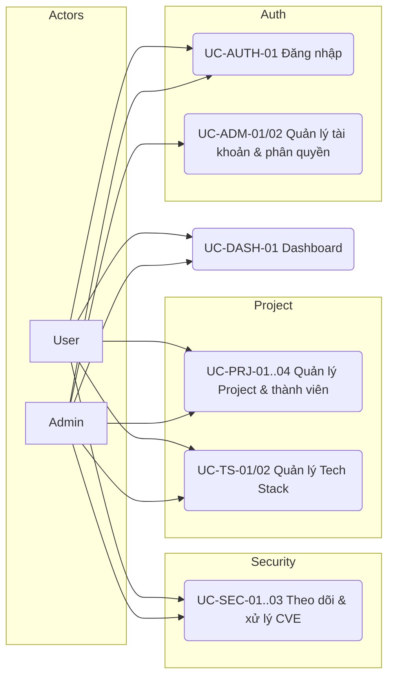

# Usecase Overview — Hệ thống Quản lý Dự án, Tech Stack & Bảo mật

> **Phase**: Design — Foundation | **Trạng thái**: Draft v0.1 — chờ BU verify
> **Upstream**: [01-business-understanding.md](./01-business-understanding.md)

---

## 1. System overview

Hệ thống quản trị nội bộ cho phép tổ chức theo dõi danh mục dự án phần mềm, tech stack theo từng dự án và tình trạng bảo mật (CVE). Người dùng đăng nhập với vai trò Admin hoặc User; Admin quản trị tài khoản và toàn quyền dữ liệu, User thao tác trong phạm vi dự án mình tham gia `[ASSUMED — Q-03]`.

## 2. Actors

| Actor      | Mô tả                                                                 |
| ---------- | --------------------------------------------------------------------- |
| Admin      | Quản trị hệ thống: tài khoản, phân quyền, toàn quyền trên mọi dữ liệu |
| User       | Thành viên dự án: xem dữ liệu, cập nhật dữ liệu dự án mình tham gia   |
| (Hệ thống) | Tổng hợp số liệu Dashboard từ dữ liệu đã nhập                         |

## 3. Use case summary table

| ID         | Name                              | Primary actor                | Goal                                                                               | Pre-condition               | Post-condition                                    | Priority |
| ---------- | --------------------------------- | ---------------------------- | ---------------------------------------------------------------------------------- | --------------------------- | ------------------------------------------------- | -------- |
| UC-AUTH-01 | Đăng nhập                         | Admin, User                  | Truy cập hệ thống bằng tài khoản được cấp                                          | Có tài khoản hoạt động      | Phiên đăng nhập được tạo                          | Must     |
| UC-AUTH-02 | Đăng xuất                         | Admin, User                  | Kết thúc phiên làm việc                                                            | Đã đăng nhập                | Phiên bị hủy                                      | Must     |
| UC-ADM-01  | Quản lý tài khoản người dùng      | Admin                        | Tạo, sửa, khóa/mở khóa tài khoản                                                   | Đăng nhập với vai trò Admin | Tài khoản được cập nhật                           | Must     |
| UC-ADM-02  | Phân quyền (gán vai trò)          | Admin                        | Gán vai trò Admin/User cho tài khoản                                               | Đăng nhập Admin             | Vai trò được cập nhật                             | Must     |
| UC-PRJ-01  | Xem danh sách & tìm kiếm Project  | Admin, User                  | Tra cứu dự án theo tên, trạng thái, công nghệ                                      | Đã đăng nhập                | —                                                 | Must     |
| UC-PRJ-02  | Xem chi tiết Project              | Admin, User                  | Xem thông tin, repository, thành viên, trạng thái                                  | Project tồn tại             | —                                                 | Must     |
| UC-PRJ-03  | Tạo / cập nhật Project            | Admin, User (thành viên)     | Khai báo thông tin dự án, repository, trạng thái                                   | Đã đăng nhập, có quyền      | Hồ sơ Project được lưu                            | Must     |
| UC-PRJ-04  | Quản lý thành viên Project        | Admin, User (PM) `[ASSUMED]` | Thêm/xóa thành viên, gán vai trò trong dự án                                       | Project tồn tại             | Danh sách thành viên cập nhật                     | Must     |
| UC-TS-01   | Xem Tech Stack của Project        | Admin, User                  | Xem công nghệ và phiên bản đang dùng                                               | Project tồn tại             | —                                                 | Must     |
| UC-TS-02   | Cập nhật Tech Stack               | Admin, User (thành viên)     | Thêm/sửa/gỡ hạng mục công nghệ kèm phiên bản                                       | Project tồn tại, có quyền   | Tech stack được lưu                               | Must     |
| UC-SEC-01  | Xem danh sách lỗ hổng             | Admin, User                  | Tra cứu CVE theo project, mức nghiêm trọng, trạng thái                             | Đã đăng nhập                | —                                                 | Must     |
| UC-SEC-02  | Ghi nhận lỗ hổng (CVE)            | Admin, User (thành viên)     | Khai báo CVE, thư viện/phiên bản ảnh hưởng, mức nghiêm trọng, khuyến nghị nâng cấp | Project tồn tại             | Lỗ hổng được ghi nhận, trạng thái "Mới"           | Must     |
| UC-SEC-03  | Cập nhật trạng thái xử lý lỗ hổng | Admin, User (thành viên)     | Chuyển trạng thái (Mới → Đang xử lý → Đã xử lý / Chấp nhận rủi ro) kèm ghi chú     | Lỗ hổng tồn tại             | Trạng thái được cập nhật, giữ lịch sử `[ASSUMED]` | Must     |
| UC-DASH-01 | Xem Dashboard tổng quan           | Admin, User                  | Xem thống kê dự án, công nghệ, tình trạng bảo mật                                  | Đã đăng nhập                | —                                                 | Must     |

## 4. Use case diagram

## 5. Usecase ↔ Screen mapping (draft)

| Use case      | Screen (dự kiến — xem [05-screen-flow.md](./05-screen-flow.md))                    |
| ------------- | ---------------------------------------------------------------------------------- |
| UC-AUTH-01/02 | SCR-AUTH-10 Login                                                                  |
| UC-ADM-01/02  | SCR-ADM-10 Quản lý người dùng, SCR-ADM-11 Popup tạo/sửa tài khoản                  |
| UC-PRJ-01     | SCR-PRJ-10 Danh sách Project                                                       |
| UC-PRJ-02     | SCR-PRJ-20 Chi tiết Project (tab Thông tin)                                        |
| UC-PRJ-03     | SCR-PRJ-11 Tạo/Sửa Project                                                         |
| UC-PRJ-04     | SCR-PRJ-21 Tab Thành viên                                                          |
| UC-TS-01/02   | SCR-PRJ-22 Tab Tech Stack, SCR-PRJ-23 Popup thêm/sửa hạng mục                      |
| UC-SEC-01     | SCR-SEC-10 Danh sách lỗ hổng (toàn hệ thống), SCR-PRJ-24 Tab Security theo Project |
| UC-SEC-02/03  | SCR-SEC-11 Chi tiết/Tạo lỗ hổng                                                    |
| UC-DASH-01    | SCR-DASH-10 Dashboard                                                              |

## 6. Open questions / conflicts

- Q-03 (từ BU): phạm vi xem/sửa của User quyết định pre-condition của UC-PRJ-03/04, UC-TS-02, UC-SEC-02/03.
- Q-04 (từ BU): mô hình CVE theo từng Project ảnh hưởng UC-SEC-02 (ghi nhận một lần cho nhiều project hay từng project riêng).
- Chưa phát hiện conflict với BU.
