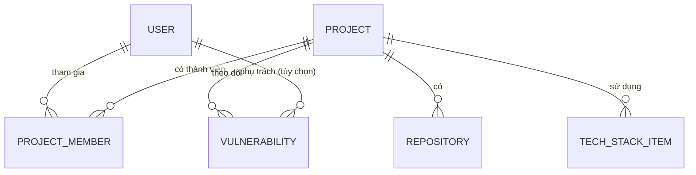

# Business Entities — Hệ thống Quản lý Dự án, Tech Stack & Bảo mật

> **Phase**: Design — Foundation/Specification | **Trạng thái**: Draft v0.1 — chờ BU verify
> **Upstream**: [01-business-understanding.md](./01-business-understanding.md), [02-usecase-overview.md](./02-usecase-overview.md)

---

## 1. Danh sách thực thể (Entity list)

| Entity                             | Ý nghĩa nghiệp vụ                                                                                            | Owner nghiệp vụ          | Ghi chú                                               |
| ---------------------------------- | ------------------------------------------------------------------------------------------------------------ | ------------------------ | ----------------------------------------------------- |
| User (Người dùng)                  | Tài khoản đăng nhập hệ thống, mang vai trò Admin hoặc User                                                   | Admin                    | Khóa thay vì xóa `[ASSUMED]`                          |
| Project (Dự án)                    | Hồ sơ một dự án phần mềm: thông tin chung, trạng thái                                                        | PM / Admin               | Tên duy nhất toàn hệ thống (BR-04)                    |
| Repository                         | Kho mã nguồn thuộc một dự án                                                                                 | Thành viên dự án         | Một Project có nhiều repository                       |
| ProjectMember (Thành viên dự án)   | Liên kết User ↔ Project kèm vai trò trong dự án                                                              | PM / Admin               | Vai trò trong dự án ≠ vai trò hệ thống                |
| TechStackItem (Hạng mục công nghệ) | Một công nghệ dự án đang dùng: loại, tên, phiên bản                                                          | Thành viên dự án         | Loại: ngôn ngữ / framework / database / cache / cloud |
| Vulnerability (Lỗ hổng)            | Một CVE ghi nhận cho một dự án: thư viện ảnh hưởng, mức nghiêm trọng, trạng thái xử lý, khuyến nghị nâng cấp | Thành viên dự án / Admin | Không xóa, chỉ chuyển trạng thái `[ASSUMED]`          |

Dashboard là **màn hình tổng hợp** từ các entity trên, không phải entity riêng.

## 2. Đặc tả từng thực thể — từ điển trường

### 2.1 User

| Field            | Nhãn hiển thị        | Bắt buộc | Kiểu            | Quy tắc một trường                                       | Mặc định / tập giá trị | Nguồn         |
| ---------------- | -------------------- | -------- | --------------- | -------------------------------------------------------- | ---------------------- | ------------- |
| username / email | Email đăng nhập      | Có       | Văn bản (email) | Phải đúng định dạng email; duy nhất toàn hệ thống        | —                      | `[FROM-TEAM]` |
| full_name        | Họ tên               | Có       | Văn bản         | Tối đa 100 ký tự `[ASSUMED]`                             | —                      | `[ASSUMED]`   |
| password         | Mật khẩu             | Có       | Văn bản (ẩn)    | Tối thiểu 8 ký tự, có chữ và số `[ASSUMED — cần policy]` | —                      | `[ASSUMED]`   |
| role             | Vai trò hệ thống     | Có       | Danh mục        | Chỉ nhận một trong hai giá trị                           | Admin / User           | `[FROM-TEAM]` |
| status           | Trạng thái tài khoản | Có       | Danh mục        | Tài khoản khóa không đăng nhập được                      | Hoạt động / Khóa       | `[ASSUMED]`   |

### 2.2 Project

| Field       | Nhãn hiển thị                | Bắt buộc          | Kiểu        | Quy tắc một trường                        | Mặc định / tập giá trị                                                                   | Nguồn         |
| ----------- | ---------------------------- | ----------------- | ----------- | ----------------------------------------- | ---------------------------------------------------------------------------------------- | ------------- |
| name        | Tên dự án                    | Có                | Văn bản     | Duy nhất toàn hệ thống; tối đa 100 ký tự  | —                                                                                        | `[FROM-TEAM]` |
| code        | Mã dự án                     | Có `[ASSUMED]`    | Văn bản     | Duy nhất; viết hoa, không dấu `[ASSUMED]` | —                                                                                        | `[ASSUMED]`   |
| description | Mô tả                        | Không             | Văn bản dài | —                                         | —                                                                                        | `[FROM-TEAM]` |
| status      | Trạng thái                   | Có                | Danh mục    | —                                         | Đang vận hành / Đang phát triển / Tạm dừng / Kết thúc `[ASSUMED — cần chốt tập giá trị]` | `[FROM-TEAM]` |
| customer    | Khách hàng / đơn vị chủ quản | Không `[ASSUMED]` | Văn bản     | —                                         | —                                                                                        | `[ASSUMED]`   |

### 2.3 Repository

| Field | Nhãn hiển thị  | Bắt buộc | Kiểu          | Quy tắc một trường | Nguồn         |
| ----- | -------------- | -------- | ------------- | ------------------ | ------------- |
| name  | Tên repository | Có       | Văn bản       | —                  | `[FROM-TEAM]` |
| url   | Đường dẫn      | Có       | Văn bản (URL) | Phải là URL hợp lệ | `[FROM-TEAM]` |
| note  | Ghi chú        | Không    | Văn bản       | —                  | `[ASSUMED]`   |

### 2.4 ProjectMember

| Field        | Nhãn hiển thị       | Bắt buộc | Kiểu            | Quy tắc một trường                                  | Tập giá trị                                 | Nguồn         |
| ------------ | ------------------- | -------- | --------------- | --------------------------------------------------- | ------------------------------------------- | ------------- |
| user         | Thành viên          | Có       | Tham chiếu User | Một User không xuất hiện hai lần trong cùng Project | —                                           | `[FROM-TEAM]` |
| project_role | Vai trò trong dự án | Có       | Danh mục        | —                                                   | PM / Dev / QA / Khác `[ASSUMED — cần chốt]` | `[ASSUMED]`   |
| joined_date  | Ngày tham gia       | Không    | Ngày            | Không được là ngày tương lai                        | —                                           | `[ASSUMED]`   |

### 2.5 TechStackItem

| Field    | Nhãn hiển thị       | Bắt buộc | Kiểu     | Quy tắc một trường                               | Tập giá trị                                     | Nguồn         |
| -------- | ------------------- | -------- | -------- | ------------------------------------------------ | ----------------------------------------------- | ------------- |
| category | Loại                | Có       | Danh mục | —                                                | Ngôn ngữ / Framework / Database / Cache / Cloud | `[FROM-TEAM]` |
| name     | Tên công nghệ       | Có       | Văn bản  | Ví dụ: Java, Spring Boot, PostgreSQL, Redis, AWS | —                                               | `[FROM-TEAM]` |
| version  | Phiên bản đang dùng | Có       | Văn bản  | Ghi theo phiên bản thực tế, ví dụ "17", "3.2.1"  | —                                               | `[FROM-TEAM]` |
| note     | Ghi chú             | Không    | Văn bản  | —                                                | —                                               | `[ASSUMED]`   |

### 2.6 Vulnerability

| Field            | Nhãn hiển thị                    | Bắt buộc          | Kiểu               | Quy tắc một trường                                                                         | Tập giá trị                                    | Nguồn                         |
| ---------------- | -------------------------------- | ----------------- | ------------------ | ------------------------------------------------------------------------------------------ | ---------------------------------------------- | ----------------------------- |
| cve_id           | Mã CVE                           | Có                | Văn bản            | Đúng định dạng `CVE-YYYY-NNNN...`; kèm project không được trùng bản ghi `[ASSUMED — Q-04]` | —                                              | `[FROM-TEAM]`                 |
| project          | Dự án                            | Có                | Tham chiếu Project | —                                                                                          | —                                              | `[FROM-TEAM]`                 |
| library          | Thư viện ảnh hưởng               | Có                | Văn bản            | —                                                                                          | —                                              | `[FROM-TEAM]`                 |
| affected_version | Phiên bản đang dùng bị ảnh hưởng | Có                | Văn bản            | —                                                                                          | —                                              | `[FROM-TEAM]`                 |
| severity         | Mức nghiêm trọng                 | Có                | Danh mục           | —                                                                                          | Critical / High / Medium / Low                 | `[ASSUMED — theo chuẩn CVSS]` |
| status           | Trạng thái xử lý                 | Có                | Danh mục           | Chuyển trạng thái theo luồng ở mục 3                                                       | Mới / Đang xử lý / Đã xử lý / Chấp nhận rủi ro | `[ASSUMED]`                   |
| recommendation   | Khuyến nghị nâng cấp             | Không             | Văn bản            | Ví dụ "Nâng lên 2.17.1 trở lên"                                                            | —                                              | `[FROM-TEAM]`                 |
| assignee         | Người phụ trách                  | Không `[ASSUMED]` | Tham chiếu User    | Nên là thành viên của project                                                              | —                                              | `[ASSUMED]`                   |
| detected_date    | Ngày ghi nhận                    | Có                | Ngày               | Không được là ngày tương lai                                                               | Mặc định: hôm nay                              | `[ASSUMED]`                   |
| resolved_date    | Ngày xử lý xong                  | Không             | Ngày               | Chỉ có giá trị khi trạng thái là "Đã xử lý"                                                | —                                              | `[ASSUMED]`                   |

## 3. Ràng buộc trong một thực thể (cross-field)

| Mã        | Mô tả                                                                                                                               | Trường liên quan                    | Khi vi phạm                | Nguồn                           |
| --------- | ----------------------------------------------------------------------------------------------------------------------------------- | ----------------------------------- | -------------------------- | ------------------------------- |
| R-ENT-001 | Trạng thái lỗ hổng chỉ được chuyển theo luồng: Mới → Đang xử lý → (Đã xử lý \| Chấp nhận rủi ro); từ "Đã xử lý" không quay về "Mới" | Vulnerability.status                | Chặn lưu, báo lỗi          | `[ASSUMED — cần BU chốt luồng]` |
| R-ENT-002 | Khi chuyển sang "Đã xử lý" phải nhập ngày xử lý và ghi chú cách xử lý                                                               | status, resolved_date               | Chặn lưu                   | `[ASSUMED]`                     |
| R-ENT-003 | Ngày xử lý xong không được trước ngày ghi nhận                                                                                      | detected_date, resolved_date        | Chặn lưu                   | `[ASSUMED]`                     |
| R-ENT-004 | Khi chọn "Chấp nhận rủi ro" phải nhập lý do                                                                                         | status, note                        | Chặn lưu                   | `[ASSUMED]`                     |
| R-ENT-005 | Trong một Project, không có hai hạng mục tech stack trùng cả loại + tên                                                             | TechStackItem                       | Chặn lưu hoặc cảnh báo gộp | `[ASSUMED]`                     |
| R-ENT-006 | Tài khoản bị khóa không được gán làm người phụ trách lỗ hổng mới                                                                    | User.status, Vulnerability.assignee | Chặn lưu                   | `[ASSUMED]`                     |

## 4. Quan hệ và ràng buộc giữa các thực thể

### 4.1 Bảng quan hệ tổng quan

| Entity A | Entity B      | Quan hệ nghiệp vụ                        | Bắt buộc khi tạo A?                          | Ghi chú trùng lặp                         |
| -------- | ------------- | ---------------------------------------- | -------------------------------------------- | ----------------------------------------- |
| Project  | Repository    | Một dự án có nhiều repository            | Không                                        | Trùng URL trong cùng project → cảnh báo   |
| Project  | ProjectMember | Một dự án có nhiều thành viên            | Không (có thể tạo project trước) `[ASSUMED]` | User + Project là duy nhất                |
| Project  | TechStackItem | Một dự án dùng nhiều công nghệ           | Không                                        | Loại + tên duy nhất trong project         |
| Project  | Vulnerability | Một dự án có nhiều lỗ hổng được theo dõi | Không                                        | CVE + Project duy nhất `[ASSUMED — Q-04]` |
| User     | ProjectMember | Một người tham gia nhiều dự án           | Không                                        | —                                         |

### 4.2 Ràng buộc tham chiếu và hành vi nghiệp vụ

| Mã      | Từ            | Đến             | Khi tạo mới                         | Khi cập nhật                                                 | Khi xóa / vô hiệu                                                          | Ghi chú                |
| ------- | ------------- | --------------- | ----------------------------------- | ------------------------------------------------------------ | -------------------------------------------------------------------------- | ---------------------- |
| REL-001 | ProjectMember | User            | User phải tồn tại và đang hoạt động | —                                                            | Khóa User: giữ nguyên lịch sử thành viên                                   | `[ASSUMED]`            |
| REL-002 | Vulnerability | Project         | Project phải tồn tại                | —                                                            | Project kết thúc: lỗ hổng mở xử lý theo Q-05                               | `[NEEDS-CONFIRMATION]` |
| REL-003 | Vulnerability | User (assignee) | Nên là thành viên project           | Đổi người phụ trách được phép                                | Xóa thành viên đang phụ trách lỗ hổng mở → bắt buộc gán người khác (EC-03) | `[ASSUMED]`            |
| REL-004 | TechStackItem | Project         | Project phải tồn tại                | Cập nhật version giữ lịch sử thay đổi `[NEEDS-CONFIRMATION]` | Xóa project: không cho xóa nếu còn dữ liệu `[ASSUMED]`                     | —                      |

## 5. Câu hỏi mở

- Q-04 (BU): CVE dùng chung nhiều project — một bản ghi hay nhiều bản ghi? → ảnh hưởng khóa duy nhất của Vulnerability.
- Q-ENT-01: Có cần lưu **lịch sử thay đổi version** của tech stack (audit trail) không?
- Q-ENT-02: Tập giá trị trạng thái Project và vai trò trong dự án cần BU chốt.
- Q-ENT-03: Chính sách mật khẩu và có cần bắt đổi mật khẩu lần đầu không?
