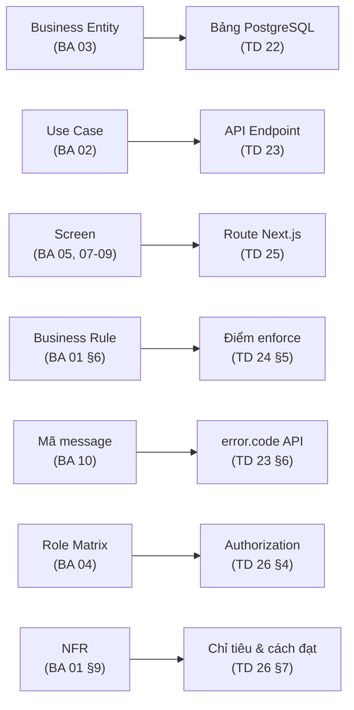

# Bộ tài liệu Technical Design — Hệ thống Quản lý Dự án, Tech Stack & Bảo mật

> **Phase**: Design — Technical | **Phiên bản**: v0.1 — 2026-08-26 | **Trạng thái**: Draft — chờ Tech Lead review
> **Upstream**: bộ tài liệu BA `00-index.md` → `10-error-message-catalog.md` (v0.2, 2026-08-26)
> **Nguyên tắc**: tài liệu kỹ thuật **không được mâu thuẫn** với BA. Phát hiện mâu thuẫn → sửa BU trước → sync xuống BA → rồi mới sửa technical.

---

## Danh mục tài liệu

| #   | Tài liệu             | File                      | Nội dung chính                                                     |
| --- | -------------------- | ------------------------- | ------------------------------------------------------------------ |
| 20  | Index (tài liệu này) | `20-technical-index.md`   | Tech stack chốt, traceability tổng thể, danh mục ADR               |
| 21  | Architecture         | `21-architecture.md`      | C4 Level 1–3, ranh giới hệ thống, 12 quyết định kiến trúc (ADR)    |
| 22  | Database Design      | `22-database-design.md`   | ERD vật lý, DDL 9 bảng, ràng buộc, index, chiến lược migration     |
| 23  | API Specification    | `23-api-specification.md` | 38 endpoint, quy ước request/response, mapping mã lỗi `MSG-*`      |
| 24  | Backend Design       | `24-backend-design.md`    | Phân tầng FastAPI, cấu trúc module, nơi enforce từng business rule |
| 25  | Frontend Design      | `25-frontend-design.md`   | App Router, Server Actions proxy, quản lý phiên, map 14 màn        |
| 26  | Security & NFR       | `26-security-nfr.md`      | Mô hình mối đe dọa, RBAC hai tầng, chỉ tiêu hiệu năng              |
| 27  | DevOps & Deployment  | `27-devops-deployment.md` | Docker Compose, CI/CD, backup, log, quy trình phát hành            |

## Tech stack đã chốt

| Lớp              | Công nghệ                      | Phiên bản           | Nguồn                                                                           |
| ---------------- | ------------------------------ | ------------------- | ------------------------------------------------------------------------------- |
| Ngôn ngữ BE      | Python                         | **3.13**            | `[FROM-TEAM]`                                                                   |
| Web framework BE | FastAPI                        | **0.115.9**         | `[FROM-TEAM]` — xem **ADR-12**, phiên bản này đang chậm hơn bản mới nhất khá xa |
| ASGI server      | Uvicorn (workers qua Gunicorn) | 0.34.x              | `[ASSUMED]`                                                                     |
| ORM              | SQLAlchemy (async)             | 2.0.x               | `[ASSUMED]` — ADR-05                                                            |
| Driver DB        | asyncpg                        | 0.30.x              | `[ASSUMED]`                                                                     |
| Migration        | Alembic                        | 1.14.x              | `[ASSUMED]`                                                                     |
| Validation       | Pydantic                       | v2 (đi kèm FastAPI) | `[ASSUMED]`                                                                     |
| Băm mật khẩu     | Argon2id (`argon2-cffi`)       | 23.x                | `[ASSUMED]` — ADR-07                                                            |
| Database         | PostgreSQL                     | **17.9**            | `[FROM-TEAM]`                                                                   |
| Framework FE     | Next.js (App Router)           | **16.3.2 LTS**      | `[ASSUMED]` — bản LTS hiện hành, xem ADR-09                                     |
| UI runtime       | React                          | 19                  | Đi kèm Next.js 16                                                               |
| Ngôn ngữ FE      | TypeScript (strict)            | 5.8+                | Chuẩn nội bộ                                                                    |
| Styling          | Tailwind CSS                   | 4                   | Chuẩn nội bộ                                                                    |
| Component        | shadcn/ui (Radix)              | latest              | Chuẩn nội bộ                                                                    |
| Bảng dữ liệu     | @tanstack/react-table          | 8                   | Chuẩn nội bộ                                                                    |
| Form             | react-hook-form + zod          | 7 / 3               | `[ASSUMED]`                                                                     |
| Triển khai       | Docker Compose trên VM nội bộ  | —                   | `[FROM-TEAM]` — ADR-10                                                          |
| Reverse proxy    | Nginx                          | 1.27.x              | `[ASSUMED]`                                                                     |

> **Không có** trong stack giai đoạn 1, đúng theo phạm vi BA: Redis (ADR-06), message queue, Elasticsearch, SMTP/mail server (DEC-08b), scanner CVE tự động (DEC-02), SSO (DEC-12).

## Kiến trúc một dòng

Một **monolith hai container** — FastAPI phục vụ toàn bộ API, Next.js phục vụ giao diện và đồng thời làm **lớp proxy giữ token**; PostgreSQL là nơi lưu trữ duy nhất và cũng là nơi thực thi phần lớn ràng buộc toàn vẹn. Trình duyệt **không bao giờ** nhìn thấy JWT và **không bao giờ** gọi thẳng FastAPI.

## Chuỗi traceability BA → Technical

### Entity → Bảng

| Business Entity (BA 03)    | Bảng PostgreSQL                | Ghi chú                                                                            |
| -------------------------- | ------------------------------ | ---------------------------------------------------------------------------------- |
| User                       | `users`                        | + `refresh_tokens`, `login_attempts` là bảng kỹ thuật, không phải entity nghiệp vụ |
| Project                    | `projects`                     | —                                                                                  |
| Repository                 | `repositories`                 | —                                                                                  |
| ProjectMember              | `project_members`              | —                                                                                  |
| TechStackItem              | `tech_stack_items`             | —                                                                                  |
| Vulnerability              | `vulnerabilities`              | —                                                                                  |
| VulnerabilityStatusHistory | `vulnerability_status_history` | Bất biến — thu hồi quyền UPDATE/DELETE ở tầng DB role (ADR-04)                     |

### Use Case → nhóm endpoint

| Use Case             | Endpoint chính                                                                        |
| -------------------- | ------------------------------------------------------------------------------------- |
| UC-AUTH-01/02        | `POST /auth/login`, `POST /auth/logout`                                               |
| UC-AUTH-03           | `POST /auth/change-password`                                                          |
| UC-ADM-01, UC-ADM-02 | `GET/POST/PATCH /admin/users`, `POST /admin/users/{id}/lock` …                        |
| UC-PRJ-01/05         | `GET /projects`, `GET /projects/export`                                               |
| UC-PRJ-02            | `GET /projects/{id}`, `GET /projects/{id}/summary`                                    |
| UC-PRJ-03            | `POST /projects`, `PATCH /projects/{id}`                                              |
| UC-PRJ-04            | `GET/POST/PATCH/DELETE /projects/{id}/members`                                        |
| UC-TS-01/02          | `GET/POST/PATCH/DELETE /projects/{id}/tech-stack`                                     |
| UC-SEC-01/05         | `GET /vulnerabilities`, `GET /vulnerabilities/grouped`, `GET /vulnerabilities/export` |
| UC-SEC-02            | `POST /vulnerabilities`                                                               |
| UC-SEC-03            | `POST /vulnerabilities/{id}/transition`                                               |
| UC-SEC-04            | `GET /vulnerabilities/{id}/history`                                                   |
| UC-DASH-01           | 4 endpoint độc lập dưới `/dashboard/*`                                                |

Chi tiết đầy đủ ở `23-api-specification.md` §3.

## Danh mục quyết định kiến trúc (ADR)

| ADR    | Quyết định                                                          | Đánh đổi chính                                                            | Tài liệu       |
| ------ | ------------------------------------------------------------------- | ------------------------------------------------------------------------- | -------------- |
| ADR-01 | Monolith hai container thay vì microservice                         | Đơn giản vận hành, đổi lại khó tách đội về sau                            | 21 §5.1        |
| ADR-02 | Next.js làm **lớp proxy giữ token**, trình duyệt không gọi thẳng BE | Bảo mật token tốt, đổi lại thêm một chặng mạng                            | 21 §5.2        |
| ADR-03 | JWT access ngắn + refresh xoay vòng, lưu hash refresh trong DB      | Thu hồi được phiên mà không cần Redis                                     | 21 §5.3        |
| ADR-04 | Bất biến lịch sử enforce ở **tầng DB role**, không chỉ ở code       | Sai sót ở tầng ứng dụng vẫn không phá được dấu vết kiểm toán              | 21 §5.4        |
| ADR-05 | SQLAlchemy async + asyncpg, không dùng repository pattern nặng      | Ít lớp trừu tượng, đổi lại service chạm ORM trực tiếp                     | 21 §5.5        |
| ADR-06 | **Không** dùng Redis ở giai đoạn 1                                  | Bớt một thành phần phải vận hành; đổi lại rate-limit lưu trong Postgres   | 21 §5.6        |
| ADR-07 | Argon2id cho mật khẩu                                               | Chống brute-force tốt hơn bcrypt; tốn RAM hơn                             | 21 §5.7        |
| ADR-08 | `TEXT` + `CHECK` cho enum thay vì kiểu ENUM của Postgres            | Migration đơn giản; đổi lại mất một chút tự tài liệu hóa ở tầng DB        | 21 §5.8, 22 §4 |
| ADR-09 | Next.js 16.3 LTS (App Router, Server Components)                    | Khớp starter nội bộ; đổi lại phải hiểu ranh giới server/client            | 21 §5.9        |
| ADR-10 | Docker Compose trên VM nội bộ, không Kubernetes                     | Vừa quy mô ~150 người dùng; đổi lại scale ngang thủ công                  | 21 §5.10       |
| ADR-11 | Khóa lạc quan bằng `updated_at`, không khóa bi quan                 | Hợp với công cụ tra cứu ít tranh chấp; đổi lại người lưu sau phải tải lại | 21 §5.11       |
| ADR-12 | Pin FastAPI 0.115.9 theo yêu cầu                                    | **Cần xác nhận lại** — chậm hơn bản hiện hành nhiều                       | 21 §5.12       |

## Câu hỏi mở — điểm cần Tech Lead xác nhận trước khi code

| #   | Vấn đề                                                                                          | Vì sao quan trọng                                                                                                                      |
| --- | ----------------------------------------------------------------------------------------------- | -------------------------------------------------------------------------------------------------------------------------------------- |
| 1   | **ADR-12** — FastAPI 0.115.9 (phát hành đầu 2025) đang chậm hơn bản hiện hành 0.141.1 khá nhiều | Bỏ lỡ các bản vá và cải tiến; nếu là ràng buộc thật thì cần ghi rõ lý do, nếu chỉ là bản đang quen dùng thì nên nâng ngay từ đầu dự án |
| 2   | Q-09 (BU) — lỗ hổng Critical có phải dữ liệu hạn chế không                                      | Quyết định có cần lọc theo quyền ở tầng truy vấn hay không; sửa sau rất tốn                                                            |
| 3   | Q-ENT-04/05 (BA 03) — tên công nghệ và tên thư viện nhập tự do                                  | Ảnh hưởng thiết kế bảng và độ tin cậy của Dashboard khối 3                                                                             |
| 4   | Chiến lược sao lưu và thời gian phục hồi mong muốn (RPO/RTO)                                    | Quyết định tần suất backup và có cần WAL archiving không — TD 27 §6                                                                    |
| 5   | Có sẵn máy chủ log tập trung nội bộ không                                                       | Quyết định ghi log ra stdout hay đẩy sang hệ thống ngoài — TD 27 §7                                                                    |

**Last Updated**: 2026-08-26
