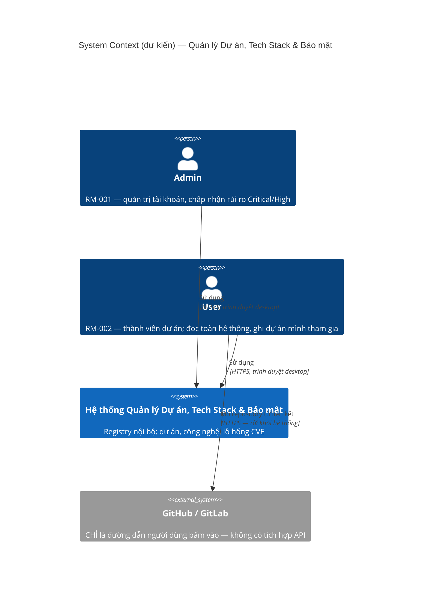
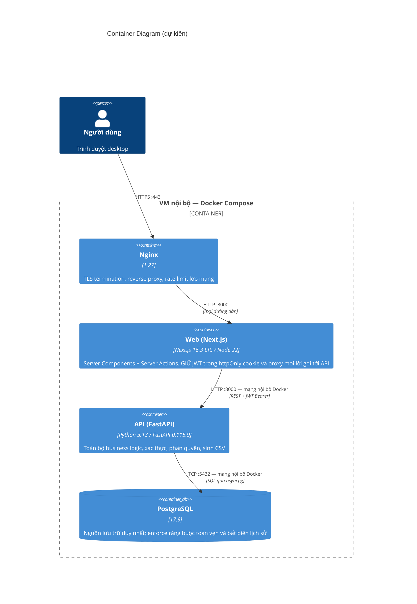
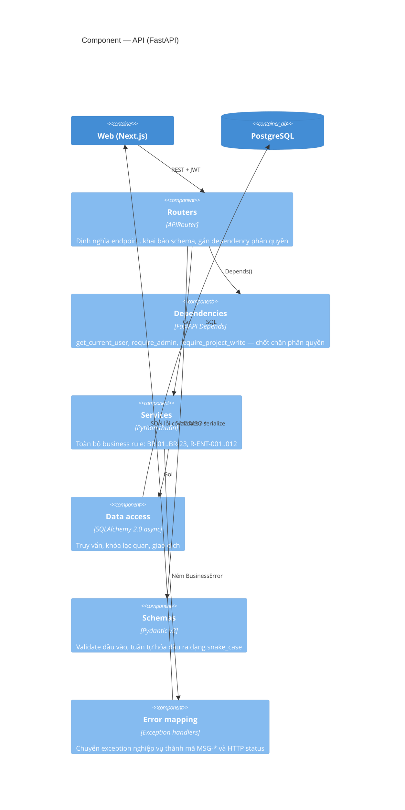

# Architecture — Hệ thống Quản lý Dự án, Tech Stack & Bảo mật

> **Phase**: Design — Technical | **Trạng thái**: Draft v0.1 — chờ Tech Lead review
> **Upstream**: `01-business-understanding.md` (v0.2), `04-role-matrix.md`, `02-usecase-overview.md`
> **Bản chất**: kiến trúc **đề xuất** — chưa có mã nguồn. Mọi phần tử là `[ASSUMED]` cho tới khi Tech Lead xác nhận.

---

## 1. Tóm tắt kiến trúc

Hệ thống là một **monolith hai container**, cố ý giữ đơn giản vì ba lý do đọc thẳng từ BA: quy mô nhỏ (~200 dự án, ~150 tài khoản, ~5.000 bản ghi lỗ hổng — DEC-01), tính sẵn sàng chỉ cần giờ hành chính (NFR-AVAIL), và **không có tích hợp bên ngoài nào** trong giai đoạn 1 (BU §10 — không NVD/OSV, không GitHub API, không SSO, không mail).

Điểm kiến trúc đáng chú ý duy nhất là **Next.js không chỉ là frontend** mà còn là lớp giữ token: trình duyệt gọi Server Action của Next.js, Next.js gắn JWT từ httpOnly cookie rồi gọi FastAPI. Trình duyệt không bao giờ chạm vào token và không có đường mạng nào từ trình duyệt tới FastAPI. Điều này xuất phát trực tiếp từ đặc thù dữ liệu: bảng `vulnerabilities` là **danh sách điểm yếu của chính tổ chức** (BU §8.1 — mức nhạy cảm cao nhất trong hệ thống), nên chi phí thêm một chặng mạng là đáng.

## 2. System Context (C4 Level 1)

### 2.1 Actors

| Actor | Mô tả                                                                                | Nguồn          | Marker        |
| ----- | ------------------------------------------------------------------------------------ | -------------- | ------------- |
| Admin | Quản trị hệ thống, toàn quyền dữ liệu, người duy nhất chấp nhận rủi ro Critical/High | RM-001, DEC-09 | `[FROM-TEAM]` |
| User  | Thành viên dự án; đọc toàn hệ thống, ghi theo tư cách thành viên                     | RM-002, DEC-03 | `[FROM-TEAM]` |

### 2.2 External systems

| Hệ thống ngoài         | Trạng thái        | Ghi chú                                                                                                                                                    |
| ---------------------- | ----------------- | ---------------------------------------------------------------------------------------------------------------------------------------------------------- |
| GitHub / GitLab        | **Ngoài phạm vi** | Chỉ lưu URL dạng văn bản (BR-10, DEC-07). Hệ thống **không** gọi API, **không** kiểm tra đường dẫn còn sống. Người dùng bấm liên kết là rời khỏi hệ thống. |
| NVD / OSV              | **Ngoài phạm vi** | Dữ liệu CVE nhập tay hoàn toàn (DEC-02)                                                                                                                    |
| SMTP / mail server     | **Ngoài phạm vi** | Không gửi email (DEC-08b) — hệ quả kiến trúc: **không cần** worker nền, không cần queue                                                                    |
| SSO / Active Directory | **Ngoài phạm vi** | Đăng nhập bằng email + mật khẩu (DEC-12)                                                                                                                   |

> Việc **không có external system nào** là đặc điểm kiến trúc quan trọng nhất của giai đoạn 1: không cần circuit breaker, không cần retry policy, không cần job nền, không cần message queue. Đừng đưa các thành phần đó vào "cho chắc".

## 3. Container (C4 Level 2)

### 3.1 Bảng container

| Container | Vai trò                                                                    | Công nghệ                     | Cổng | Phơi ra ngoài?                 | Nhóm chức năng |
| --------- | -------------------------------------------------------------------------- | ----------------------------- | ---- | ------------------------------ | -------------- |
| `nginx`   | TLS, reverse proxy, giới hạn tần suất lớp mạng, phục vụ tệp tĩnh           | Nginx 1.27                    | 443  | **Có**                         | Toàn bộ        |
| `web`     | Render giao diện, giữ phiên, proxy API, kiểm tra định dạng phía người dùng | Next.js 16.3 / Node 22        | 3000 | Không — chỉ Nginx gọi được     | 14 màn hình    |
| `api`     | Business logic, xác thực, phân quyền, truy vấn, kết xuất CSV               | Python 3.13 / FastAPI 0.115.9 | 8000 | **Không** — chỉ `web` gọi được | 38 endpoint    |
| `db`      | Lưu trữ, ràng buộc toàn vẹn, bất biến lịch sử                              | PostgreSQL 17.9               | 5432 | **Không** — chỉ `api` gọi được | 9 bảng         |

> **Ranh giới mạng là một biện pháp bảo mật, không phải chi tiết triển khai.** `api` và `db` nằm trên mạng Docker nội bộ, không publish cổng ra host. Kể cả khi có lỗ hổng ở tầng ứng dụng web, kẻ tấn công vẫn không gọi thẳng được API hay database. Xem `26-security-nfr.md` §3.

### 3.2 Vì sao Next.js phải là một container riêng chứ không phải static build

Một cách làm rẻ hơn là build Next.js thành tệp tĩnh rồi để trình duyệt gọi thẳng FastAPI. Cách đó bị loại vì:

- Token sẽ phải nằm ở nơi JavaScript đọc được (localStorage hoặc cookie không httpOnly) → mọi lỗ hổng XSS đều trở thành lộ toàn bộ dữ liệu lỗ hổng bảo mật của tổ chức.
- Server Components cho phép render danh sách và Dashboard **phía máy chủ**, giảm số lời gọi mạng từ trình duyệt và giúp đạt chỉ tiêu ≤ 3 giây (NFR-PERF) dễ hơn.
- Starter nội bộ đã theo App Router với `ActionResult<T>` — đi ngược lại sẽ mất toàn bộ phần dùng lại được.

## 4. Component — container `api` (C4 Level 3)

Chỉ phác cho `api` vì đây là nơi tập trung độ phức tạp nghiệp vụ.

**Nguyên tắc phân tầng, theo đúng thứ tự trách nhiệm:**

1. `routers` — chỉ khai báo hợp đồng HTTP. Không có `if` nghiệp vụ nào ở đây.
2. `dependencies` — nơi duy nhất quyết định "người này có được làm việc này không". Không rải kiểm tra quyền vào service.
3. `services` — nơi duy nhất chứa business rule. Mỗi rule của BA có đúng một hàm chịu trách nhiệm (bảng đối chiếu ở `24-backend-design.md` §5).
4. `repositories` (mỏng) — truy vấn và giao dịch. Không chứa quyết định nghiệp vụ.
5. `schemas` — biên giới dữ liệu vào/ra. Field **snake_case** để khớp hợp đồng với FE (chuẩn nội bộ).

## 5. Quyết định kiến trúc (ADR)

### ADR-01 — Monolith hai container thay vì microservice

**Bối cảnh.** Hệ thống có 5 khối chức năng nhưng chúng chia sẻ dữ liệu rất chặt: Dashboard đọc cả 4 entity, danh sách dự án hiển thị số lỗ hổng, tab Tech Stack đối chiếu với thư viện của lỗ hổng.

**Quyết định.** Một service FastAPI duy nhất, một database duy nhất.

**Lý do.** Tách microservice ở đây sẽ biến mọi truy vấn tổng hợp thành lời gọi mạng và ép phải xử lý nhất quán phân tán — trả giá lớn cho một hệ thống ~150 người dùng dùng trong giờ hành chính. Ranh giới module vẫn được giữ trong mã nguồn (mỗi khối một package) nên nếu sau này thật sự cần tách thì có đường đi.

**Đánh đổi.** Không thể scale hay phát hành từng khối độc lập; nhiều đội sửa cùng một repo dễ đụng nhau.

### ADR-02 — Next.js là lớp giữ token, trình duyệt không gọi thẳng FastAPI

**Bối cảnh.** Dữ liệu lỗ hổng là điểm yếu hệ thống của tổ chức (BU §8.1).

**Quyết định.** JWT được lưu trong **httpOnly, Secure, SameSite=Lax cookie** do Next.js đặt. Mọi lời gọi dữ liệu đi qua Server Action hoặc Route Handler của Next.js; container `api` không publish cổng ra ngoài.

**Lý do.** Token không nằm trong tầm với của JavaScript nên XSS không leo thang thành rò rỉ dữ liệu. Đồng thời có một chỗ tập trung để log và chặn.

**Đánh đổi.** Thêm một chặng mạng (~vài ms trong cùng VM). Debug khó hơn vì lỗi có thể phát sinh ở hai tầng. Không thể dùng Swagger UI trực tiếp từ trình duyệt của người dùng cuối — nhưng dev vẫn dùng được qua tunnel nội bộ.

### ADR-03 — JWT access ngắn + refresh xoay vòng, hash refresh lưu trong DB

**Quyết định.** Access token JWT **15 phút**, không lưu server. Refresh token **8 giờ trượt**, lưu **hash** trong bảng `refresh_tokens`, **xoay vòng mỗi lần dùng** (rotation) và phát hiện tái sử dụng.

**Lý do.** BR-22 yêu cầu phiên hết hạn sau 30 phút không thao tác — access 15 phút + refresh trượt đáp ứng được. Quan trọng hơn: BR-23 và F-AD10-05 yêu cầu **khóa tài khoản là hủy được phiên đang mở**. JWT thuần không thu hồi được; lưu hash refresh trong DB thì Admin khóa tài khoản là xóa hàng refresh, người đó mất phiên trong tối đa 15 phút.

**Đánh đổi.** Mỗi lần làm mới token là một lượt ghi DB. Ở quy mô này không đáng kể.

**Chi tiết.** Xem `26-security-nfr.md` §5.

### ADR-04 — Bất biến lịch sử enforce ở tầng DB role

**Bối cảnh.** BR-13 (không xóa lỗ hổng) và BR-14 (lịch sử không sửa, không xóa) là dấu vết kiểm toán — nếu code có bug thì dấu vết vẫn phải nguyên vẹn.

**Quyết định.** Ứng dụng kết nối bằng một DB role **không có** quyền `UPDATE`/`DELETE` trên `vulnerability_status_history`, và không có `DELETE` trên `vulnerabilities`. Thêm trigger chặn `UPDATE` để phòng trường hợp cấp quyền sai.

**Lý do.** Một lỗi ORM hay một endpoint viết vội không được phép phá dấu vết kiểm toán. Đây là loại ràng buộc phải nằm ở tầng thấp nhất có thể.

**Đánh đổi.** Migration phải chạy bằng role khác (role owner). Quy trình vận hành phức tạp hơn một chút — đã ghi trong `27-devops-deployment.md` §4.

### ADR-05 — SQLAlchemy 2.0 async, không dựng repository pattern nặng

**Quyết định.** Service gọi trực tiếp SQLAlchemy async session qua các hàm truy vấn mỏng đặt cùng module, không dựng lớp repository trừu tượng đầy đủ.

**Lý do.** Hệ thống chỉ có một nguồn dữ liệu và không có kế hoạch đổi. Lớp repository đầy đủ ở đây chủ yếu tạo thêm việc mà không mua được gì. Truy vấn tổng hợp cho Dashboard cũng dễ viết hơn khi chạm thẳng vào ORM/SQL.

**Đánh đổi.** Unit test service phải dùng database thật (testcontainers) thay vì mock repository. Chấp nhận được, và thực ra cho kết quả tin cậy hơn.

### ADR-06 — Không dùng Redis ở giai đoạn 1

**Quyết định.** Không có Redis. Rate-limit đăng nhập (BR-21) lưu trong bảng `login_attempts`; không có cache tầng ứng dụng.

**Lý do.** Redis chỉ đáng có khi giải quyết một vấn đề đang tồn tại. Ở đây: rate-limit là ~150 người × vài lần đăng nhập/ngày, và số liệu Dashboard tính từ 5.000 bản ghi — Postgres với index phù hợp thừa sức trong 3 giây. Thêm Redis là thêm một thứ phải backup, giám sát và vá lỗi.

**Đánh đổi.** Nếu sau này số bản ghi tăng một bậc, khối Dashboard sẽ cần cache. Điểm cần theo dõi đã ghi ở `26-security-nfr.md` §7.

### ADR-07 — Argon2id cho mật khẩu

**Quyết định.** `argon2-cffi` với tham số `time_cost=3, memory_cost=65536 (64 MB), parallelism=4`.

**Lý do.** BR-20 chỉ yêu cầu 8 ký tự có hoa/thường/số — không phải chính sách mạnh. Khi độ mạnh mật khẩu ở mức đó, thuật toán băm phải gánh phần còn lại. Argon2id tốn RAM nên chống được tấn công bằng GPU tốt hơn bcrypt.

**Đánh đổi.** Mỗi lần xác thực tốn ~64 MB RAM tạm thời và ~50–100ms. Với vài chục lượt đăng nhập/giờ thì không thành vấn đề, nhưng cần nhớ khi đặt số worker (xem `27-devops-deployment.md` §3).

### ADR-08 — `TEXT` + `CHECK` cho tập giá trị, không dùng kiểu ENUM của Postgres

**Quyết định.** `project_status`, `severity`, `vuln_status`, `project_role`, `tech_category` lưu dạng `TEXT` kèm ràng buộc `CHECK`.

**Lý do.** BA còn 3 câu hỏi mở có thể làm đổi tập giá trị (Q-ENT-02 đã chốt nhưng Q-ENT-04 vẫn treo). Với kiểu ENUM của Postgres, `ALTER TYPE ... ADD VALUE` không chạy được trong transaction ở nhiều tình huống và **không xóa được giá trị** — rất phiền khi tập giá trị còn có thể đổi. `CHECK` thì sửa bằng một migration bình thường.

**Đánh đổi.** Mất một chút khả năng tự tài liệu hóa ở tầng DB và tốn thêm vài byte mỗi hàng. Không đáng kể ở 5.000 hàng.

### ADR-09 — Next.js 16.3 LTS, App Router

**Quyết định.** Next.js **16.3.2 (LTS)** — bản LTS đang hoạt động tại thời điểm viết tài liệu, hỗ trợ bảo mật còn dài.

**Lý do.** Next.js 15 hết hạn hỗ trợ bảo mật vào 21/10/2026, tức chỉ còn khoảng hai tháng nữa — bắt đầu dự án mới trên nhánh sắp hết hỗ trợ là tự tạo việc nâng cấp ngay trong sprint đầu. Bản 16 cũng là bản starter nội bộ đang dùng.

**Đánh đổi.** Đội cần nắm ranh giới Server Component / Client Component; đây là nguồn lỗi phổ biến nhất khi mới chuyển sang App Router.

### ADR-10 — Docker Compose trên VM nội bộ

**Quyết định.** Một VM, Docker Compose, 4 container, không orchestrator.

**Lý do.** NFR-AVAIL chỉ yêu cầu giờ hành chính và chấp nhận gián đoạn ngắn. Kubernetes ở quy mô này là chi phí vận hành không mua được lợi ích tương xứng. Dữ liệu lỗ hổng cũng là lý do để giữ trong hạ tầng nội bộ.

**Đánh đổi.** Không có tự động phục hồi khi VM chết; scale ngang phải làm tay. Nếu yêu cầu sẵn sàng tăng lên, đường nâng cấp tự nhiên là tách `db` sang máy riêng trước, rồi mới tính đến orchestrator.

### ADR-11 — Khóa lạc quan bằng `updated_at`

**Quyết định.** Mọi thao tác ghi gửi kèm `updated_at` đã đọc; máy chủ so khớp, lệch thì trả `MSG-BIZ-020` (hoặc `MSG-BIZ-021` cho lỗ hổng).

**Lý do.** BA đã đặc tả sẵn hành vi này ở EC-05 và ở §5 của mọi Screen Spec. Đây là công cụ tra cứu, tranh chấp hiếm; khóa bi quan sẽ chặn nhau vô ích và tạo rủi ro khóa treo.

**Đánh đổi.** Người lưu sau mất thay đổi chưa lưu nếu chọn tải lại — đã được cảnh báo rõ trên giao diện theo Screen Spec.

### ADR-12 — Pin FastAPI 0.115.9 `[NEEDS-CONFIRMATION]`

**Bối cảnh.** Yêu cầu chốt FastAPI **0.115.9**. Bản này phát hành khoảng đầu năm 2025; bản hiện hành tại thời điểm viết là **0.141.1** (29/07/2026).

**Quyết định tạm.** Tôn trọng yêu cầu, pin `fastapi==0.115.9` trong `requirements.txt`.

**Điều cần nói thẳng.** Khoảng cách này là hơn một năm phát hành. Nếu lý do là "phiên bản đội đang quen" thì nên nâng ngay bây giờ — chi phí nâng ở ngày đầu dự án gần như bằng không, còn nâng sau khi đã có 38 endpoint thì tốn thật. Nếu là ràng buộc thật (thư viện nội bộ, bản đã qua thẩm định bảo mật) thì cần ghi lý do vào đây và **đặt lịch rà lại định kỳ**, vì đây là hệ thống quản lý lỗ hổng bảo mật — chạy trên một dependency lỗi thời sẽ là một nghịch lý khó giải thích khi audit.

**Việc cần làm.** Tech Lead xác nhận: giữ 0.115.9 (kèm lý do) hay nâng lên bản hiện hành trước khi bắt đầu.

## 6. Giả định kiến trúc

| #      | Giả định                                                                           | Cần xác nhận bởi       |
| ------ | ---------------------------------------------------------------------------------- | ---------------------- |
| ASM-A1 | Một VM đủ cho toàn bộ 4 container ở quy mô DEC-01                                  | Tech Lead / DevOps     |
| ASM-A2 | Có chứng chỉ TLS nội bộ (CA nội bộ hoặc chứng chỉ tổ chức) cho Nginx               | DevOps                 |
| ASM-A3 | Không có yêu cầu ghi nhật ký truy cập (audit log) ngoài lịch sử trạng thái lỗ hổng | Khách hàng — Q-10 (BU) |
| ASM-A4 | Thời gian phục hồi chấp nhận được là trong ngày làm việc (RTO ≤ 8 giờ)             | Khách hàng             |
| ASM-A5 | Trình duyệt mục tiêu là Chrome/Edge bản mới nhất và bản trước đó, độ rộng ≥ 1280px | NFR-PLAT               |

## 7. Rủi ro kiến trúc

| #       | Rủi ro                                                         | Tác động                                                                           | Hướng giảm thiểu                                                                                 |
| ------- | -------------------------------------------------------------- | ---------------------------------------------------------------------------------- | ------------------------------------------------------------------------------------------------ |
| RISK-A1 | **FastAPI 0.115.9 lỗi thời** (ADR-12)                          | Thiếu bản vá; nghịch lý với mục tiêu của chính hệ thống                            | Xác nhận lý do; nếu không có ràng buộc cứng thì nâng ngay ngày đầu                               |
| RISK-A2 | Q-09 chưa chốt — nếu lỗ hổng Critical là dữ liệu hạn chế       | Phải thêm lọc theo quyền ở **tầng truy vấn**, ảnh hưởng 6 endpoint và cả Dashboard | Chốt trước khi code khối SEC; thiết kế truy vấn sẵn chỗ cắm điều kiện                            |
| RISK-A3 | Đối chiếu tech stack ↔ lỗ hổng theo **tên văn bản** (Q-ENT-05) | Cảnh báo sai hoặc sót; người dùng mất niềm tin vào số liệu                         | Đã ghi rõ giới hạn trên giao diện; chuẩn hóa tên là việc của giai đoạn sau                       |
| RISK-A4 | Một VM, không tự phục hồi (ADR-10)                             | VM chết là hệ thống dừng tới khi có người xử lý                                    | Chấp nhận theo NFR-AVAIL; có backup và quy trình phục hồi ở TD 27 §6                             |
| RISK-A5 | Đội chưa quen ranh giới Server/Client Component của App Router | Lỗi rò rỉ bí mật ra client, hoặc `"use client"` rải quá rộng làm mất lợi ích RSC   | Quy ước rõ ở `25-frontend-design.md` §3; review kỹ PR đầu tiên của mỗi người                     |
| RISK-A6 | Kết xuất CSV 10.000 dòng chạy đồng bộ trong request            | Chiếm worker lâu, có thể chạm timeout của Nginx                                    | Dùng `StreamingResponse` + con trỏ server-side (TD 24 §7); nếu vẫn chậm thì mới tính tới job nền |

## 8. Câu hỏi đưa vào Q&A Log

| ID     | Câu hỏi                                                                  | Ảnh hưởng                                   | Hỏi ai                      | Status |
| ------ | ------------------------------------------------------------------------ | ------------------------------------------- | --------------------------- | ------ |
| QA-A01 | Giữ FastAPI 0.115.9 hay nâng lên bản hiện hành? Nếu giữ thì lý do là gì? | Bảo mật, chi phí nâng cấp về sau            | Tech Lead                   | OPEN   |
| QA-A02 | Q-09 — lỗ hổng Critical có phải dữ liệu hạn chế theo quyền không?        | Thiết kế truy vấn 6 endpoint                | Khách hàng / Bảo mật nội bộ | OPEN   |
| QA-A03 | RPO/RTO mong muốn là bao nhiêu?                                          | Tần suất backup, có cần WAL archiving không | Khách hàng                  | OPEN   |
| QA-A04 | Có máy chủ log tập trung nội bộ để đẩy log sang không?                   | Thiết kế observability                      | DevOps                      | OPEN   |
| QA-A05 | Chứng chỉ TLS lấy từ đâu (CA nội bộ hay chứng chỉ tổ chức)?              | Cấu hình Nginx                              | DevOps                      | OPEN   |

## 9. Checklist rà soát

- [x] Có đủ C4 Level 1 (Context) và Level 2 (Container); Level 3 phác cho container phức tạp nhất.
- [x] Mọi actor map được về Role Matrix; mọi external system ghi rõ **ngoài phạm vi** kèm nguồn quyết định.
- [x] Mọi node và quan hệ gắn marker; không trình bày đề xuất như sự thật đã xác minh.
- [x] Mỗi ADR ghi rõ **đánh đổi**, không chỉ ghi lý do chọn.
- [x] NFR phản chiếu vào lựa chọn container: NFR-AVAIL → không orchestrator; NFR-SEC → ranh giới mạng + proxy token; NFR-PERF → RSC + index.
- [x] Rủi ro có tác động cụ thể và hướng giảm thiểu, không chỉ nêu tên.
- [x] Diagram Mermaid C4 đúng cú pháp (`C4Context`, `C4Container`, `C4Component`).

**Last Updated**: 2026-08-26
