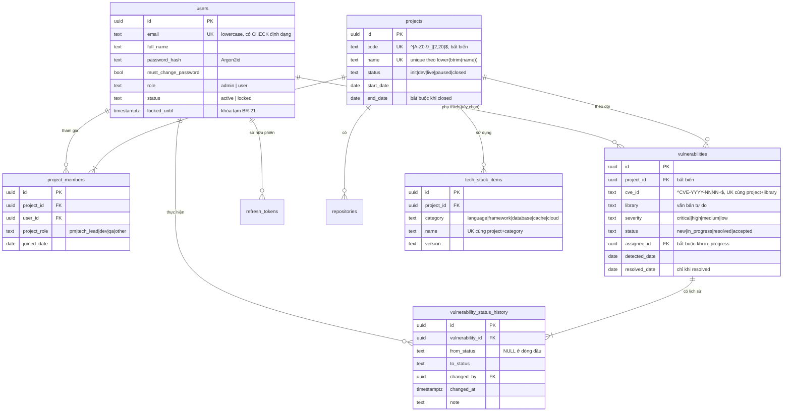

# Database Design — PostgreSQL 17.9

> **Phase**: Design — Technical | **Trạng thái**: Draft v0.1 — chờ Tech Lead review
> **Upstream**: `03-business-entities.md` (v0.2), `01-business-understanding.md` (v0.2 §6)
> **Tệp kèm theo**: `sql/schema.sql` (DDL đầy đủ), `sql/verify_rules.sql` (kịch bản kiểm chứng)
> **Đã kiểm chứng**: DDL được áp lên một PostgreSQL thật và chạy 21 kịch bản ràng buộc — **21/21 đạt**. Chi tiết ở §8.

---

## 1. Nguyên tắc thiết kế

Ba nguyên tắc chi phối toàn bộ schema này, xếp theo thứ tự ưu tiên:

1. **Ràng buộc toàn vẹn đặt càng thấp càng tốt.** Nếu một quy tắc có thể diễn đạt bằng `CHECK`, `UNIQUE` hay trigger thì nó nằm ở database, không nằm ở Python. Lý do: tầng ứng dụng có thể bị vòng qua (script vận hành, migration viết vội, một endpoint mới quên kiểm tra), còn database thì không.
2. **Dấu vết kiểm toán không được phép hỏng vì bug.** BR-13 và BR-14 được enforce bằng **cả trigger lẫn phân quyền DB role** (ADR-04). Một lỗi ORM không được phép xóa lịch sử xử lý lỗ hổng.
3. **Chỉ đánh index cho truy vấn thật.** Mỗi index trong tài liệu này đều chỉ ra được màn hình hoặc endpoint dùng nó. Không có index "cho chắc".

## 2. ERD vật lý



## 3. Danh mục bảng

| #   | Bảng                           | Entity nghiệp vụ           | Số hàng dự kiến (2 năm) | Ghi chú                       |
| --- | ------------------------------ | -------------------------- | ----------------------- | ----------------------------- |
| 1   | `users`                        | User                       | ~150                    | Chỉ khóa, không xóa (BR-23)   |
| 2   | `refresh_tokens`               | _(kỹ thuật)_               | ~450 hoạt động          | Hỗ trợ thu hồi phiên — ADR-03 |
| 3   | `login_attempts`               | _(kỹ thuật)_               | ~50.000, dọn định kỳ    | Thay Redis cho BR-21 — ADR-06 |
| 4   | `projects`                     | Project                    | ~200                    | —                             |
| 5   | `repositories`                 | Repository                 | ~400                    | Chỉ lưu URL (BR-10)           |
| 6   | `project_members`              | ProjectMember              | ~800                    | Luôn còn ≥1 PM (BR-08)        |
| 7   | `tech_stack_items`             | TechStackItem              | ~2.000                  | —                             |
| 8   | `vulnerabilities`              | Vulnerability              | ~5.000                  | **Không xóa** (BR-13)         |
| 9   | `vulnerability_status_history` | VulnerabilityStatusHistory | ~15.000                 | **Bất biến** (BR-14, DEC-10)  |

Tổng khối lượng dữ liệu ước tính dưới 100 MB sau 2 năm — nhỏ so với bộ nhớ của một VM thông thường, nên gần như toàn bộ working set sẽ nằm trong `shared_buffers`. Đây là lý do trực tiếp để **không cần Redis** (ADR-06).

## 4. Quy ước kiểu dữ liệu

| Loại               | Kiểu chọn                    | Lý do                                                                                                                                       |
| ------------------ | ---------------------------- | ------------------------------------------------------------------------------------------------------------------------------------------- |
| Khóa chính         | `UUID` + `gen_random_uuid()` | ID xuất hiện trên URL (`/projects/:id`); dùng số tự tăng sẽ lộ quy mô hệ thống và cho phép đoán bản ghi kế bên                              |
| Tập giá trị (enum) | `TEXT` + `CHECK`             | ADR-08 — migration đơn giản hơn kiểu `ENUM` của Postgres, vốn không xóa được giá trị và `ALTER TYPE ADD VALUE` bị hạn chế trong transaction |
| Thời điểm          | `TIMESTAMPTZ`                | Luôn lưu UTC, hiển thị GMT+7 ở tầng ứng dụng (ASM-05). Không bao giờ dùng `TIMESTAMP` không có timezone                                     |
| Ngày nghiệp vụ     | `DATE`                       | `detected_date`, `resolved_date`, `joined_date`, `start_date`, `end_date` — đây là ngày theo lịch, không phải mốc thời gian                 |
| Văn bản            | `TEXT` + `CHECK char_length` | Postgres không có lợi ích hiệu năng khi dùng `VARCHAR(n)`; đặt giới hạn bằng `CHECK` để thấy rõ và sửa dễ                                   |
| Địa chỉ IP         | `INET`                       | Kiểu chuyên dụng, có sẵn toán tử so khớp dải mạng                                                                                           |

### 4.1 Bảng ánh xạ giá trị hiển thị ↔ giá trị lưu

Tập giá trị của `projects.status` và `project_members.project_role` chốt theo **DEC-08**; `vulnerabilities.status` theo sơ đồ BU §5.1.

Giá trị lưu trong DB là **tiếng Anh, chữ thường, snake_case**; nhãn tiếng Việt do tầng ứng dụng dịch. Không lưu tiếng Việt trong cột trạng thái — nếu sau này thêm ngôn ngữ thì không phải đụng dữ liệu.

| Cột                            | Giá trị lưu                                               | Nhãn hiển thị                                                    |
| ------------------------------ | --------------------------------------------------------- | ---------------------------------------------------------------- |
| `projects.status`              | `init` / `dev` / `live` / `paused` / `closed`             | Khởi tạo / Đang phát triển / Đang vận hành / Tạm dừng / Kết thúc |
| `project_members.project_role` | `pm` / `tech_lead` / `dev` / `qa` / `other`               | PM / Tech Lead / Dev / QA / Khác                                 |
| `tech_stack_items.category`    | `language` / `framework` / `database` / `cache` / `cloud` | Ngôn ngữ / Framework / Database / Cache / Cloud                  |
| `vulnerabilities.severity`     | `critical` / `high` / `medium` / `low`                    | Critical / High / Medium / Low                                   |
| `vulnerabilities.status`       | `new` / `in_progress` / `resolved` / `accepted`           | Mới / Đang xử lý / Đã xử lý / Chấp nhận rủi ro                   |
| `users.role`                   | `admin` / `user`                                          | Admin / User                                                     |
| `users.status`                 | `active` / `locked`                                       | Hoạt động / Khóa                                                 |

## 5. Ràng buộc nghiệp vụ enforce ở tầng DB

| Business rule (BA)                                              | Cách enforce                                                   | Đối tượng DB                                            |
| --------------------------------------------------------------- | -------------------------------------------------------------- | ------------------------------------------------------- |
| BR-05 — luôn còn ≥1 Admin hoạt động                             | Constraint trigger **DEFERRABLE**                              | `users_require_active_admin`                            |
| BR-06 — mã và tên dự án duy nhất                                | Unique index, tên so theo `lower(btrim(...))`                  | `projects_code_uq`, `projects_name_uq`                  |
| BR-08 — mỗi dự án luôn còn ≥1 PM                                | Constraint trigger **DEFERRABLE**                              | `project_members_require_pm`                            |
| BR-09 / R-ENT-005 — tech stack không trùng loại+tên             | Unique index trên `(project_id, category, lower(btrim(name)))` | `tech_stack_project_cat_name_uq`                        |
| BR-10 — repository chỉ là URL                                   | `CHECK (url ~* '^https?://')`                                  | `repositories_url_scheme`                               |
| BR-12 / R-ENT-009 — (dự án+CVE+thư viện) duy nhất               | Unique index có `lower(btrim(library))`                        | `vuln_project_cve_library_uq`                           |
| BR-13 — không xóa lỗ hổng                                       | Trigger `BEFORE DELETE` **+ thu hồi quyền DELETE**             | `vuln_block_delete` + GRANT                             |
| BR-14 — lịch sử bất biến                                        | Trigger chặn UPDATE/DELETE **+ thu hồi quyền**                 | `vsh_block_update`, `vsh_block_delete` + GRANT          |
| BR-23 — chỉ khóa, không xóa tài khoản                           | `ON DELETE RESTRICT` ở mọi FK trỏ tới `users`                  | Toàn bộ FK `*_by`, `user_id`, `assignee_id`             |
| R-ENT-002 — `resolved` cần ngày + ghi chú                       | `CHECK` nhiều cột                                              | `vuln_resolved_requires_fields`                         |
| R-ENT-003 — ngày xử lý ≥ ngày ghi nhận                          | `CHECK` so hai cột                                             | `vuln_resolved_after_detected`                          |
| R-ENT-004 — `accepted` cần lý do                                | `CHECK`                                                        | `vuln_accepted_requires_reason`                         |
| R-ENT-007 — `in_progress` cần người phụ trách                   | `CHECK`                                                        | `vuln_in_progress_requires_assignee`                    |
| R-ENT-008 — `closed` cần `end_date`, và `end_date ≥ start_date` | Hai `CHECK`                                                    | `projects_closed_needs_end_date`, `projects_date_order` |

### 5.1 Vì sao BR-05 và BR-08 phải dùng CONSTRAINT TRIGGER DEFERRABLE

Đây là điểm thiết kế dễ làm sai nhất trong schema này, nên nói rõ.

Cả hai quy tắc đều có dạng "sau thao tác, tập hợp phải còn ít nhất một phần tử thỏa điều kiện". Không diễn đạt được bằng `CHECK` (vì `CHECK` chỉ nhìn một hàng) cũng không bằng `UNIQUE`. Một trigger `AFTER` thông thường sẽ **chặn nhầm một thao tác hợp lệ**: khi PM bàn giao cho người khác, nếu ta hạ vai trò PM cũ trước rồi mới nâng người mới, trigger thường sẽ nổ ở bước một dù kết cục là hợp lệ.

`CONSTRAINT TRIGGER ... DEFERRABLE INITIALLY DEFERRED` giải quyết đúng việc này: kiểm tra được hoãn tới **cuối giao dịch**, nên trình tự bên trong giao dịch không còn quan trọng — chỉ trạng thái cuối cùng mới bị đánh giá.

Điều này đã được kiểm chứng bằng T18 (bàn giao PM) và T21 (nâng Admin thứ hai rồi khóa Admin thứ nhất) — cả hai đều **thành công trong một giao dịch**, trong khi các thao tác đơn lẻ tương ứng (T16, T17, T19, T20) đều bị chặn đúng như mong đợi.

**Hệ quả cho tầng ứng dụng**: mọi thao tác bàn giao PM hoặc đổi vai trò Admin **phải nằm trong một giao dịch duy nhất**. Ghi rõ ở `24-backend-design.md` §6.

### 5.2 Ràng buộc cố ý KHÔNG đặt ở DB

| Ràng buộc                                                                           | Vì sao không đặt ở DB                                                                                                                                                                                                             | Đặt ở đâu                                   |
| ----------------------------------------------------------------------------------- | --------------------------------------------------------------------------------------------------------------------------------------------------------------------------------------------------------------------------------- | ------------------------------------------- |
| Ngày không được là ngày tương lai (`detected_date`, `resolved_date`, `joined_date`) | `CURRENT_DATE` **không immutable**. Đặt vào `CHECK` sẽ khiến một hàng hợp lệ hôm nay có thể **fail khi `pg_restore`**, và `ALTER TABLE ... VALIDATE CONSTRAINT` sẽ đánh giá lại theo ngày chạy lệnh. Đây là một cái bẫy kinh điển | Tầng service — `MSG-VAL-040`, `MSG-VAL-056` |
| Luồng chuyển trạng thái lỗ hổng (R-ENT-001)                                         | Trigger diễn đạt được nhưng thông báo lỗi sẽ nghèo nàn, và luồng còn có thể thay đổi theo nghiệp vụ                                                                                                                               | Tầng service — `MSG-BIZ-040`                |
| BR-15 — chỉ Admin chấp nhận rủi ro Critical/High                                    | DB không biết ai đang thao tác (kết nối dùng chung một DB role)                                                                                                                                                                   | Tầng service + dependency — `MSG-AUTH-006`  |
| BR-18 — không kết thúc dự án khi còn lỗ hổng mở                                     | Diễn đạt được bằng trigger nhưng cần trả về **số lượng** để hiển thị trong `MSG-BIZ-003`                                                                                                                                          | Tầng service                                |
| `projects.code` bất biến (R-ENT-010)                                                | Trigger được, nhưng đơn giản hơn là không đưa trường này vào schema cập nhật                                                                                                                                                      | Tầng service + Pydantic schema              |

> Nguyên tắc rút ra: đặt ở DB những gì **immutable và đúng mãi mãi**; đặt ở service những gì cần **ngữ cảnh người dùng** hoặc cần **thông điệp giàu thông tin**.

## 6. Chiến lược index

Mỗi index dưới đây gắn với một truy vấn có thật.

| Index                                                           | Bảng                           | Phục vụ                                                                                       |
| --------------------------------------------------------------- | ------------------------------ | --------------------------------------------------------------------------------------------- |
| `users_email_uq`                                                | `users`                        | Đăng nhập (`UC-AUTH-01`), kiểm tra trùng email (`MSG-BIZ-061`)                                |
| `users_full_name_search_idx` (GIN, bỏ dấu)                      | `users`                        | Tìm kiếm ở `SCR-ADM-10` — gõ "duc" ra "Đức"                                                   |
| `projects_name_search_idx` (GIN, bỏ dấu)                        | `projects`                     | Tìm kiếm ở `SCR-PRJ-10` — gõ "thanh toan" ra "Thanh toán"                                     |
| `projects_name_uq` (`lower(btrim(name))`)                       | `projects`                     | BR-06                                                                                         |
| `project_members_project_user_uq`                               | `project_members`              | Chống trùng thành viên (`MSG-BIZ-052`)                                                        |
| `project_members_user_idx`                                      | `project_members`              | **Truy vấn nóng nhất hệ thống**: "người này có quyền ghi trên dự án nào" — chạy ở mọi request |
| `project_members_pm_idx` (partial `role='pm'`)                  | `project_members`              | BR-08                                                                                         |
| `tech_stack_name_lower_idx`                                     | `tech_stack_items`             | Lọc dự án theo công nghệ (`SCR-PRJ-10`), Dashboard khối 3                                     |
| **`vuln_open_idx`** (partial `status IN ('new','in_progress')`) | `vulnerabilities`              | **Quan trọng nhất**: cột "lỗ hổng còn mở" ở `SCR-PRJ-10`, ô cảnh báo Dashboard, BR-18, EC-03  |
| `vuln_open_detected_idx` (partial)                              | `vulnerabilities`              | Sắp xếp mặc định của `SCR-SEC-10` theo số ngày còn mở                                         |
| `vuln_severity_status_idx`                                      | `vulnerabilities`              | Ma trận 4×4 ở Dashboard khối 4                                                                |
| `vuln_cve_idx`                                                  | `vulnerabilities`              | Chế độ gom nhóm theo CVE (`SCR-SEC-10`, DEC-04)                                               |
| `vuln_assignee_idx` (partial `NOT NULL`)                        | `vulnerabilities`              | Lọc theo người phụ trách; EC-03 khi xóa thành viên                                            |
| `vsh_vulnerability_idx`                                         | `vulnerability_status_history` | Bảng lịch sử ở `SCR-SEC-11`, sắp mới nhất trước                                               |

**Vì sao dùng partial index cho "còn mở".** Sau vài năm, phần lớn bản ghi lỗ hổng sẽ ở trạng thái `resolved` — nhưng gần như mọi truy vấn quan trọng lại chỉ quan tâm phần **còn mở**. Partial index chỉ chứa các hàng đang mở, nên nhỏ hơn nhiều lần và nằm gọn trong bộ nhớ. Đây là kiểu truy vấn mà partial index sinh ra để phục vụ.

**Về tìm kiếm bỏ dấu.** `unaccent()` mặc định **không immutable** (phụ thuộc dictionary có thể thay đổi) nên không dùng thẳng trong index expression được — Postgres từ chối. Schema bọc lại thành `immutable_unaccent()`. Đánh đổi phải biết: nếu sau này đổi cấu hình dictionary thì **phải `REINDEX`** các index này.

## 7. Migration với Alembic

### 7.1 Quy ước

- Mỗi thay đổi schema là một revision; **không sửa revision đã merge vào nhánh chính**.
- Mọi revision phải có `downgrade()` chạy được. Revision nào không thể hoàn tác (ví dụ xóa cột có dữ liệu) thì `downgrade()` phải `raise` kèm lời giải thích, không để `pass` im lặng.
- Đặt tên: `YYYYMMDD_HHMM_<mô tả ngắn>.py`.
- Migration chạy bằng **DB role owner**, không phải role của ứng dụng (xem §9) — vì role ứng dụng cố ý không có quyền DDL.

### 7.2 Thứ tự revision khởi tạo

| #   | Revision                 | Nội dung                                                    |
| --- | ------------------------ | ----------------------------------------------------------- |
| 001 | `init_extensions`        | `pgcrypto`, `unaccent`, hàm `immutable_unaccent`            |
| 002 | `create_users`           | `users`, `refresh_tokens`, `login_attempts`                 |
| 003 | `create_projects`        | `projects`, `repositories`, `project_members`               |
| 004 | `create_tech_stack`      | `tech_stack_items`                                          |
| 005 | `create_vulnerabilities` | `vulnerabilities`, `vulnerability_status_history`           |
| 006 | `create_triggers`        | 5 nhóm trigger ở §5                                         |
| 007 | `create_views`           | `v_open_vulnerabilities`, `v_project_summary`               |
| 008 | `create_roles_grants`    | DB role ứng dụng + thu hồi quyền theo ADR-04                |
| 009 | `seed_bootstrap_admin`   | Một tài khoản Admin khởi tạo, `must_change_password = true` |

### 7.3 Cạm bẫy cần tránh

- **Alembic autogenerate không phát hiện được** trigger, view, partial index có biểu thức, và `CHECK` phức tạp. Những thứ này phải viết tay bằng `op.execute()`. Sau mỗi lần autogenerate, đọc lại file sinh ra trước khi commit — đừng tin nó là đủ.
- Thêm cột `NOT NULL` vào bảng đã có dữ liệu: thêm dạng nullable → backfill → mới `SET NOT NULL`. Ở quy mô này (dưới 5.000 hàng) có thể làm một bước, nhưng giữ thói quen đúng.
- Migration **008** thu hồi quyền của role ứng dụng. Sau khi chạy, phải kiểm tra lại rằng ứng dụng vẫn `INSERT` được vào `vulnerability_status_history` — quyền `INSERT` phải còn, chỉ `UPDATE`/`DELETE` bị thu hồi.

## 8. Kết quả kiểm chứng

DDL trong `sql/schema.sql` đã được áp lên một PostgreSQL thật và chạy `sql/verify_rules.sql` gồm 21 kịch bản. **Kết quả: 21/21 đạt.**

| #   | Kịch bản                                                           | Kỳ vọng    | Kết quả |
| --- | ------------------------------------------------------------------ | ---------- | ------- |
| T01 | Tên dự án trùng, khác hoa/thường và có khoảng trắng thừa           | Lỗi        | Đạt     |
| T02 | Mã dự án viết thường                                               | Lỗi        | Đạt     |
| T03 | `status='closed'` mà thiếu `end_date`                              | Lỗi        | Đạt     |
| T04 | Tech stack trùng loại+tên, khác hoa/thường                         | Lỗi        | Đạt     |
| T05 | Mã CVE sai định dạng (`CVE-24-123`)                                | Lỗi        | Đạt     |
| T06 | Ghi nhận lỗ hổng hợp lệ + dòng lịch sử đầu tiên                    | Thành công | Đạt     |
| T07 | Trùng (dự án + CVE + thư viện), thư viện khác hoa/thường           | Lỗi        | Đạt     |
| T08 | Chuyển `in_progress` mà không có người phụ trách                   | Lỗi        | Đạt     |
| T09 | Chuyển `in_progress` có người phụ trách                            | Thành công | Đạt     |
| T10 | Chuyển `resolved` thiếu ghi chú                                    | Lỗi        | Đạt     |
| T11 | Ngày xử lý trước ngày ghi nhận                                     | Lỗi        | Đạt     |
| T12 | Chuyển `resolved` đầy đủ                                           | Thành công | Đạt     |
| T13 | Xóa lỗ hổng (BR-13)                                                | Lỗi        | Đạt     |
| T14 | Sửa dòng lịch sử (BR-14)                                           | Lỗi        | Đạt     |
| T15 | Xóa dòng lịch sử (BR-14)                                           | Lỗi        | Đạt     |
| T16 | Xóa PM cuối cùng (BR-08)                                           | Lỗi        | Đạt     |
| T17 | Hạ vai trò PM cuối cùng (BR-08)                                    | Lỗi        | Đạt     |
| T18 | **Bàn giao PM trong một giao dịch**                                | Thành công | Đạt     |
| T19 | Hạ vai trò Admin cuối cùng (BR-05)                                 | Lỗi        | Đạt     |
| T20 | Khóa Admin cuối cùng (BR-05)                                       | Lỗi        | Đạt     |
| T21 | **Nâng Admin thứ hai rồi khóa Admin thứ nhất trong một giao dịch** | Thành công | Đạt     |

> **Lưu ý về môi trường kiểm chứng**: chạy trên PostgreSQL 16 (bản có sẵn trong môi trường kiểm thử), trong khi đích triển khai là **17.9**. Toàn bộ cú pháp và tính năng dùng ở đây đã có từ Postgres 13 trở đi, nên không có khác biệt nào đáng lo giữa hai bản. Dù vậy, **cần chạy lại kịch bản này trên 17.9** ở lần dựng môi trường đầu tiên như một bước kiểm tra hồi quy.

## 9. Phân quyền DB role

Hai role, tách bạch rõ ràng:

| Role          | Dùng cho                             | Quyền                                                                 |
| ------------- | ------------------------------------ | --------------------------------------------------------------------- |
| `app_owner`   | Alembic migration, thao tác vận hành | Chủ sở hữu toàn bộ schema, có DDL                                     |
| `app_runtime` | Kết nối của FastAPI                  | `SELECT`, `INSERT`, `UPDATE`, `DELETE` — **trừ các thu hồi bên dưới** |

```sql
-- Trích từ migration 008
REVOKE DELETE ON vulnerabilities              FROM app_runtime;
REVOKE UPDATE, DELETE ON vulnerability_status_history FROM app_runtime;
-- app_runtime vẫn INSERT được vào bảng lịch sử: ghi thêm thì được, sửa quá khứ thì không.
```

Đây là hiện thực hóa của ADR-04. Trigger ở §5 là lớp bảo vệ thứ hai — nếu ai đó cấp lại quyền nhầm, trigger vẫn chặn.

## 10. Vận hành dữ liệu

| Việc                                                        | Tần suất                         | Ghi chú                                                                                                 |
| ----------------------------------------------------------- | -------------------------------- | ------------------------------------------------------------------------------------------------------- |
| Dọn `login_attempts` cũ hơn 30 ngày                         | Hằng ngày                        | `DELETE FROM login_attempts WHERE attempted_at < now() - interval '30 days'` — bảng này tăng nhanh nhất |
| Dọn `refresh_tokens` đã hết hạn hoặc bị thu hồi quá 30 ngày | Hằng ngày                        | Giữ 30 ngày để còn điều tra được khi nghi ngờ đánh cắp token                                            |
| `VACUUM`/`ANALYZE`                                          | Autovacuum mặc định              | Khối lượng nhỏ, không cần chỉnh                                                                         |
| Sao lưu                                                     | Xem `27-devops-deployment.md` §6 | **Không bao giờ** dọn `vulnerabilities` hay `vulnerability_status_history`                              |

> Hai bảng lỗ hổng và lịch sử **không có chính sách xóa dữ liệu**. Đây là quyết định nghiệp vụ (BR-13, BR-14), không phải thiếu sót — ai đề xuất "dọn dữ liệu cũ" cho hai bảng này cần được chỉ ngược lại về BU §8.1.

## 11. Câu hỏi mở

| Mã      | Câu hỏi                                                                                                       | Ảnh hưởng                                                                                                                                   |
| ------- | ------------------------------------------------------------------------------------------------------------- | ------------------------------------------------------------------------------------------------------------------------------------------- |
| Q-DB-01 | Q-09 (BU) — nếu lỗ hổng Critical là dữ liệu hạn chế theo quyền, có cần Row Level Security của Postgres không? | Cách hiện tại (lọc ở tầng service) đơn giản hơn nhưng dựa vào việc mọi truy vấn đều nhớ lọc. RLS an toàn hơn nhưng khó debug                |
| Q-DB-02 | Q-ENT-04 — có chuẩn hóa danh mục tên công nghệ thành bảng riêng không?                                        | Hiện `tech_stack_items.name` là văn bản tự do; tách bảng `technologies` sẽ làm Dashboard khối 3 chính xác nhưng thêm màn quản trị danh mục  |
| Q-DB-03 | Q-ENT-05 — `vulnerabilities.library` có nên thành FK tới `tech_stack_items` không?                            | Hiện là văn bản tự do có chủ ý (lỗ hổng có thể ở thư viện phụ thuộc gián tiếp chưa khai báo). Đổi thành FK sẽ chặn mất trường hợp hợp lệ đó |
| Q-DB-04 | Có cần bảng `audit_log` chung cho hành vi đăng nhập và truy cập dữ liệu nhạy cảm không?                       | Q-10 (BU) — nếu có thì thêm bảng thứ 10, chỉ ghi thêm, không sửa                                                                            |

**Last Updated**: 2026-08-26
