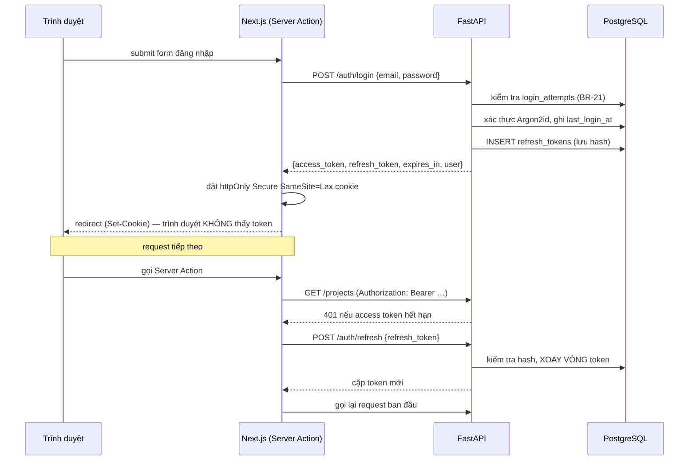

# API Specification — FastAPI

> **Phase**: Design — Technical | **Trạng thái**: Draft v0.1 — chờ Tech Lead review
> **Upstream**: `02-usecase-overview.md`, `04-role-matrix.md`, `07/08/09-screen-spec-*.md`, `10-error-message-catalog.md`
> **Base URL**: `http://api:8000/api/v1` (mạng nội bộ Docker — **không** phơi ra ngoài, xem ADR-02)
> **Người gọi duy nhất**: container `web` (Next.js). Trình duyệt không bao giờ gọi trực tiếp.

---

## 1. Quy ước chung

### 1.1 Định dạng

| Hạng mục    | Quy ước                                                | Lý do                                                                                  |
| ----------- | ------------------------------------------------------ | -------------------------------------------------------------------------------------- |
| Tên trường  | **snake_case** ở cả request lẫn response               | Chuẩn nội bộ; FE giữ nguyên tên, không đổi tên lại — tránh churn khi hợp đồng thay đổi |
| Thời điểm   | ISO 8601 UTC có hậu tố `Z` — `2026-08-26T09:14:00Z`    | Đổi sang GMT+7 ở tầng hiển thị (ASM-05)                                                |
| Ngày        | `YYYY-MM-DD`                                           | Ngày theo lịch, không kèm giờ                                                          |
| ID          | UUID dạng chuỗi                                        | Khớp `22-database-design.md` §4                                                        |
| Tập giá trị | Chữ thường, snake_case (`in_progress`, `tech_lead`)    | Khớp giá trị lưu trong DB; nhãn tiếng Việt do FE dịch                                  |
| Rỗng        | `null` cho giá trị không có; **không** dùng chuỗi rỗng | Phân biệt "chưa nhập" với "nhập chuỗi rỗng"                                            |

### 1.2 Vỏ response

Response thành công trả **thẳng** đối tượng hoặc cấu trúc phân trang, **không** bọc thêm lớp `{data: ...}`:

```jsonc
// GET /projects/{id} — 200
{ "id": "…", "code": "PAYGW", "name": "Cổng thanh toán", … }

// GET /projects — 200 (danh sách phân trang)
{
  "items": [ … ],
  "meta": { "page": 1, "per_page": 20, "total_items": 47,
            "total_pages": 3, "has_next": true, "has_prev": false }
}
```

Cấu trúc `{items, meta}` là **bắt buộc** cho mọi danh sách và khớp đúng type `DataResponse<T>` của starter FE. Không phát minh vỏ riêng kiểu `{projects: [], count: n}`.

### 1.3 Vỏ lỗi

Mọi lỗi trả về cùng một hình dạng, và **luôn có mã message** trỏ tới `10-error-message-catalog.md`:

```jsonc
{
  "error": {
    "code": "MSG-BIZ-003",
    "message": "Không thể kết thúc dự án khi còn 8 lỗ hổng chưa xử lý. Vui lòng xử lý hoặc chấp nhận rủi ro trước.",
    "field": null,
    "details": { "open_count": 8, "project_id": "…" },
  },
}
```

| Trường    | Ý nghĩa                                                                                     |
| --------- | ------------------------------------------------------------------------------------------- |
| `code`    | Mã trong Error Message Catalog. **Đây mới là hợp đồng**, không phải `message`               |
| `message` | Nội dung tiếng Việt đã điền biến — tiện cho log và debug                                    |
| `field`   | Tên trường gây lỗi, hoặc `null` nếu lỗi thuộc cả form. FE dùng để đặt lỗi inline đúng ô     |
| `details` | Dữ liệu bổ sung để FE dựng thông báo giàu thông tin (số lượng, liên kết tới bản ghi trùng…) |

> **Nguyên tắc quan trọng**: FE hiển thị theo `code`, **không** parse `message`. Nếu sau này đổi câu chữ trong catalog thì FE không phải sửa. Trường `details` là nơi truyền dữ liệu FE cần để dựng liên kết (ví dụ `MSG-BIZ-030` cần `existing_vulnerability_id` để làm liên kết "Xem bản ghi đã có").

Lỗi validate nhiều trường cùng lúc trả `422` với danh sách:

```jsonc
{
  "error": {
    "code": "MSG-VAL-MULTI",
    "message": "Dữ liệu không hợp lệ.",
    "field": null,
    "details": {
      "errors": [
        { "field": "code", "code": "MSG-VAL-013", "message": "…" },
        { "field": "name", "code": "MSG-VAL-014", "message": "…" },
      ],
    },
  },
}
```

### 1.4 Mã HTTP

| Mã    | Dùng khi                                                | Nhóm message tương ứng         |
| ----- | ------------------------------------------------------- | ------------------------------ |
| `200` | Đọc, cập nhật thành công                                | —                              |
| `201` | Tạo mới thành công                                      | `MSG-INF-*`                    |
| `204` | Xóa thành công (chỉ thành viên, tech stack, repository) | —                              |
| `400` | Vi phạm quy tắc nghiệp vụ                               | `MSG-BIZ-*`                    |
| `401` | Chưa xác thực hoặc token hết hạn                        | `MSG-AUTH-001..004`            |
| `403` | Đã xác thực nhưng không đủ quyền                        | `MSG-AUTH-005`, `MSG-AUTH-006` |
| `404` | Bản ghi không tồn tại                                   | `MSG-NF-*`                     |
| `409` | **Xung đột cập nhật đồng thời**                         | `MSG-BIZ-020`, `MSG-BIZ-021`   |
| `422` | Sai định dạng đầu vào                                   | `MSG-VAL-*`                    |
| `429` | Vượt giới hạn tần suất                                  | `MSG-AUTH-002`                 |
| `500` | Lỗi ngoài dự kiến                                       | `MSG-SYS-001`                  |

> **`400` với `409` khác nhau có chủ ý.** `400` là "yêu cầu của bạn sai theo nghiệp vụ, sửa rồi thử lại". `409` là "yêu cầu của bạn đúng nhưng dữ liệu đã đổi, tải lại rồi làm lại". Screen Spec xử lý hai trường hợp này khác nhau (một bên hiện lỗi inline, một bên hiện nút "Tải lại dữ liệu mới"), nên API phải phân biệt được.

### 1.5 Phân trang, sắp xếp, lọc

| Tham số    | Kiểu    | Mặc định     | Ghi chú                                                                |
| ---------- | ------- | ------------ | ---------------------------------------------------------------------- |
| `page`     | int ≥ 1 | 1            | —                                                                      |
| `per_page` | int     | 20           | Chỉ nhận 20 / 50 / 100 (ASM-06); giá trị khác trả `422`                |
| `sort`     | string  | tùy endpoint | Dạng `field:asc` hoặc `field:desc`; chỉ nhận danh sách trường cho phép |
| `q`        | string  | —            | Tìm kiếm toàn văn, bỏ dấu tiếng Việt                                   |

Tham số lọc nhận nhiều giá trị viết dạng danh sách phân tách bằng dấu phẩy: `?status=new,in_progress&severity=critical,high`. Cách này giữ URL đọc được và khớp với query string mà FE dùng để chia sẻ link (Screen Spec §1.7 của `SCR-SEC-10`).

### 1.6 Khóa lạc quan

Mọi endpoint `PATCH` **bắt buộc** nhận `updated_at` trong body — chính giá trị FE đã đọc về:

```jsonc
PATCH /projects/{id}
{ "name": "Cổng thanh toán mới", "status": "paused",
  "updated_at": "2026-08-25T16:20:00Z" }
```

Nếu lệch với DB → `409` kèm `MSG-BIZ-020` và `details.current` chứa bản ghi mới nhất, để FE hiển thị được cái gì đã thay đổi mà không cần gọi thêm một lượt. Xem ADR-11.

## 2. Xác thực

### 2.1 Luồng



### 2.2 Vòng đời token

| Token        | Thời hạn                       | Lưu ở đâu                                         | Thu hồi                                         |
| ------------ | ------------------------------ | ------------------------------------------------- | ----------------------------------------------- |
| Access (JWT) | **15 phút**                    | Chỉ trong httpOnly cookie do Next.js giữ          | Không thu hồi được — chấp nhận vì thời hạn ngắn |
| Refresh      | **8 giờ trượt**, tối đa 24 giờ | httpOnly cookie + **hash** trong `refresh_tokens` | Xóa/đánh dấu hàng trong DB là mất hiệu lực ngay |

**Xoay vòng và phát hiện đánh cắp.** Mỗi lần refresh, token cũ bị đánh dấu `replaced_by` token mới. Nếu một token **đã bị thay** được dùng lại, đó là dấu hiệu token bị đánh cắp: hệ thống thu hồi **toàn bộ chuỗi** của người dùng đó và buộc đăng nhập lại. Chi tiết ở `26-security-nfr.md` §5.

**Khóa tài khoản là hủy phiên.** Khi Admin khóa một tài khoản (`POST /admin/users/{id}/lock`), toàn bộ hàng `refresh_tokens` của người đó bị thu hồi trong cùng giao dịch. Người đó mất quyền truy cập chậm nhất sau 15 phút (khi access token hết hạn). Đây là lý do ADR-03 chọn lưu hash refresh trong DB thay vì JWT thuần.

### 2.3 Endpoint xác thực

| Method | Path                    | Use case   | Quyền                      | Body / Query                       | Trả về                                                                               |
| ------ | ----------------------- | ---------- | -------------------------- | ---------------------------------- | ------------------------------------------------------------------------------------ |
| `POST` | `/auth/login`           | UC-AUTH-01 | Public                     | `{email, password}`                | `200` cặp token + hồ sơ người dùng · `401` `MSG-AUTH-001/003` · `429` `MSG-AUTH-002` |
| `POST` | `/auth/refresh`         | —          | Public (cần refresh token) | `{refresh_token}`                  | `200` cặp token mới · `401` nếu không hợp lệ hoặc đã bị thay                         |
| `POST` | `/auth/logout`          | UC-AUTH-02 | Đã đăng nhập               | `{refresh_token}`                  | `204` — thu hồi token                                                                |
| `POST` | `/auth/change-password` | UC-AUTH-03 | Đã đăng nhập               | `{current_password, new_password}` | `200` `MSG-INF-001` · `422` `MSG-VAL-001/008` · `400` `MSG-VAL-002`                  |
| `GET`  | `/auth/me`              | —          | Đã đăng nhập               | —                                  | `200` hồ sơ + `writable_project_ids`                                                 |

> **`/auth/me` trả kèm `writable_project_ids`** — danh sách ID dự án người dùng có quyền ghi. FE dùng nó để quyết định ẩn/hiện nút mà không phải hỏi lại máy chủ ở từng màn (`[PERMISSION-CLIENT]` trong Screen Spec). Với ~200 dự án và mỗi người tham gia vài dự án, danh sách này rất nhỏ. **Máy chủ vẫn kiểm tra lại ở mọi thao tác ghi** — đây chỉ là dữ liệu để giao diện thân thiện, không phải cơ chế bảo mật.

## 3. Danh mục endpoint

Ký hiệu quyền: **P** public · **A** đã đăng nhập · **W** có quyền ghi trên dự án · **ADM** chỉ Admin

### 3.1 Quản trị người dùng — `SCR-ADM-10`, `SCR-ADM-11`

| Method  | Path                               | UC                   | Quyền   | Ghi chú                                                                    |
| ------- | ---------------------------------- | -------------------- | ------- | -------------------------------------------------------------------------- |
| `GET`   | `/admin/users`                     | UC-ADM-01, UC-ADM-02 | **ADM** | Lọc `q`, `role`, `status`; phân trang                                      |
| `POST`  | `/admin/users`                     | UC-ADM-01            | **ADM** | `409` → `MSG-BIZ-061` nếu trùng email                                      |
| `GET`   | `/admin/users/{id}`                | UC-ADM-01            | **ADM** | `404` → `MSG-NF-002`                                                       |
| `PATCH` | `/admin/users/{id}`                | UC-ADM-01/02         | **ADM** | Sửa `full_name`, `role`, `status`. `400` → `MSG-BIZ-060` nếu vi phạm BR-05 |
| `POST`  | `/admin/users/{id}/lock`           | UC-ADM-01            | **ADM** | Thu hồi toàn bộ refresh token trong cùng giao dịch                         |
| `POST`  | `/admin/users/{id}/unlock`         | UC-ADM-01            | **ADM** | Đặt lại `failed_login_count`                                               |
| `POST`  | `/admin/users/{id}/reset-password` | UC-ADM-01            | **ADM** | Bật `must_change_password`; trả mật khẩu tạm **một lần duy nhất**          |

### 3.2 Dự án — `SCR-PRJ-10`, `SCR-PRJ-11`, `SCR-PRJ-20`

| Method  | Path                          | UC        | Quyền | Ghi chú                                                                        |
| ------- | ----------------------------- | --------- | ----- | ------------------------------------------------------------------------------ |
| `GET`   | `/projects`                   | UC-PRJ-01 | **A** | Lọc `q`, `status`, `tech`, `open_severity`. Trả kèm số lỗ hổng còn mở theo mức |
| `POST`  | `/projects`                   | UC-PRJ-03 | **A** | BR-04 — người tạo tự thành PM trong cùng giao dịch                             |
| `GET`   | `/projects/{id}`              | UC-PRJ-02 | **A** | —                                                                              |
| `GET`   | `/projects/{id}/summary`      | UC-PRJ-02 | **A** | Ba ô chỉ số. **Endpoint riêng** để lỗi ở đây không làm hỏng cả màn             |
| `PATCH` | `/projects/{id}`              | UC-PRJ-03 | **W** | `400` → `MSG-BIZ-003` (BR-18, DEC-05) · `409` → `MSG-BIZ-020`                  |
| `GET`   | `/projects/export`            | UC-PRJ-05 | **A** | CSV theo bộ lọc — xem §5                                                       |
| `GET`   | `/projects/{id}/repositories` | UC-PRJ-02 | **A** | —                                                                              |
| `PUT`   | `/projects/{id}/repositories` | UC-PRJ-03 | **W** | **Thay trọn danh sách**, không sửa từng dòng — xem ghi chú dưới                |

> **Vì sao repository dùng `PUT` thay cả danh sách.** Màn `SCR-PRJ-11` cho người dùng thêm/xóa/sửa nhiều dòng repository rồi bấm Lưu một lần. Nếu API làm từng dòng, một lần Lưu sẽ thành nhiều request và có thể dừng giữa chừng, để lại trạng thái nửa vời mà giao diện không mô tả. Thay trọn danh sách trong một giao dịch khớp đúng với cách người dùng nghĩ về thao tác này.

### 3.3 Thành viên dự án — `SCR-PRJ-21`

| Method   | Path                                 | UC        | Quyền | Ghi chú                                                                                   |
| -------- | ------------------------------------ | --------- | ----- | ----------------------------------------------------------------------------------------- |
| `GET`    | `/projects/{id}/members`             | UC-PRJ-04 | **A** | Trả kèm `user.role` và `user.status` để hiện nhãn "Tài khoản đã khóa"                     |
| `POST`   | `/projects/{id}/members`             | UC-PRJ-04 | **W** | `409` → `MSG-BIZ-052` nếu đã là thành viên                                                |
| `PATCH`  | `/projects/{id}/members/{member_id}` | UC-PRJ-04 | **W** | Đổi `project_role`. `400` → `MSG-BIZ-051` (BR-08)                                         |
| `DELETE` | `/projects/{id}/members/{member_id}` | UC-PRJ-04 | **W** | `400` → `MSG-BIZ-050` kèm `details.blocking_vulnerabilities[]` (EC-03) hoặc `MSG-BIZ-051` |

> `DELETE` khi bị chặn bởi EC-03 trả về **danh sách lỗ hổng đang chặn** trong `details`, để giao diện dựng được hộp thoại có liên kết tới từng lỗ hổng — đúng như Screen Spec `SCR-PRJ-21` §4.6 mô tả. Không bắt FE gọi thêm một lượt để lấy danh sách đó.

### 3.4 Tech Stack — `SCR-PRJ-22`, `SCR-PRJ-23`

| Method   | Path                                  | UC       | Quyền | Ghi chú                                                                             |
| -------- | ------------------------------------- | -------- | ----- | ----------------------------------------------------------------------------------- |
| `GET`    | `/projects/{id}/tech-stack`           | UC-TS-01 | **A** | Nhóm theo `category`; kèm `related_open_vulnerability_count` cho mỗi hạng mục       |
| `POST`   | `/projects/{id}/tech-stack`           | UC-TS-02 | **W** | `409` → `MSG-BIZ-010` kèm `details.existing_id`                                     |
| `PATCH`  | `/projects/{id}/tech-stack/{item_id}` | UC-TS-02 | **W** | `409` xung đột hoặc trùng                                                           |
| `DELETE` | `/projects/{id}/tech-stack/{item_id}` | UC-TS-02 | **W** | `204`. **Không chặn** khi có lỗ hổng liên quan — chỉ cảnh báo ở FE (EC-06)          |
| `GET`    | `/tech-stack/names`                   | —        | **A** | Gợi ý tên công nghệ đã dùng trong hệ thống (ô lọc `SCR-PRJ-10`, gợi ý `SCR-PRJ-23`) |

> `DELETE` tech stack **cố ý trả 204 ngay cả khi có lỗ hổng liên quan**. `MSG-BIZ-011` là cảnh báo hiển thị **trước** khi gọi API (FE lấy số lượng từ `related_open_vulnerability_count` đã có sẵn trong `GET`), không phải lỗi trả về. Đây là chỗ rất dễ implement nhầm thành chặn — xem `10-error-message-catalog.md` §11 điểm 4.

### 3.5 Lỗ hổng bảo mật — `SCR-SEC-10`, `SCR-SEC-11`, `SCR-PRJ-24`

| Method  | Path                               | UC        | Quyền | Ghi chú                                                                                                                                  |
| ------- | ---------------------------------- | --------- | ----- | ---------------------------------------------------------------------------------------------------------------------------------------- |
| `GET`   | `/vulnerabilities`                 | UC-SEC-01 | **A** | Lọc `q`, `project_id`, `severity`, `status`, `assignee_id`, `detected_from`, `detected_to`, `overdue`. Mặc định `status=new,in_progress` |
| `GET`   | `/vulnerabilities/grouped`         | UC-SEC-01 | **A** | Gom nhóm theo `cve_id` (DEC-04) — endpoint riêng vì hình dạng dữ liệu khác hẳn                                                           |
| `GET`   | `/vulnerabilities/facets`          | UC-SEC-01 | **A** | Số lượng theo từng mức, áp cùng bộ lọc **trừ** bộ lọc mức — cho nhãn đếm trên ô lọc                                                      |
| `POST`  | `/vulnerabilities`                 | UC-SEC-02 | **W** | `409` → `MSG-BIZ-030` kèm `details.existing_id` · `400` → `MSG-BIZ-032` nếu dự án đã kết thúc                                            |
| `GET`   | `/vulnerabilities/{id}`            | UC-SEC-01 | **A** | —                                                                                                                                        |
| `PATCH` | `/vulnerabilities/{id}`            | UC-SEC-02 | **W** | Sửa nội dung. **Không** đổi được `project_id` (R-ENT-012), **không** đổi `status`                                                        |
| `POST`  | `/vulnerabilities/{id}/transition` | UC-SEC-03 | **W** | **Endpoint riêng cho chuyển trạng thái** — xem ghi chú                                                                                   |
| `GET`   | `/vulnerabilities/{id}/history`    | UC-SEC-04 | **A** | Sắp mới nhất trước; endpoint riêng để lỗi không làm hỏng cả màn                                                                          |
| `GET`   | `/vulnerabilities/export`          | UC-SEC-05 | **A** | CSV theo bộ lọc — xem §5                                                                                                                 |

> **Vì sao chuyển trạng thái là endpoint riêng chứ không phải `PATCH {status}`.** Chuyển trạng thái không phải "gán một giá trị" mà là **một hành động nghiệp vụ** có tiền điều kiện riêng (luồng hợp lệ R-ENT-001), trường bắt buộc thay đổi theo đích đến (R-ENT-002/004/007), quy tắc phân quyền riêng theo mức nghiêm trọng (BR-15), và **luôn sinh một dòng lịch sử** (BR-14). Nhét vào `PATCH` sẽ khiến một endpoint mang hai ngữ nghĩa khác nhau và rất dễ để lọt trường hợp cập nhật `status` mà quên ghi lịch sử.

**Body của `POST /vulnerabilities/{id}/transition`:**

```jsonc
{
  "to_status": "resolved",
  "note": "Đã nâng log4j-core lên 2.17.1, chạy lại bộ hồi quy đầy đủ.",
  "resolved_date": "2026-08-26", // bắt buộc khi to_status=resolved
  "assignee_id": null, // bắt buộc khi to_status=in_progress và chưa có
  "updated_at": "2026-08-25T09:12:00Z",
}
```

| Đích                                 | Trường bắt buộc thêm        | Quy tắc                                | Lỗi khi thiếu                 |
| ------------------------------------ | --------------------------- | -------------------------------------- | ----------------------------- |
| `in_progress`                        | `assignee_id` (nếu chưa có) | R-ENT-007                              | `MSG-VAL-033`                 |
| `resolved`                           | `resolved_date`, `note`     | R-ENT-002, R-ENT-003                   | `MSG-VAL-031`, `MSG-VAL-030`  |
| `accepted`                           | `note` (lý do)              | R-ENT-004; **BR-15** nếu Critical/High | `MSG-VAL-032`, `MSG-AUTH-006` |
| `in_progress` từ `resolved` (mở lại) | `note` (lý do mở lại)       | —                                      | `MSG-VAL-057`                 |

### 3.6 Dashboard — `SCR-DASH-10`

Bốn endpoint **hoàn toàn độc lập**, đúng theo yêu cầu của Screen Spec: lỗi ở một khối không được làm hỏng ba khối còn lại.

| Method | Path                              | Khối   | Ghi chú                                                     |
| ------ | --------------------------------- | ------ | ----------------------------------------------------------- |
| `GET`  | `/dashboard/security-alerts`      | Khối 1 | Critical còn mở, quá hạn >30 ngày, chưa gán người phụ trách |
| `GET`  | `/dashboard/projects-by-status`   | Khối 2 | Đếm theo 5 trạng thái                                       |
| `GET`  | `/dashboard/tech-distribution`    | Khối 3 | Top 10 công nghệ theo số dự án                              |
| `GET`  | `/dashboard/vulnerability-matrix` | Khối 4 | Ma trận 4 mức × 4 trạng thái + dòng/cột tổng                |

Tất cả nhận chung tham số `?include_closed_projects=false` (mặc định `false` — BR-19).

> **Vì sao không gộp thành một `GET /dashboard`.** Gộp thì một truy vấn chậm hoặc lỗi sẽ kéo cả màn xuống, trong khi Screen Spec `SCR-DASH-10` §4.5 yêu cầu rõ: _"Chỉ khối đó hiện thông báo kèm nút Thử lại; ba khối còn lại hiển thị bình thường"_. Bốn endpoint tách rời cho phép FE gọi song song và xử lý lỗi từng khối. Chi phí: bốn kết nối thay vì một — không đáng kể trong cùng một VM.

## 4. Bảng ánh xạ mã lỗi → HTTP

Bảng này là hợp đồng giữa BE và FE. Mọi `MSG-*` trong `10-error-message-catalog.md` có thể xuất hiện từ API đều nằm đây.

| HTTP  | Mã message                    | Endpoint điển hình                                                     |
| ----- | ----------------------------- | ---------------------------------------------------------------------- | ---------------------------------------------------- |
| `401` | `MSG-AUTH-001`                | `POST /auth/login` — email hoặc mật khẩu sai                           |
| `401` | `MSG-AUTH-003`                | `POST /auth/login` — tài khoản bị khóa                                 |
| `401` | `MSG-AUTH-004`                | Mọi endpoint — token hết hạn                                           |
| `403` | `MSG-AUTH-005`                | Mọi endpoint cần **ADM** hoặc **W**                                    |
| `403` | `MSG-AUTH-006`                | `POST /vulnerabilities/{id}/transition` — BR-15                        |
| `404` | `MSG-NF-001`                  | `/projects/{id}`                                                       |
| `404` | `MSG-NF-002`                  | `/admin/users/{id}`                                                    |
| `404` | `MSG-NF-003`                  | `/projects/{id}/members/{member_id}`                                   |
| `404` | `MSG-NF-004`                  | `/projects/{id}/tech-stack/{item_id}`                                  |
| `404` | `MSG-NF-005`                  | `/vulnerabilities/{id}`                                                |
| `409` | `MSG-BIZ-020`                 | Mọi `PATCH` — xung đột `updated_at`                                    |
| `409` | `MSG-BIZ-021`                 | `POST /vulnerabilities/{id}/transition` — kèm `details.current_status` |
| `409` | `MSG-BIZ-001` / `MSG-BIZ-002` | `POST                                                                  | PATCH /projects` — trùng mã / tên                    |
| `409` | `MSG-BIZ-010`                 | `POST                                                                  | PATCH /projects/{id}/tech-stack`                     |
| `409` | `MSG-BIZ-030`                 | `POST /vulnerabilities`                                                |
| `409` | `MSG-BIZ-052`                 | `POST /projects/{id}/members`                                          |
| `409` | `MSG-BIZ-061`                 | `POST /admin/users`                                                    |
| `400` | `MSG-BIZ-003`                 | `PATCH /projects/{id}` — BR-18, kèm `details.open_count`               |
| `400` | `MSG-BIZ-032`                 | `POST /vulnerabilities` — dự án đã kết thúc                            |
| `400` | `MSG-BIZ-033`                 | `POST                                                                  | PATCH /vulnerabilities` — assignee là tài khoản khóa |
| `400` | `MSG-BIZ-040`                 | `POST /vulnerabilities/{id}/transition` — luồng không hợp lệ           |
| `400` | `MSG-BIZ-050` / `MSG-BIZ-051` | `DELETE                                                                | PATCH /projects/{id}/members/{id}`                   |
| `400` | `MSG-BIZ-060`                 | `PATCH /admin/users/{id}`, `/lock` — BR-05                             |
| `400` | `MSG-BIZ-070` / `MSG-BIZ-071` | `/projects/export`, `/vulnerabilities/export`                          |
| `422` | `MSG-VAL-*`                   | Mọi endpoint có nhập liệu                                              |
| `429` | `MSG-AUTH-002`                | `POST /auth/login` — BR-21                                             |
| `500` | `MSG-SYS-001`                 | Mọi endpoint                                                           |

### 4.1 Mã message chỉ tồn tại ở FE

Các mã sau **không bao giờ** do API sinh ra — chúng thuộc về giao diện: `MSG-VAL-003`, `MSG-VAL-004`, `MSG-VAL-005`, `MSG-VAL-006`, `MSG-VAL-007`, `MSG-INF-003`, `MSG-INF-010..016`, `MSG-INF-030..045`, `MSG-SYS-002` (mất kết nối), `MSG-SYS-003`, `MSG-SYS-004`, `MSG-SYS-006`.

Phân biệt này quan trọng: một mã trạng thái rỗng như `MSG-INF-036` được FE hiển thị khi `items` là mảng rỗng — API **không** trả lỗi cho danh sách rỗng, mà trả `200` với `items: []`. Đây là quy ước ở `contract-conventions` của starter và cũng là điều Screen Spec mô tả (danh sách rỗng không phải lỗi).

## 5. Kết xuất CSV

Hai endpoint `/projects/export` và `/vulnerabilities/export` dùng chung cơ chế:

| Hạng mục         | Quy định                                                                          |
| ---------------- | --------------------------------------------------------------------------------- |
| Nguồn quyết định | **DEC-06** — có export CSV, UTF-8 có BOM, CRLF, tối đa 10.000 dòng                |
| Phạm vi          | Toàn bộ kết quả của **bộ lọc hiện tại**, không giới hạn ở trang đang xem          |
| Giới hạn         | 10.000 dòng. Vượt → `400` + `MSG-BIZ-070`, **không** tạo tệp                      |
| Rỗng             | 0 dòng → `400` + `MSG-BIZ-071`, **không** tạo tệp rỗng                            |
| Encoding         | UTF-8 **có BOM** (`\xEF\xBB\xBF`) để Excel đọc đúng tiếng Việt                    |
| Xuống dòng       | CRLF                                                                              |
| Tiêu đề cột      | **Tiếng Việt**, khớp nhãn trên giao diện                                          |
| Tên tệp          | `Content-Disposition: attachment; filename="vulnerabilities_20260826_091400.csv"` |
| Truyền tải       | `StreamingResponse` + con trỏ server-side, **không** dựng cả tệp trong bộ nhớ     |

Cột và quy tắc format từng cột đã đặc tả đầy đủ ở `09-screen-spec-security-dashboard.md` §1.9 (`EXP-SEC-01`) và `08-screen-spec-project.md` §1.9 (`EXP-PRJ-01`) — BE phải bám đúng thứ tự cột ở đó.

> **Điểm cần chú ý khi hiện thực**: `Số ngày còn mở` để **trống** với lỗ hổng đã đóng, **không** ghi `0`. Ghi `0` sẽ khiến người đọc báo cáo tưởng lỗ hổng vừa được đóng hôm nay.

## 6. Bảo vệ chống lạm dụng

| Bảo vệ                   | Cách làm                                                                       | Nguồn                        |
| ------------------------ | ------------------------------------------------------------------------------ | ---------------------------- |
| Giới hạn đăng nhập       | 5 lần sai / 15 phút / email → khóa tạm 15 phút                                 | BR-21, bảng `login_attempts` |
| Giới hạn tần suất chung  | Nginx `limit_req` 60 req/phút/IP cho `/api/`                                   | ASM                          |
| Giới hạn kích thước body | 1 MB — hệ thống không có upload tệp                                            | ASM                          |
| Timeout truy vấn         | `statement_timeout = 10s` cho kết nối ứng dụng; endpoint export dùng 60s riêng | NFR-PERF                     |
| Chặn liệt kê tài khoản   | `MSG-AUTH-001` giống hệt cho email không tồn tại và mật khẩu sai               | Catalog §11 điểm 1           |

## 7. Tài liệu OpenAPI

FastAPI sinh OpenAPI 3.1 tự động tại `/openapi.json`. Quy ước để tài liệu sinh ra dùng được:

- Mọi endpoint khai báo `response_model` và `responses={...}` cho các mã lỗi có thể xảy ra — **kèm ví dụ**, vì tester và FE đọc ví dụ nhiều hơn đọc schema.
- `operation_id` đặt theo dạng `<domain>_<action>` (`vulnerabilities_transition`) để sinh client TypeScript có tên hàm đọc được.
- Gắn `tags` theo 6 nhóm ở §3 để trang tài liệu có cấu trúc giống Screen Flow.
- Swagger UI và ReDoc **tắt ở môi trường production** (`docs_url=None`) — container `api` không phơi ra ngoài, nhưng tắt là nguyên tắc phòng vệ theo lớp.

## 8. Câu hỏi mở

| Mã       | Câu hỏi                                                                                                            | Ảnh hưởng                                      |
| -------- | ------------------------------------------------------------------------------------------------------------------ | ---------------------------------------------- |
| Q-API-01 | Q-09 (BU) — nếu lỗ hổng Critical là dữ liệu hạn chế, `GET /vulnerabilities` phải lọc theo quyền đọc                | Ảnh hưởng 6 endpoint + 4 endpoint Dashboard    |
| Q-API-02 | Có cần endpoint `GET /tech-stack/export` để kiểm kê công nghệ toàn hệ thống không?                                 | Câu hỏi mở ở `08-screen-spec-project.md` §5.11 |
| Q-API-03 | `SCR-PRJ-24` có cần nút kết xuất riêng không, hay dùng `/vulnerabilities/export?project_id=` là đủ?                | Hiện thiết kế theo phương án thứ hai           |
| Q-API-04 | Giới hạn 10.000 dòng CSV có phù hợp không? Ở 5.000 bản ghi lỗ hổng thì giới hạn này thực tế không bao giờ chạm tới | Có thể hạ xuống hoặc bỏ                        |

**Last Updated**: 2026-08-26
