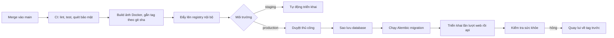

# DevOps & Deployment

> **Phase**: Design — Technical | **Trạng thái**: Draft v0.1 — chờ DevOps review
> **Upstream**: `21-architecture.md` (ADR-10), `26-security-nfr.md` §3
> **Mô hình**: Docker Compose trên một VM nội bộ. Không Kubernetes — xem ADR-10.

---

## 1. Môi trường

| Môi trường   | Mục đích                     | Dữ liệu                                               | Ai truy cập                        |
| ------------ | ---------------------------- | ----------------------------------------------------- | ---------------------------------- |
| `local`      | Máy lập trình viên           | Dữ liệu mẫu sinh bằng script                          | Đội phát triển                     |
| `staging`    | Kiểm thử tích hợp, BU verify | Dữ liệu mẫu — **không bao giờ** sao chép dữ liệu thật | Đội phát triển, QA, BA, khách hàng |
| `production` | Vận hành                     | Dữ liệu thật                                          | Người dùng cuối                    |

> **Không có bước chuyển dữ liệu từ hệ thống cũ** (DEC-11) — các team tự nhập dữ liệu ban đầu, nên quy trình phát hành lần đầu không cần công cụ migration dữ liệu, chỉ cần migration schema.

> **Không sao chép dữ liệu production sang staging.** Với hệ thống thông thường đây là lời khuyên; với hệ thống này là quy tắc cứng — staging thường có kiểm soát truy cập lỏng hơn, mà dữ liệu ở đây là danh sách điểm yếu của tổ chức. Cần dữ liệu giống thật thì dùng script sinh dữ liệu giả với cấu trúc tương đương.

## 2. Cấu trúc Docker Compose

```yaml
# docker-compose.prod.yml (rút gọn — phần cốt lõi)
services:
  nginx:
    image: nginx:1.27-alpine
    ports: ['443:443', '80:80'] # container DUY NHẤT publish cổng
    volumes:
      - ./nginx/nginx.conf:/etc/nginx/nginx.conf:ro
      - ./certs:/etc/nginx/certs:ro
    depends_on: { web: { condition: service_healthy } }
    restart: unless-stopped

  web:
    build: { context: ./app-fe, dockerfile: Dockerfile }
    expose: ['3000'] # KHÔNG có ports:
    environment:
      API_BASE_URL: http://api:8000/api/v1
      NODE_ENV: production
    env_file: [.env.web]
    depends_on: { api: { condition: service_healthy } }
    healthcheck:
      test:
        [
          'CMD',
          'node',
          '-e',
          "fetch('http://localhost:3000/api/health').then(r=>process.exit(r.ok?0:1))",
        ]
      interval: 30s
      timeout: 5s
      retries: 3
      start_period: 20s
    restart: unless-stopped

  api:
    build: { context: ./app-be, dockerfile: Dockerfile }
    expose: ['8000'] # KHÔNG có ports:
    env_file: [.env.api]
    depends_on: { db: { condition: service_healthy } }
    healthcheck:
      test:
        [
          'CMD',
          'python',
          '-c',
          "import urllib.request;urllib.request.urlopen('http://localhost:8000/health')",
        ]
      interval: 30s
      timeout: 5s
      retries: 3
      start_period: 20s
    restart: unless-stopped

  db:
    image: postgres:17.9-alpine
    expose: ['5432'] # KHÔNG có ports:
    volumes:
      - pgdata:/var/lib/postgresql/data
      - ./backups:/backups
    env_file: [.env.db]
    healthcheck:
      test: ['CMD-SHELL', 'pg_isready -U $${POSTGRES_USER} -d $${POSTGRES_DB}']
      interval: 10s
      timeout: 5s
      retries: 5
    restart: unless-stopped

volumes:
  pgdata:
```

**Ba điểm cần chú ý:**

1. **Chỉ `nginx` có `ports:`.** Ba container còn lại dùng `expose:` — chỉ gọi được từ trong mạng Docker. Đây là hiện thực hóa của `26-security-nfr.md` §3. Nếu ai đó thêm `ports: ["8000:8000"]` vào `api` để tiện debug, đó là phá một lớp bảo mật — hãy dùng `docker compose exec` hoặc SSH tunnel thay thế.
2. **`healthcheck` với `condition: service_healthy`** — không dùng `depends_on` trần, vì nó chỉ chờ container **khởi động** chứ không chờ **sẵn sàng phục vụ**. Postgres đặc biệt cần điều này: container lên trước khi database nhận kết nối.
3. **`start_period`** cho phép container khởi động chậm mà không bị đánh dấu hỏng oan — Next.js standalone và Uvicorn đều cần vài giây.

## 3. Cấu hình tài nguyên

| Container   | CPU        | RAM      | Ghi chú                                              |
| ----------- | ---------- | -------- | ---------------------------------------------------- |
| `nginx`     | 0.25       | 128 MB   | —                                                    |
| `web`       | 1.0        | 1 GB     | Next.js standalone                                   |
| `api`       | 2.0        | 2 GB     | Xem tính toán bên dưới                               |
| `db`        | 2.0        | 4 GB     | `shared_buffers = 1GB` — đủ chứa toàn bộ working set |
| **Tổng VM** | **4 vCPU** | **8 GB** | Có dư cho hệ điều hành và backup                     |

**Về số worker của `api`.** Argon2id được cấu hình `memory_cost = 64 MB` (ADR-07), tức **mỗi lần xác thực đồng thời chiếm 64 MB RAM tạm thời**. Với 4 worker Uvicorn và trường hợp xấu nhất là cả 4 cùng xác thực, đó là 256 MB chỉ cho việc băm mật khẩu — chưa tính bộ nhớ ứng dụng. Giới hạn 2 GB là đủ rộng, nhưng đây là con số cần nhớ nếu sau này ai đó tăng `memory_cost` hoặc tăng số worker.

Khuyến nghị khởi điểm: `gunicorn -k uvicorn.workers.UvicornWorker -w 4`. Với ~150 người dùng dùng trong giờ hành chính, 4 worker là dư dả.

**Pool kết nối database**: `pool_size=5, max_overflow=5` mỗi worker → tối đa 40 kết nối. Đặt `max_connections = 100` ở Postgres để còn chỗ cho migration và thao tác vận hành.

## 4. Quy trình phát hành



### 4.1 Thứ tự và điểm cần chú ý

| Bước          | Chi tiết                                                                                 |
| ------------- | ---------------------------------------------------------------------------------------- |
| 1. Sao lưu    | `pg_dump` **trước mọi lần** chạy migration. Không có ngoại lệ                            |
| 2. Migration  | Chạy bằng DB role **`app_owner`**, không phải `app_runtime` (`22-database-design.md` §9) |
| 3. Triển khai | `docker compose up -d --no-deps api web`                                                 |
| 4. Kiểm tra   | Chờ healthcheck xanh; gọi thử một endpoint đọc và một endpoint ghi                       |
| 5. Quay lui   | Đổi tag ảnh về bản trước và `up -d` lại                                                  |

> **Vấn đề khó của việc quay lui.** Quay lui mã nguồn thì dễ; quay lui **schema** thì không phải lúc nào cũng được. Quy tắc: migration phải **tương thích ngược ít nhất một bản phát hành**. Muốn đổi tên cột thì làm ba bước qua hai lần phát hành: thêm cột mới và ghi cả hai → chuyển đọc sang cột mới → mới xóa cột cũ. Ở giai đoạn đầu dự án việc này ít xảy ra, nhưng thói quen cần có từ đầu.

Migration nào **không** hoàn tác được (xóa cột có dữ liệu, gộp bảng) phải được đánh dấu rõ trong mô tả revision và cần duyệt riêng.

### 4.2 CI pipeline

| Giai đoạn       | Việc                                                      | Chặn merge?               |
| --------------- | --------------------------------------------------------- | ------------------------- |
| Lint            | `ruff`, `mypy`, `eslint`, `tsc --noEmit`                  | Có                        |
| Test BE         | `pytest` với testcontainers PostgreSQL **17.9**           | Có                        |
| Test FE         | `vitest` + kiểm thử component                             | Có                        |
| Đồng bộ catalog | Mọi `MSG-*` trong code khớp `10-error-message-catalog.md` | Có                        |
| Bảo vệ route    | Mọi route có dependency xác thực                          | Có                        |
| Bảo mật         | `pip-audit`, `npm audit`, `gitleaks`, `bandit`            | Có với mức `high` trở lên |
| Build           | Ảnh Docker cho `web` và `api`                             | Có                        |
| Quét ảnh        | `trivy`                                                   | Cảnh báo                  |

## 5. Cấu hình môi trường

Ba tệp riêng, quyền `600`, chủ sở hữu `root`:

| Tệp        | Container | Biến chính                                                                                                                    |
| ---------- | --------- | ----------------------------------------------------------------------------------------------------------------------------- |
| `.env.db`  | `db`      | `POSTGRES_USER`, `POSTGRES_PASSWORD`, `POSTGRES_DB`                                                                           |
| `.env.api` | `api`     | `DATABASE_URL`, `JWT_SECRET`, `ACCESS_TOKEN_TTL=900`, `REFRESH_TOKEN_TTL=28800`, `ARGON2_MEMORY_COST=65536`, `LOG_LEVEL=INFO` |
| `.env.web` | `web`     | `API_BASE_URL`, `SESSION_COOKIE_SECRET`, `NEXT_PUBLIC_APP_NAME`                                                               |

Cả ba đều nằm trong `.gitignore` **từ commit đầu tiên**. Kèm theo repo là `.env.*.example` chứa tên biến và giá trị giả — để người mới biết cần những gì mà không lộ bí mật.

Ứng dụng **validate biến môi trường lúc khởi động** và fail nhanh nếu thiếu (Pydantic Settings ở BE, `@t3-oss/env-nextjs` ở FE). Thiếu `JWT_SECRET` phải làm container không lên được, chứ không phải chạy được rồi lỗi mơ hồ ở request đầu tiên.

## 6. Sao lưu và phục hồi

### 6.1 Chiến lược

| Hạng mục | Quy định                                                                   |
| -------- | -------------------------------------------------------------------------- |
| Tần suất | `pg_dump -Fc` hằng ngày lúc 02:00 GMT+7, **và** trước mọi lần triển khai   |
| Lưu giữ  | 7 bản hằng ngày + 4 bản hằng tuần + 3 bản hằng tháng                       |
| Nơi lưu  | Ngoài VM ứng dụng — nếu VM hỏng thì backup phải còn                        |
| Mã hóa   | Bản sao lưu **phải được mã hóa** khi lưu — nó chứa toàn bộ dữ liệu lỗ hổng |
| Kiểm tra | **Phục hồi thử hằng tháng** vào môi trường tạm và đếm số bản ghi           |

> Mục cuối là mục hay bị bỏ qua nhất. Một bản sao lưu chưa từng được phục hồi thử thì chưa phải là bản sao lưu — nó chỉ là một tệp mà ta hy vọng là dùng được. Với hệ thống lưu dấu vết kiểm toán không tái tạo được (`vulnerability_status_history`), đây không phải chuyện có thể bỏ qua.

### 6.2 RPO / RTO

| Chỉ tiêu                           | Giá trị hiện đặt             | Nguồn                                      |
| ---------------------------------- | ---------------------------- | ------------------------------------------ |
| RPO (mất tối đa bao nhiêu dữ liệu) | 24 giờ                       | `[ASSUMED]` — chỉ dựa vào backup hằng ngày |
| RTO (bao lâu phục hồi xong)        | ≤ 8 giờ, trong ngày làm việc | `[ASSUMED]` — ASM-A4                       |

**Cần khách hàng xác nhận (QA-A03).** Nếu RPO 24 giờ là quá rộng — nghĩa là mất một ngày cập nhật lỗ hổng là không chấp nhận được — thì phải bật **WAL archiving** để phục hồi tới thời điểm bất kỳ. Chi phí: thêm dung lượng lưu trữ và một chút phức tạp vận hành. Đây là quyết định của khách hàng, không phải của đội kỹ thuật, nên cần hỏi rõ chứ không tự chọn.

### 6.3 Quy trình phục hồi

1. Dừng `web` và `api`, giữ `db` chạy.
2. `pg_restore -c -d <db> <tệp backup>`.
3. Chạy `sql/verify_rules.sql` để xác nhận ràng buộc và trigger còn nguyên.
4. Kiểm tra số bản ghi `vulnerabilities` và `vulnerability_status_history` khớp kỳ vọng.
5. Khởi động lại `api` rồi `web`; chờ healthcheck.

Bước 3 quan trọng: `pg_restore` có thể tạo lại bảng mà bỏ sót trigger hoặc grant nếu tùy chọn không đúng — mà đó chính là những thứ bảo vệ dấu vết kiểm toán (ADR-04).

## 7. Ghi log và giám sát

### 7.1 Log

| Nguồn   | Định dạng                                           | Đích                    |
| ------- | --------------------------------------------------- | ----------------------- |
| `api`   | JSON một dòng ra stdout                             | Docker json-file driver |
| `web`   | JSON một dòng ra stdout                             | Như trên                |
| `nginx` | Access log dạng JSON, có `request_id`               | Như trên                |
| `db`    | Log Postgres, `log_min_duration_statement = 1000ms` | Như trên                |

Xoay vòng log: `max-size: 50m, max-file: 5` cho mỗi container — nếu không đặt, log sẽ lấp đầy ổ đĩa VM và đó là nguyên nhân sập rất phổ biến.

`request_id` sinh ở Nginx (`$request_id`) và truyền xuống qua header `X-Request-Id`, xuyên suốt cả ba tầng — để truy vết một request từ đầu tới cuối.

**Nhắc lại quy tắc từ `24-backend-design.md` §8**: không bao giờ log mật khẩu, token, `resolution_note` hay `risk_accept_reason`. Hai trường sau mô tả điểm yếu cụ thể của hệ thống nội bộ.

### 7.2 Giám sát tối thiểu

| Chỉ số                   | Ngưỡng cảnh báo                  | Vì sao                             |
| ------------------------ | -------------------------------- | ---------------------------------- |
| Container không chạy     | Bất kỳ container nào dừng        | Sự cố dừng dịch vụ                 |
| Dung lượng đĩa           | > 80%                            | Nguyên nhân sập phổ biến nhất      |
| Backup thất bại          | Bất kỳ lần nào                   | Mất khả năng phục hồi              |
| Tỷ lệ lỗi 5xx            | > 1% trong 5 phút                | Suy giảm chất lượng                |
| Thời gian phản hồi P95   | > 3 giây                         | Vi phạm NFR-PERF                   |
| Kết nối DB               | > 80 / 100                       | Rò rỉ kết nối                      |
| **Số lần đăng nhập sai** | > 50 trong 15 phút toàn hệ thống | Dấu hiệu password spraying — TH-02 |

Chỉ số cuối là chỉ số **bảo mật**, không phải chỉ số vận hành, và nó bù đắp một phần cho khoảng trống Q-SEC-02.

Với quy mô này, một Uptime Kuma hoặc script cron gửi cảnh báo là đủ — chưa cần dựng Prometheus + Grafana. Nếu tổ chức đã có sẵn hệ thống giám sát nội bộ thì đẩy vào đó (QA-A04).

## 8. Cấu hình Nginx cốt lõi

```nginx
# rút gọn — phần đáng chú ý
limit_req_zone $binary_remote_addr zone=api_limit:10m rate=60r/m;
limit_req_zone $binary_remote_addr zone=login_limit:10m rate=10r/m;

server {
    listen 443 ssl http2;
    ssl_protocols TLSv1.2 TLSv1.3;
    ssl_prefer_server_ciphers off;

    client_max_body_size 1m;              # hệ thống không có upload tệp

    add_header Strict-Transport-Security "max-age=31536000; includeSubDomains" always;
    add_header Content-Security-Policy "default-src 'self'; script-src 'self'; style-src 'self' 'unsafe-inline'; img-src 'self' data:; frame-ancestors 'none'; base-uri 'self'; form-action 'self'" always;
    add_header X-Content-Type-Options nosniff always;
    add_header Referrer-Policy strict-origin-when-cross-origin always;

    location /login {
        limit_req zone=login_limit burst=5 nodelay;    # lớp phòng vệ thứ hai cho BR-21
        proxy_pass http://web:3000;
    }

    location / {
        limit_req zone=api_limit burst=20 nodelay;
        proxy_set_header X-Request-Id $request_id;
        proxy_pass http://web:3000;
    }

    location /export {
        proxy_read_timeout 120s;          # kết xuất CSV cần lâu hơn
        proxy_pass http://web:3000;
    }
}

server { listen 80; return 301 https://$host$request_uri; }
```

`limit_req` riêng cho `/login` là lớp phòng vệ thứ hai cho BR-21 và **có chặn được password spraying** ở mức độ nhất định (vì đếm theo IP chứ không theo email) — nhưng chưa thay thế được đề xuất Q-SEC-02.

## 9. Danh sách kiểm tra trước khi lên production

- [ ] **ADR-12 đã được quyết** — giữ FastAPI 0.115.9 kèm lý do, hoặc đã nâng cấp
- [ ] Chứng chỉ TLS hợp lệ, tự động gia hạn hoặc có lịch nhắc
- [ ] Ba tệp `.env` quyền `600`, không có tệp nào trong lịch sử Git
- [ ] `JWT_SECRET` và `SESSION_COOKIE_SECRET` sinh ngẫu nhiên ≥ 32 byte, **khác** giá trị ở staging
- [ ] Chỉ `nginx` publish cổng — kiểm tra bằng `docker compose ps`
- [ ] Migration 008 đã chạy: `app_runtime` **không** có `DELETE` trên `vulnerabilities` và `vulnerability_status_history`
- [ ] `sql/verify_rules.sql` chạy đạt **21/21** trên PostgreSQL **17.9**
- [ ] Tài khoản Admin khởi tạo đã đổi mật khẩu; mật khẩu mặc định không còn dùng được
- [ ] Sao lưu đã chạy thành công **và đã phục hồi thử một lần**
- [ ] Log không chứa mật khẩu, token, `resolution_note`, `risk_accept_reason` — kiểm tra bằng `grep` trên log staging
- [ ] Swagger UI đã tắt ở production (`docs_url=None`)
- [ ] Xoay vòng log đã cấu hình
- [ ] Cảnh báo đã kết nối và **đã thử gửi một lần**
- [ ] Đã đo thời gian phản hồi ở staging với dữ liệu quy mô thật (200 dự án, 5.000 lỗ hổng)

## 10. Câu hỏi mở

| Mã       | Câu hỏi                                                  | Ảnh hưởng                          |
| -------- | -------------------------------------------------------- | ---------------------------------- |
| QA-A03   | RPO/RTO mong muốn? Có cần WAL archiving không?           | Chiến lược backup, chi phí lưu trữ |
| QA-A04   | Có hệ thống log và giám sát tập trung nội bộ không?      | Kiến trúc observability            |
| QA-A05   | Chứng chỉ TLS lấy từ đâu?                                | Cấu hình Nginx, quy trình gia hạn  |
| Q-OPS-01 | VM nằm trong mạng nào, ai truy cập được qua SSH?         | Kiểm soát truy cập vận hành        |
| Q-OPS-02 | Có registry Docker nội bộ không, hay build ngay trên VM? | Quy trình phát hành                |

**Last Updated**: 2026-08-26
